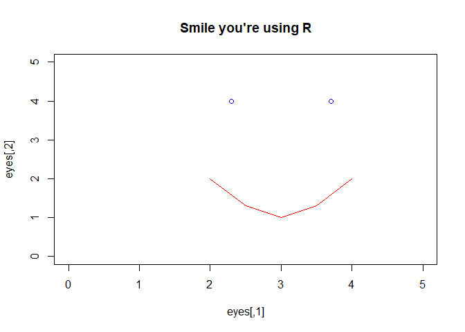

How to use R/RStudio effectively
================

Learning Outcomes
-----------------

-   RStudio UI and main features
-   R Objects and Functions
-   Subsetting
-   Plotting
-   Help
-   Installing Packages

Welcome to RStudio
------------------

This course assumes that you have already got some basic knowledge of working with R. If you don't see the [prerequisites](https://github.com/ITSLeeds/TDS/blob/master/courses/2day.md).


### Projects

Projects are a way to organise related work together. Each project has its own folder and Rproj file.

Start a new project with:

> File &gt; New Project

You can choose to create a new directory (folder) or associate a project with an existing directory. Make a new project called TDS and save it in a sensible place on your computer. Notice that TDS now appears in the top right of RStudio.

**Always do your work within a project**

### R Scripts

We could simply type all our code into the console, but that would require us to retype all our code every time we wish to run it. So we usually save code in a script file (with the .R extension).

Make a new script:

> Flie &gt; New File &gt; Rscript

Or use the new script button on the toolbar.

Save the script and give it a sensible name like `TDS-lesson-1.R` with:

> File &gt; Save

Or the save button on the toolbar.

### Writing Code

Let's start with some basic R operations

``` r
x <- 1:5
y <- c(0,1,3,9,18)
plot(x, y)
```

This code creates two objects, both vectors of length == 5, and then plots them.

### Running Code

We have several ways to run code within a script.

1.  Place the cursor on a line of code and press `CTRL + Enter` to run that line of code.
2.  Highlight a block of code or part of a line of code and press `CTRL + Enter` to run the highlighted code.
3.  Press `CTRL + Shift + Enter` to run all the code in a script.
4.  Press the Run button on the toolbar to run all the code in a script.
5.  Use the function `source()` to run all the code in a script e.g. `source("TDS-lesson-1.R")`

### Vewing Objects

Lets create some different types of object:

``` r
cat <- data.frame(name = c("Tiddles", "Chester", "Shadow"),
                  type = c("Tabby", "Persian", "Siamese"),
                   age = c(1, 3, 5),
                  likes_milk = c(TRUE, FALSE,TRUE))
even_numbers <- seq(from = 2, to = 4000, by = 2)
random_letters <- sample(letters, size = 100, replace = TRUE)
small_matrix <- matrix(1:24, nrow = 12)
```

We can view the objects in a range of ways:

1.  Type the name of the object into the console e.g. `cat`, what happens if we try to view all 2000 even\_numbers?
2.  Use the `head()` function to view the first few values e.g. `head(even_numbers)`
3.  Use the view table button next to matrix or data.frame objects in the environment tab.

We can also get an overview of an object using a range of functions.

1.  `summary()`
2.  `class()`
3.  `class()`
4.  `dim()`
5.  `length()`

**Exercise** try these functions, what results do they give?

### Using Autocomplete

RStudio can help you write code by autocompleting. RStudio will look for similar objects and functions after typing the first three letters of a name.


When there is more than one option you can select from the list using the mouse or arrow keys.

Within a function you can get a list of arguments by pressing Tab.


Notice the help popup.

### Getting help

Every function in R has a help page. You can view the help using `?` for example `?sum`. Many packages also contain vignettes, these are long form help documents containing examples and guides. `vignette()` will show a list of all the vignettes available, or you can show a specific vignette for example `vignette(topic = "sf1", package = "sf")`.

### Commenting Code

It is good practice to use comments in your code to explain what your code does. You can comment code using `#`

For example:

``` r
# A whole line comment
x <- 1:5 # An inline comment
y <- x * 2
```

You can comment a whole block of text by selecting it and using CTRL + Shift + C

You can add a comment section using CTRL + Shift + R

### Cleaning your environment and removing objects

The Environment tab shows all the objects in your environment, this includes Data, Values, and Functions. By default, new objects appear in the Global Environment but you can see other environments with the drop-down menu. For example, each package has its own environment.

Sometimes you wish to remove things from your environment, perhaps because you no longer need them or things are getting cluttered.

You can remove an object with the `rm()` function e.g. `rm(x)` or `rm(x,y)` or you can clear your whole environment with the broom button on the Environment Tab.

### Debugging Code

This code example will run, but we can see some of RStudio's debugging features by changing it. See that when the bracket is removed the red X and the underlying highlight the broken code. You may need to save the code you see the debugging prompt.


**Always address debugging prompts before running your code**

### Saving your work

We have already seen that you can save an R script. You can also save R objects in the RDS format.

``` r
saveRDS(cat,"cat.Rds")
```

We can also read back in our data.

``` r
cat2 <- readRDS("cat.Rds")
identical(cat, cat2)
```

R also supports many other formats. For example CSV files.

``` r
write.csv(cat, "cat.csv")
cat3 <- read.csv("cat.csv")
identical(cat3, cat1)
```

Notice that `cat3` and `cat` are not identical, what has changed? Hint: use `?write.csv`.

### Subsetting

We can subset any R object to just get part of the object. Subsetting can be done by either providing the positional numbers of the subset or logical vector of the same length. For two dimension object such as matrices and data.frames you can subset by row or column. Subsetting is done using square brackets `[]` after the name of an object.

``` r
even_numbers[1:5] # Just the first five even_numbers
x[c(TRUE, FALSE,TRUE,FALSE,TRUE)] # The 1st, 3rd, and 5th element in x
cat[c(1,2),] # First and second row of cat
cat[,c(1,3)] # First and third column of cat
cat[,c("name","age")] # First and third column of cat by name
```

It is also possible to create logial vector for subsetting by creating a query

``` r
x[x == 5] # Only when x == 5 (notice the use of double equals)
even_numbers[even_numbers < 50] # Just the  even_numbers less than 50
even_numbers[even_numbers %% 9 == 0] # Just the  even_numbers that are a multiple of 9
cat[cat$name == "Tiddles",] # THe rows where the name is Tiddles (notice the use of $)
```

### Dealing with NAs

R object can have a value of NA. This is how R represents missing data.

``` r
z <- c(4,5,NA,7)
```

NA values are common in real-world data but can cause trouble, for example

``` r
sum(z) # Result is NA
```

Some functions can be told to ignore NA values.

``` r
sum(z, na.rm = TRUE) # Result is equal to 4 + 5 + 7
```

You can find NAs using the `is.na()` function, and then remove them

``` r
is.na(z)
z_nona <- z[!is.na(z)] #Note the use of the not operator !
sum(z)
```

Be careful of NAs especially in statistical analysis, for example, the average of a value excluding NAs may not be representative of the whole.

### Packages

R has lots of functionality built in, but the real value in R is the community of package developers. Packages add new functions to R. Some packages are so useful they have become almost essential while others are only used for specific purposes.

There are two stages to using a package.

#### Instaling a package.

Packages that you don't have on your computer can be installed using `install.packages()` Packages come from [The Comprehensive R Archive Network](https://cran.r-project.org/) there are over 10,000 packages on CRAN. You only need to install a package once.

**Note: it is bad practice to install packages within a script, as installing packages each time it runs risks corrupting the package**

``` r
install.packages("sf")
```

Once you have a package on your computer you need to add it to your current environment

``` r
library(sf)
```

It is good practice to shart your script by loading any packages that are required.

There will be lots more about packages in the next session.

Now you are ready to use R
--------------------------

``` r
eyes <- c(2.3,4,3.7,4)
eyes <- matrix(eyes, ncol = 2, byrow = T)
mouth <- c(2,2,2.5,1.3,3,1,3.5,1.3,4,2)
mouth <- matrix(mouth, ncol = 2, byrow = T)
plot(eyes, 
     type = "p", 
     main = "Smile you're using R",
     cex = 2,
     xlim = c(0,5),
     ylim = c(0,5))
lines(mouth,
     type = "l",
     col = "red")
```


