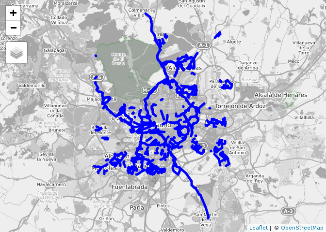

4 hour workshop: R for Transport Data Analysis
================

Transport Data Science course, based on materials hosted at <https://github.com/ITSLeeds/TDS>

Assumed prior knowledge:

-   Working knowledge of R, e.g. have completed:
-   Introduction to R free DataCamp course: <https://www.datacamp.com/courses/free-introduction-to-r>
-   Recommended reading: Section 4.2 of *Efficient R Programming* (Gillespie and Lovelace 2016): <https://csgillespie.github.io/efficientR/efficient-workflow.html#package-selection>

-   Some knowledge of tidyverse is highly recommended, e.g. already know the contents of or have read-up on **and tried examples from** the following 'cheatsheets':
-   Tidyverse for Beginners DataCamp Cheat Sheet (see [here](https://s3.amazonaws.com/assets.datacamp.com/blog_assets/Tidyverse+Cheat+Sheet.pdf)). **At a minimum you will have completed up to Chapter 5 on this online course** (this may take ~2 hours)
-   Data wrangling with dplyr and tidyr RStudio cheet cheet (see [here](https://www.rstudio.com/wp-content/uploads/2015/02/data-wrangling-cheatsheet.pdf))

<!-- **It's in the Analysis directorate** -->
Computing Requirements
----------------------

-   Desktops with recent versions of R and RStudio installed, including:
-   R 3.6.0 or later recommended (although any R 3.5 release should work): **download and install the latest version from** <https://cran.r-project.org/>
-   A recent version of RStudio: **download and install the latest version from** <https://www.rstudio.com/products/rstudio/download/>
-   Up-to-date versions of **tidyverse** and **sf** packages, at a minimum
-   Other packages we'll use are shown in the code below, which installs them

The packages used can be installed as follows:

``` r
install.packages("remotes")
pkgs = c(
  "osmdata",
  "pct",
  "sf",
  "stats19",
  "stplanr",
  "tidyverse",
  "tmap"
)
remotes::install_cran(pkgs)
```

-   Own laptops should be used, unless the necessary packages work on the cluster

-   Data: all data will be either provided by packages or downloaded on the day (assuming good internet)
-   A test to check if data downloads work is accessing stats19 data (check this works):

``` r
crashes = stats19::get_stats19(year = 2017, type = "accidents", ask = FALSE)
```

-   To test you can download data from OSM, try the following code:

``` r
# set-up
library(osmdata)
```

    ## Data (c) OpenStreetMap contributors, ODbL 1.0. http://www.openstreetmap.org/copyright

``` r
library(tmap)
ttm()
```

    ## tmap mode set to interactive viewing

``` r
# get data
d = opq("madrid") %>% 
  add_osm_feature("highway", "cycleway") %>% 
  osmdata_sf()

# plot data
tm_shape(d$osm_lines) + 
  tm_lines(col = "blue", lwd = 5) +
  tm_view(basemaps = leaflet::providers$OpenStreetMap.BlackAndWhite)
```

    ## Linking to GEOS 3.5.1, GDAL 2.1.2, PROJ 4.9.3



Venue and course times
----------------------

The course will take place from 10:00 to 14:00 at [Edificio Multiusos Ciudad Universitaria](https://www.google.com/maps/place/Edificio+Multiusos/@40.4500279,-3.7331934,15z/data=!4m5!3m4!1s0x0:0x721fc321c370faad!8m2!3d40.4500279!4d-3.7331934), 28040 Madrid

See <https://forms.gle/m5zraC8QQH5AydgT8>

<!-- - Download data from open roads: put on test scripts -->
Required reading
----------------

The course will build on Chapter 12 of *Geocomputation with R* (Lovelace, Nowosad, and Meunchow 2019): <http://geocompr.robinlovelace.net/transport.html>

Optional extra reading
----------------------

-   Optional extra reading: for context, you may want to read-up on:
-   Overview of GIS in R, e.g. in Chapter 1 of *Geocomputation with R* or this blog post: <https://www.jessesadler.com/post/gis-with-r-intro/>
-   stplanr: A package for transport planning (Lovelace and Ellison 2018)
-   R for data science (Grolemund and Wickham 2016)

### Agenda

-   10:00 - 11:00: Introduction and getting started with R

-   11:00 - 12:00: Getting and analysing spatio-temporal transport: examples with `stats19`, `pct` and `osmdata` packages

12:00 - 12:30: Break

-   12:30 - 13:00: Origin-destination (OD) data analysis with `stplanr`

-   13:00 - 14:00: From routes to route networks and data and methods for assessing cycling potential

Exercises
---------

References
----------

Gillespie, Colin, and Robin Lovelace. 2016. *Efficient R Programming: A Practical Guide to Smarter Programming*. O’Reilly Media. <https://csgillespie.github.io/efficientR/>.

Grolemund, Garrett, and Hadley Wickham. 2016. *R for Data Science*. 1 edition. O’Reilly Media.

Lovelace, Robin, and Richard Ellison. 2018. “Stplanr: A Package for Transport Planning.” *The R Journal* 10 (2): 7–23. doi:[10.32614/RJ-2018-053](https://doi.org/10.32614/RJ-2018-053).

Lovelace, Robin, Jakub Nowosad, and Jannes Meunchow. 2019. *Geocomputation with R*. CRC Press. <http://robinlovelace.net/geocompr>.
