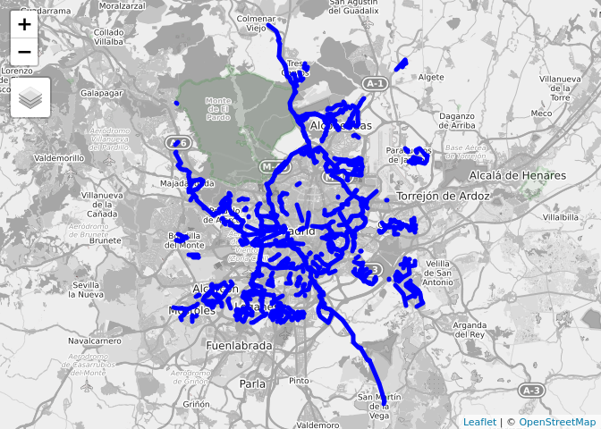
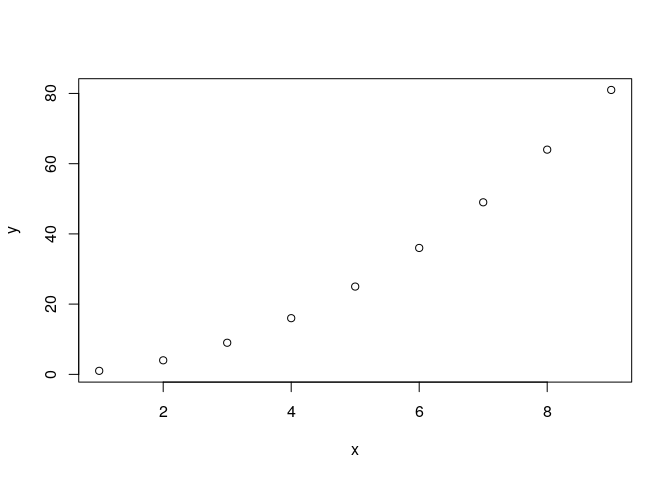
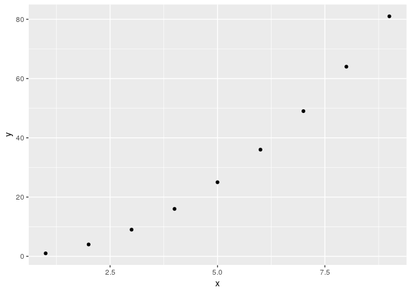
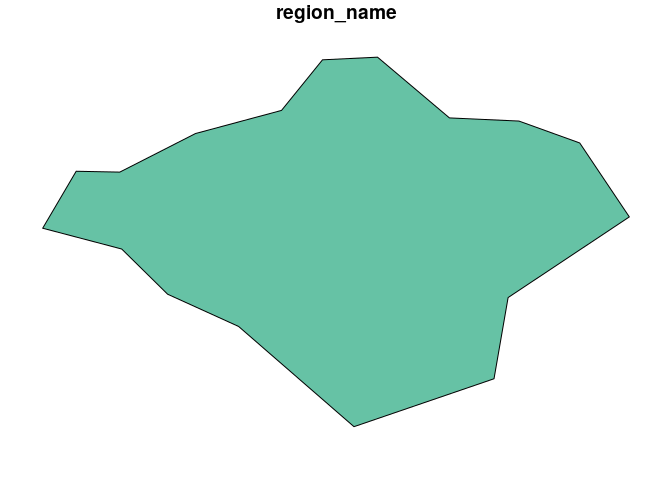
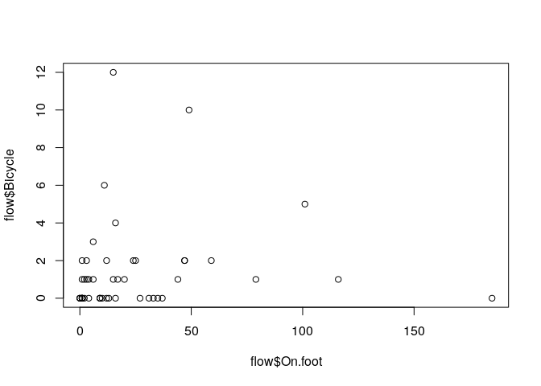
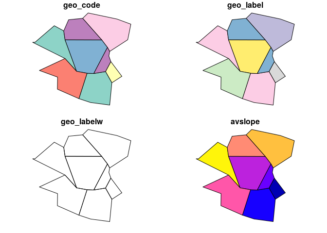
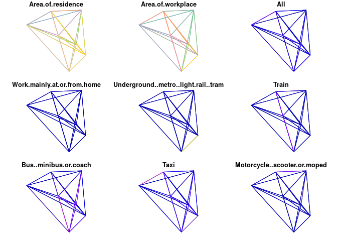
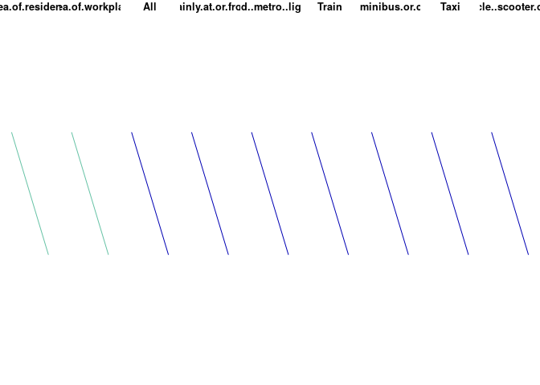

4 hour workshop: R for Transport Data Analysis
================

Transport Data Science course, based on materials hosted at
<https://github.com/ITSLeeds/TDS>

Home of this course: git.io/tds4hr

Assumed prior knowledge:

  - Working knowledge of R, e.g. have completed:
      - Introduction to R free DataCamp course:
        <https://www.datacamp.com/courses/free-introduction-to-r>
      - Recommended reading: Section 4.2 of *Efficient R Programming*
        (Gillespie and Lovelace 2016):
        <https://csgillespie.github.io/efficientR/efficient-workflow.html#package-selection>
  - Some knowledge of tidyverse is highly recommended, e.g. already know
    the contents of or have read-up on **and tried examples from** the
    following ‘cheatsheets’:
      - Tidyverse for Beginners DataCamp Cheat Sheet (see
        [here](https://s3.amazonaws.com/assets.datacamp.com/blog_assets/Tidyverse+Cheat+Sheet.pdf)).
        **At a minimum you will have completed up to Chapter 5 on this
        online course** (this may take ~2 hours)
      - Data wrangling with dplyr and tidyr RStudio cheet cheet (see
        [here](https://www.rstudio.com/wp-content/uploads/2015/02/data-wrangling-cheatsheet.pdf))

<!-- **It's in the Analysis directorate** -->

## Computing Requirements

  - Desktops with recent versions of R and RStudio installed, including:
      - R 3.6.0 or later recommended (although any R 3.5 release should
        work): **download and install the latest version from**
        <https://cran.r-project.org/>
      - A recent version of RStudio: **download and install the latest
        version from**
        <https://www.rstudio.com/products/rstudio/download/>
      - Up-to-date versions of **tidyverse** and **sf** packages, at a
        minimum
      - Other packages we’ll use are shown in the code below, which
        installs them

The packages used can be installed as follows:

``` r
install.packages("remotes")
pkgs = c(
  "osmdata",
  "pct",
  "sf",
  "stats19",
  "stplanr",
  "tidyverse",
  "tmap"
)
remotes::install_cran(pkgs)
```

  - Own laptops should be used, unless the necessary packages work on
    the cluster

  - Data: all data will be either provided by packages or downloaded on
    the day (assuming good internet)
    
      - A test to check if data downloads work is accessing stats19 data
        (check this
works):

<!-- end list -->

``` r
crashes = stats19::get_stats19(year = 2017, type = "accidents", ask = FALSE)
```

  - To test you can download data from OSM, try the following code:

<!-- end list -->

``` r
# set-up
library(osmdata)
```

    ## Registered S3 method overwritten by 'rvest':
    ##   method            from
    ##   read_xml.response xml2

    ## Data (c) OpenStreetMap contributors, ODbL 1.0. http://www.openstreetmap.org/copyright

``` r
library(tmap)
ttm()
```

    ## tmap mode set to interactive viewing

``` r
# get data
d = opq("madrid") %>% 
  add_osm_feature("highway", "cycleway") %>% 
  osmdata_sf()

# plot data
tm_shape(d$osm_lines) + 
  tm_lines(col = "blue", lwd = 5) +
  tm_view(basemaps = leaflet::providers$OpenStreetMap.BlackAndWhite)
```

    ## Linking to GEOS 3.7.0, GDAL 2.4.0, PROJ 5.2.0

<!-- -->

## Venue and course times

The course will take place from 10:00 to 14:00 at [Edificio Multiusos
Ciudad
Universitaria](https://www.google.com/maps/place/Edificio+Multiusos/@40.4500279,-3.7331934,15z/data=!4m5!3m4!1s0x0:0x721fc321c370faad!8m2!3d40.4500279!4d-3.7331934),
28040 Madrid

See <https://forms.gle/m5zraC8QQH5AydgT8>

<!-- - Download data from open roads: put on test scripts -->

## Required reading

The course will build on Chapter 12 of *Geocomputation with R*
(Lovelace, Nowosad, and Meunchow 2019):
<http://geocompr.robinlovelace.net/transport.html>

## Optional extra reading

  - Optional extra reading: for context, you may want to read-up on:
      - Overview of GIS in R, e.g. in Chapter 1 of *Geocomputation with
        R* or this blog post:
        <https://www.jessesadler.com/post/gis-with-r-intro/>
      - stplanr: A package for transport planning (Lovelace and Ellison
        2018)
      - R for data science (Grolemund and Wickham 2016)

### Agenda

  - 10:00 - 11:00: Introduction and getting started with R

  - 11:00 - 12:00: Getting and analysing transport data: examples with
    `stats19`, `pct` and `osmdata` packages

12:00 - 12:30: Break

  - 12:30 - 13:00: Origin-destination (OD) data analysis with `stplanr`

  - 13:00 - 14:00: From routes to route networks and data and methods
    for assessing cycling potential

## Exercises

## Getting started

See section 1 of the exercises: <https://git.io/tds2dayex>

``` r
d = data.frame(x = 1:9, y = (1:9)^2)
plot(d)           # base R
library(ggplot2)  # with a package
ggplot(d) +
  geom_point(aes(x, y))
```



## Getting tranport data

Starting point: run the following
    commands.

``` r
library(tidyverse)
```

    ## ── Attaching packages ───────────────────────────── tidyverse 1.2.1 ──

    ## ✔ tibble  2.1.1       ✔ purrr   0.3.2  
    ## ✔ tidyr   0.8.3       ✔ dplyr   0.8.0.1
    ## ✔ readr   1.3.1       ✔ stringr 1.4.0  
    ## ✔ tibble  2.1.1       ✔ forcats 0.4.0

    ## ── Conflicts ──────────────────────────────── tidyverse_conflicts() ──
    ## ✖ dplyr::filter() masks stats::filter()
    ## ✖ dplyr::lag()    masks stats::lag()

``` r
library(stats19)
```

    ## Data provided under OGL v3.0. Cite the source and link to:
    ## www.nationalarchives.gov.uk/doc/open-government-licence/version/3/

``` r
library(pct)
regions = pct::pct_regions
iow = regions %>% 
  filter(region_name == "isle-of-wight")
plot(iow)
```

<!-- -->

``` r
vehicles = get_stats19(year = 2017, type = "vehicles", ask = FALSE)
```

    ## Files identified: dftRoadSafetyData_Vehicles_2017.zip

    ##    http://data.dft.gov.uk.s3.amazonaws.com/road-accidents-safety-data/dftRoadSafetyData_Vehicles_2017.zip

    ## Attempt downloading from:

    ## Data saved at /tmp/Rtmpff26ac/dftRoadSafetyData_Vehicles_2017/Veh.csv

1.  Download and plot all crashes reported in Great Britain in 2017
    (hint: see [the stats19
    vignette](https://cran.r-project.org/web/packages/stats19/vignettes/stats19.html))
2.  Find the function in the `stats19` package that converts a
    `data.frame` object into an `sf` data frame. Use this function to
    convert the road crashes into an `sf` object, called `crashes_sf`,
    for example.
3.  Filter crashes that happened in the Isle of Wight based on attribute
    data (hint: the relevant column contains the word `local`)
4.  Filter crashes happened in the Isle of Wight using geographic
    subsetting (hint: remember `st_crs()`?)

## Origin-destination data with stplanr

The starting point of these exercises is to work with the
Origin-Destination data in the `stplanr` package.

``` r
library(stplanr)
```

    ## Registered S3 method overwritten by 'R.oo':
    ##   method        from       
    ##   throw.default R.methodsS3

    ## 
    ## Attaching package: 'stplanr'

    ## The following object is masked from 'package:stats19':
    ## 
    ##     dl_stats19

``` r
head(flow)
```

    ##        Area.of.residence Area.of.workplace All Work.mainly.at.or.from.home
    ## 920573         E02002361         E02002361 109                           0
    ## 920575         E02002361         E02002363  38                           0
    ## 920578         E02002361         E02002367  10                           0
    ## 920582         E02002361         E02002371  44                           0
    ## 920587         E02002361         E02002377  34                           0
    ## 920591         E02002361         E02002382   7                           0
    ##        Underground..metro..light.rail..tram Train Bus..minibus.or.coach
    ## 920573                                    0     0                     4
    ## 920575                                    0     1                     4
    ## 920578                                    0     0                     1
    ## 920582                                    0     0                     2
    ## 920587                                    0     0                     0
    ## 920591                                    0     0                     1
    ##        Taxi Motorcycle..scooter.or.moped Driving.a.car.or.van
    ## 920573    2                            0                   39
    ## 920575    1                            0                   24
    ## 920578    0                            0                    8
    ## 920582    2                            0                   28
    ## 920587    1                            2                   19
    ## 920591    0                            0                    5
    ##        Passenger.in.a.car.or.van Bicycle On.foot
    ## 920573                         3       2      59
    ## 920575                         4       0       4
    ## 920578                         0       0       1
    ## 920582                         3       3       6
    ## 920587                         3       0       9
    ## 920591                         1       0       0
    ##        Other.method.of.travel.to.work                  id
    ## 920573                              0 E02002361 E02002361
    ## 920575                              0 E02002361 E02002363
    ## 920578                              0 E02002361 E02002367
    ## 920582                              0 E02002361 E02002371
    ## 920587                              0 E02002361 E02002377
    ## 920591                              0 E02002361 E02002382

``` r
plot(flow$On.foot, flow$Bicycle)
```

<!-- -->

``` r
cor(flow$On.foot, flow$Bicycle)
```

    ## [1] 0.1183101

``` r
plot(zones_sf)
```

<!-- -->

``` r
l = od2line(flow, zones_sf)
```

    ## Creating centroids representing desire line start and end points.

    ## Warning in st_centroid.sf(zones): st_centroid assumes attributes are
    ## constant over geometries of x

    ## Warning in st_centroid.sfc(st_geometry(x), of_largest_polygon =
    ## of_largest_polygon): st_centroid does not give correct centroids for
    ## longitude/latitude data

``` r
plot(l)
```

    ## Warning: plotting the first 9 out of 15 attributes; use max.plot = 15 to
    ## plot all

<!-- -->

  - Plot the map interactively using mapview
  - Highlight the desire line along which most people walk

You can analyse OD data in more detail as follows.

``` r
l1 = l %>% 
  top_n(1,  Bicycle)
plot(l1)
```

    ## Warning: plotting the first 9 out of 15 attributes; use max.plot = 15 to
    ## plot all

<!-- -->

### Exercises

1.  Create an object representing desire lines in Isle of Wight, e.g,
    with: `desire_lines_all = pct::get_pct_lines(region =
    "isle-of-wight")`
2.  Subset the desire lines with a value of `all` of 200 or above
3.  Create a buffer of 500 m for each desire line and calculate the
    number of crashes that happened within each (using STATS19 data
    downloaded in the previous exercise)
4.  Create a faceted plot showing the temporal distribution of crashes
    in Isle of Wight (you can choose whether to show these over the
    months of the year, over days of the week, or over the hours of a
    day)
5.  Do a spatiotemporal subset to identify the crashes that happened
    within the most commonly travelled desire line between 07:00 and
    10:00 during weekdays.

<!-- end list -->

``` r
u = "https://www.openstreetmap.org/trace/2992569/data"
download.file(u, "track.gpx")
sf::st_layers("track.gpx")

tracks = sf::st_read("track.gpx", layer= "track_points")
# ?st_read
mapview::mapview(tracks)


library(stplanr)
library(tidyverse)
f = flow[1:3, 1:5]
f_tidy = flow %>% 
  select(1:5) %>% 
  slice(1:3)
f
class(f)
z = zones_sf
l = od2line(f, z)
plot(l[2, ])
nrow(l)
r = line2route(l, route_fun = route_osrm)
plot(r)

# get data from PCT
od = pct::get_od()
od
class(od)
iow = pct::get_pct_centroids("isle-of-wight")
plot(iow)
mapview::mapview(iow)

od_iow = od %>%
  filter(geo_code1 %in% iow$geo_code) %>% 
  filter(geo_code2 %in% iow$geo_code) 

l_iow = od2line(od_iow, iow)
mapview::mapview(l_iow)

l_iow = l_iow %>% 
  mutate(percent_drive = car_driver / all * 100) %>% 
  mutate(distance_euclidean = sf::st_length(l_iow)) %>% 
  mutate(distance_euclidean = as.numeric(distance_euclidean))
l_iow$percent_drive
class(l_iow$distance_euclidean)

summary(l_iow$percent_drive)
summary(l_iow$distance_euclidean)

l_iow_car_dependent = l_iow %>% 
  filter(percent_drive > 75) %>% 
  filter(distance_euclidean < 10000)

mapview::mapview(l_iow_car_dependent)

r_fast = line2route(l_iow_car_dependent)
r = line2route(l_iow_car_dependent, plan = "quietest")

mapview::mapview(r) +
  mapview::mapview(r_fast)

r_fast$bicycle = l_iow_car_dependent$bicycle

iow_rnet = overline(r_fast, "bicycle")
plot(iow_rnet)

# git.io/tds2dayex

# travel patterns in/around complutense
library(osmdata)
library(tidyverse)
complu = opq(bbox = "Madrid") %>% 
  add_osm_feature(key = "name", value = "Complutense", value_exact = FALSE) %>% 
  osmdata_sf()

complu

complu_poly = complu$osm_polygons
mapview::mapview(complu_poly)
complu1 = complu_poly %>% 
  mutate(area = as.numeric(sf::st_area(.))) %>% 
  top_n(1, area)
mapview::mapview(complu1)

# get 1 km buffer
complu_buffer = complu1 %>% 
  st_transform(3087) %>% 
  st_buffer(1000) %>% 
  st_transform(4326)

mapview::mapview(complu_buffer)
b = sf::st_bbox(complu_buffer)

# s = dodgr::dodgr_streetnet(bbox = b)
osm = opq(bbox = b) %>% 
  add_osm_feature("highway") %>% 
  osmdata_sf()

mapview::mapview(osm$osm_lines)

rnet = SpatialLinesNetwork(osm$osm_lines)

rnet@sl$centrality = igraph::edge_betweenness(rnet@g)

plot(rnet@sl["centrality"])

library(tmap)
ttm()
tm_shape(rnet@sl) +
  tm_lines(lwd = "centrality", scale = 9, col = "highway")

# try cyclstreets in Madrid

spain = rnaturalearth::ne_(scale = 10, country = "Spain", returnclass = "sf")
names(spain)

sf::st_geometry_type(spain)

sf::write_sf(spain, "/tmp/spain.gpkg")

u = "http://www.ine.es/censos2011_datos/cartografia_censo2011_nacional.zip"
download.file(u, "data.zip")
unzip("data.zip")
spain = sf::read_sf("SECC_CPV_E_20111101_01_R_INE.shp")
spain_sub = spain %>% 
  filter(CUSECCUMUN == "01001")
mapview::mapview(spain[1:100, ])
```

## References

<div id="refs" class="references">

<div id="ref-gillespie_efficient_2016">

Gillespie, Colin, and Robin Lovelace. 2016. *Efficient R Programming: A
Practical Guide to Smarter Programming*. O’Reilly Media.
<https://csgillespie.github.io/efficientR/>.

</div>

<div id="ref-grolemund_r_2016">

Grolemund, Garrett, and Hadley Wickham. 2016. *R for Data Science*. 1
edition. O’Reilly Media.

</div>

<div id="ref-lovelace_stplanr:_2018">

Lovelace, Robin, and Richard Ellison. 2018. “Stplanr: A Package for
Transport Planning.” *The R Journal* 10 (2): 7–23.
<https://doi.org/10.32614/RJ-2018-053>.

</div>

<div id="ref-lovelace_geocomputation_2019">

Lovelace, Robin, Jakub Nowosad, and Jannes Meunchow. 2019.
*Geocomputation with R*. CRC Press. <http://robinlovelace.net/geocompr>.

</div>

</div>
