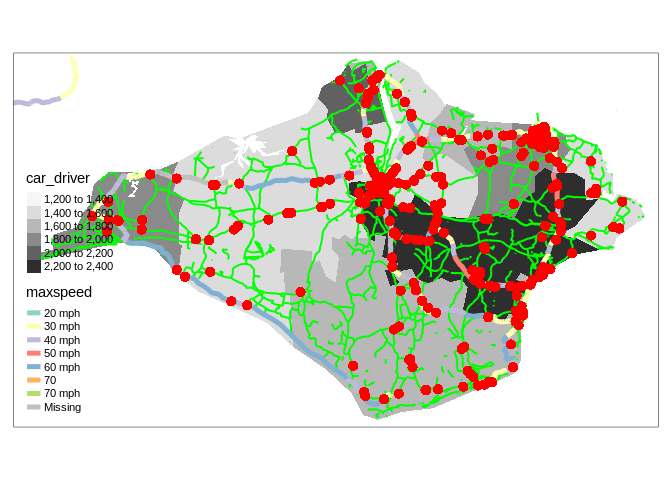
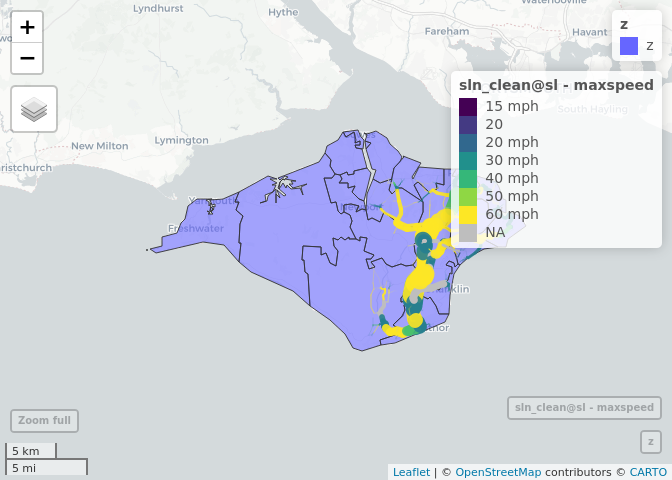

Coursework submission for Transport Data Science (TRAN5340M)
================
Student 12345

# Introduction

This template contains information and suggested headings for the TDS
module. Do not submit coursework that contains this note or any text
(other than the headings) from this template. It is just designed to get
you started. You will submit the .Rmd file and the resulting document as
your coursework submission.

As outlined in the module catalogue, the coursework should be:

  - A maximum of 3000 words long, excluding code, figure captions and
    references
  - A maximum of 10 pages long, excluding references and appendices (you
    should include your best work and think about maximising the use of
    space - the chunk option `out.width="50%"`, for example, can help
    with this as outlined
    [here](https://bookdown.org/yihui/bookdown/figures.html) )

## RMarkdown

This is an R Markdown file. You can set the output by changing `output:
github_document` to something different, like `output: html_document`.
You will need to submit your work as a pdf document, which can be
generated by converting html output to pdf (e.g. with the `pagedown`
package) or (recommended) by setting the output to `pdf_document`. The
first lines of your RMarkdown document could look something like this to
ensure that the output is a PDF document and that the R code does not
run (set `eval = TRUE` to make the R code run):

    ---
    title: "Coursework submission for Transport Data Science (TRAN5340M)"
    subtitle: "Enter your own title here (e.g. Exploring open transport data: a study of the Isle of Wight)"
    output:
      pdf_document:
        number_sections: true
    author: "Student 12345"
    bibliography: references.bib
    ---

``` r
knitr::opts_chunk$set(echo = TRUE, warning = FALSE, message = FALSE, eval = FALSE)
```

See here for more info: <https://rmarkdown.rstudio.com/lesson-2.html>

When you open this file in RStudio and click the **Knit** button all R
code chunks are run and a markdown file (.md) suitable for publishing to
GitHub is generated.

To ensure the document is reproducible, you should include a code chunk
that shows which packages you used, e.g.:

``` r
# install.packages("remotes")
remotes::install_github("itsleeds/pct")
remotes::install_github("itsleeds/geofabrik")
remotes::install_github("ropensci/stats19")
library(pct)
library(sf)
library(stplanr)
library(tidyverse)
library(tmap)
```

You can add references manually or with `[@citation-key]` references
linking to a .bib file like this(Lovelace and Ellison 2017). And this
(Fox 2018).

## Including Code

You can include R code in the document as follows:

``` r
summary(cars)
```

    ##      speed           dist       
    ##  Min.   : 4.0   Min.   :  2.00  
    ##  1st Qu.:12.0   1st Qu.: 26.00  
    ##  Median :15.0   Median : 36.00  
    ##  Mean   :15.4   Mean   : 42.98  
    ##  3rd Qu.:19.0   3rd Qu.: 56.00  
    ##  Max.   :25.0   Max.   :120.00

## Including Plots

You can also embed plots, for example:

<!-- -->

Note that the `echo = FALSE` parameter was added to the code chunk to
prevent printing of the R code that generated the plot.

# Datasets used

You can get zone, OD and even route data for any city in the UK with the
following commands. We got data for the Isle of Wight with the following
commands:

``` r
library(pct)
region_name = "isle-of-wight"
z = get_pct_zones(region = region_name)
od = get_od()
od_in_zones = od %>% 
  filter(geo_code1 %in% z$geo_code) %>% 
  filter(geo_code2 %in% z$geo_code) 
desire_lines = od2line(od_in_zones, z)
```

You could get data from OpenStreetMap with the `osmdata` package.

``` r
library(osmdata)
osm_data = opq("isle of wight") %>% 
  add_osm_feature(key = "highway", value = "primary") %>% 
  osmdata_sf()
```

You can get large OSM datasets with `geofabrik`:

``` r
library(geofabrik)
iow_highways = get_geofabrik(name = "Isle of Wight", layer = "lines")
summary(as.factor(iow_highways$highway))
```

    ##      bridleway   construction       cycleway        footway  living_street 
    ##            170             16            139           5436              3 
    ##           path     pedestrian        primary   primary_link       proposed 
    ##            370             18            548             18             12 
    ##    residential      secondary secondary_link        service          steps 
    ##           2400            370              1           6746            368 
    ##       tertiary  tertiary_link          track   unclassified           NA's 
    ##            467              3           4312            835          22555

``` r
iow_highways2 = iow_highways %>% 
  filter(!is.na(highway)) %>% 
  filter(!str_detect(string = highway, pattern = "primary|track|resi|service|foot"))
summary(as.factor(iow_highways2$highway))
```

    ##      bridleway   construction       cycleway  living_street           path 
    ##            170             16            139              3            370 
    ##     pedestrian       proposed      secondary secondary_link          steps 
    ##             18             12            370              1            368 
    ##       tertiary  tertiary_link   unclassified 
    ##            467              3            835

You could get road casualty data with the `stats19` pakckage, as shown
below.

``` r
crashes = stats19::get_stats19(year = 2018, output_format = "sf") %>% 
  sf::st_transform(crs = sf::st_crs(z))

crashes_in_region = crashes[z, ]
tm_shape(z) +
  tm_fill("car_driver", palette = "Greys") +
  tm_shape(iow_highways2) +
  tm_lines(col = "green", lwd = 2) +
  tm_shape(osm_data$osm_lines) +
  tm_lines(col = "maxspeed", lwd = 5) +
  tm_shape(crashes_in_region) +
  tm_dots(size = 0.5, col = "red")
```

<!-- -->

# Descriptive analysis

``` r
plot(desire_lines)
```

<!-- -->

# Route analysis

See [here](https://geocompr.robinlovelace.net/transport.html#routes) and
[here](https://www.r-spatial.org/r/2019/09/26/spatial-networks.html) for
details.

``` r
sln = SpatialLinesNetwork(iow_highways2)
sln_clean = sln_clean_graph(sln)
plot(sln_clean@sl$`_ogr_geometry_`)
```

<!-- -->

``` r
centrality = igraph::edge_betweenness(sln_clean@g)
centrality_normalised = centrality / mean(centrality)
```

``` r
mapview::mapview(z) +
  mapview::mapview(sln_clean@sl, lwd = centrality_normalised * 3, zcol = "maxspeed")
```

<!-- -->

# Additional datasets

# Policy analysis

Here you could explain how you explored answers to policy questions such
as:

  - how to make the roads safer?
  - how to reduce congestion?
  - where to build bike parking?

# Discussion

Include here limitations and ideas for further research.

# Conclusion

What are the main things we have learned from this project?

# References

<div id="refs" class="references">

<div id="ref-fox_data_2018">

Fox, Charles. 2018. *Data Science for Transport: A Self-Study Guide with
Computer Exercises*. 1st ed. 2018 edition. New York, NY: Springer.

</div>

<div id="ref-lovelace_stplanr_2017">

Lovelace, Robin, and Richard Ellison. 2017. “Stplanr: A Package for
Transport Planning.” *The R Journal*.

</div>

</div>
