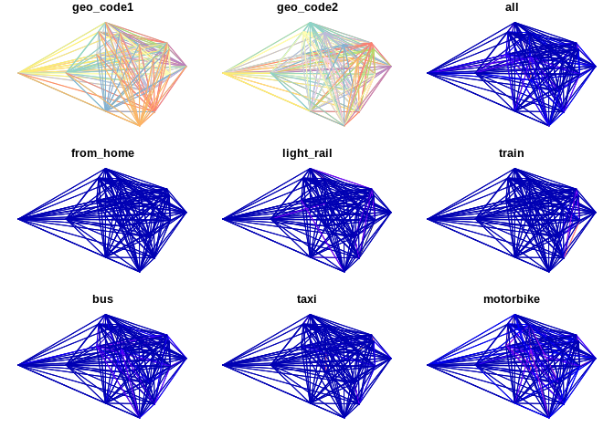
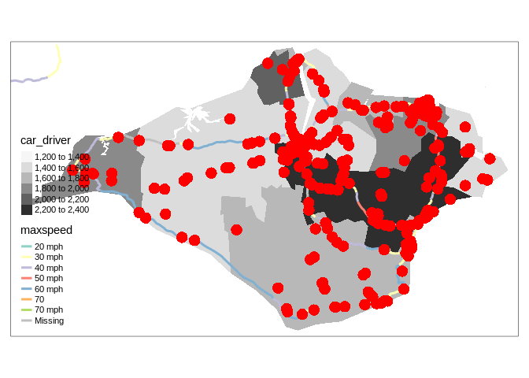

Coursework submission for Transport Data Science (TRAN5340M)
================

# Introduction

This template contains information and suggested headings for the TDS
module. Please do not submit coursework that contains this note or any
text (other than the headings) from this template. It is just designed
to get you started. You will submit the .Rmd file and the resulting
document as your coursework submission.

## RMarkdown

This is an R Markdown file. You can set the output by changing `output:
github_document` to something different, like `output: html_document`.
See here for more info: <https://rmarkdown.rstudio.com/lesson-2.html>

When you open this file in RStudio and click the **Knit** button all R
code chunks are run and a markdown file (.md) suitable for publishing to
GitHub is generated.

To ensure the document is reproducible, you should include a code chunk
that shows which packages you used, e.g.:

``` r
# install.packages("remotes")
remotes::install_github("itsleeds/pct")
remotes::install_github("ropensci/stats19")
library(dplyr)
library(pct)
library(stplanr)
```

You can add references manually or with `[@citation-key]` references
linking to a .bib file like this(Lovelace and Ellison 2017). And this
(Fox 2018).

## Including Code

You can include R code in the document as follows:

``` r
summary(cars)
```

    ##      speed           dist       
    ##  Min.   : 4.0   Min.   :  2.00  
    ##  1st Qu.:12.0   1st Qu.: 26.00  
    ##  Median :15.0   Median : 36.00  
    ##  Mean   :15.4   Mean   : 42.98  
    ##  3rd Qu.:19.0   3rd Qu.: 56.00  
    ##  Max.   :25.0   Max.   :120.00

## Including Plots

You can also embed plots, for example:

<!-- -->

Note that the `echo = FALSE` parameter was added to the code chunk to
prevent printing of the R code that generated the plot.

# Datasets used

You can get zone, OD and even route data for any city in the UK with the
following commands. We got data for the Isle of Wight with the following
commands:

``` r
library(pct)
region_name = "isle-of-wight"
z = get_pct_zones(region = region_name)
od = get_od()
od_in_zones = od %>% 
  filter(geo_code1 %in% z$geo_code) %>% 
  filter(geo_code2 %in% z$geo_code) 
desire_lines = od2line(od_in_zones, z)
```

# Descriptive analysis

``` r
plot(desire_lines)
```

<!-- -->

``` r
library(tmap)
```

# Route analysis

# Additional datasets

You could get data from OpenStreetMap with the `osmdata` package.

``` r
library(osmdata)
osm_data = opq("isle of wight") %>% 
  add_osm_feature(key = "highway", value = "primary") %>% 
  osmdata_sf()
```

You could get road casualty data with the `stats19` pakckage, as shown
below.

``` r
crashes = stats19::get_stats19(year = 2018, output_format = "sf") %>% 
  sf::st_transform(crs = sf::st_crs(z))

crashes_in_region = crashes[z, ]
tm_shape(z) +
  tm_fill("car_driver", palette = "Greys") +
  tm_shape(osm_data$osm_lines) +
  tm_lines(col = "maxspeed", lwd = 3) +
  tm_shape(crashes_in_region) +
  tm_dots(size = 1, col = "red")
```

<!-- -->

# Policy analysis

Here you could explain how you explored answers to policy questions such
as:

  - how to make the roads safer?
  - how to reduce congestion?
  - where to build bike parking?

# Discussion

Include here limitations and ideas for further research.

# Conclusion

What are the main things we have learned from this project?

# References

<div id="refs" class="references">

<div id="ref-fox_data_2018">

Fox, Charles. 2018. *Data Science for Transport: A Self-Study Guide with
Computer Exercises*. 1st ed. 2018 edition. New York, NY: Springer.

</div>

<div id="ref-lovelace_stplanr_2017">

Lovelace, Robin, and Richard Ellison. 2017. “Stplanr: A Package for
Transport Planning.” *The R Journal*.

</div>

</div>
