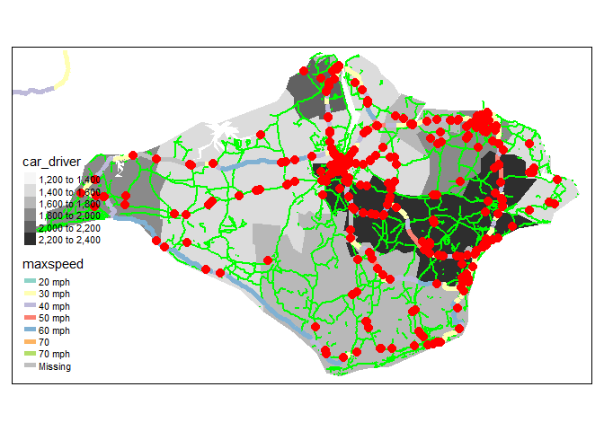

Coursework submission for Transport Data Science (TRAN5340M)
================
Student 12345

# Introduction

This template contains information and suggested headings for the TDS
module. Do not submit coursework that contains this note or any text
(other than the headings) from this template. It is just designed to get
you started. You will submit the .Rmd file, optionally included in a
.zip file if you want to include data, and the resulting PDF document as
your coursework submission.

As outlined in the module catalogue, the coursework should be:

  - A maximum of 3000 words long, excluding code, figure captions and
    references
  - A maximum of 10 pages long, excluding references and appendices (you
    should include your best work and think about maximising the use of
    space - the chunk option `out.width="50%"`, for example, can help
    with this as outlined
    [here](https://bookdown.org/yihui/bookdown/figures.html) )

# Coursework guidance

The information below provides guidance on the coursework. The
fundamentals are:

  - Deadline: Friday 15th May, 14:00
  - Format: a PDF file (max 10 pages) and an Rmd file or a .zip file
    containing the Rmd file and minimal dataset needed to reproduce the
    results if possible (40 MB max size)
  - Template: You can download a template .Rmd file as the bais of your
    submission:
    <https://github.com/ITSLeeds/TDS/raw/master/coursework-template.Rmd>

For the coursework you will submit a pdf a document with a maximum of 10
pages that contains code and results demonstrating your transport data
science skills.

## Marks

Marks are awarded in 5 categories, each of which is evaluated out of 20
and which will take account of the following criteria:

**Understanding of concepts, methods and approaches**

1.  Demonstrate understanding of core concepts of data science,
    including data cleaning/wrangling, joining, exploratory analysis and
    visualisation.

2.  Implement methods appropriate to the objectives of the report.

3.  Discuss alternative methods/approaches that could have been used,
    and consider and their advantages and disadvantages.

4.  Describe code that you have written as part of the analysis.
    
    **Data, processing access and cleaning**

5.  Describe how your team obtained and cleaned data

6.  Describe methods for cleaning the data and how this added value to
    it

7.  Discuss methods for gaining data using transport techniques such as
    routing and conversion of origin-destination data to geographic
    desire lines

8.  Describe how your team stored and transported data, including
    appropriate file formats
    
    **Application choice and modelling**

9.  Choice of topic that has interesting datasets and important real
    world applications

10. Appropriate use of methods for the choice of application

11. Demonstrate the progression from a simplistic model of the data to
    modelling techniques

12. Discuss alternative approaches
    
    **Visualization**

13. Include high quality, attractive and innovative visualisations

14. Describe how they were produced, including code

15. Describe the theory about why they were designed this way

16. Describe how your own work uses concepts from the literature
    
    **Understand the data science process**

17. The results presented are reproducible using code shared in the
    report submission or on a code-sharing platform.

18. Evaluation of the computational efficiency of the approach taken and
    discuss how scalable the code used is and changes that could be made
    to make it work on larger datasets, e.g. with reference to a
    benchmark to test different methods/implementations.

19. Provide evidence of teamwork, e.g. how work was divided, scheduled,
    and managed.

20. Give examples of how you communicated your own ideas to the target
    audience of the report and within the group.

## Ideas for coursework topics

If you are struggling for ideas and example code, these resources, in
addition to the links provided in the lectures and practicals can help:

1.  Work through the stats19 training vignette to sharpen your R skills:
    <https://docs.ropensci.org/stats19/articles/stats19-training.html>

2.  Take a look at the Model Basics chapter (and the next if interested)
    of the book R for Data Science:
    <https://r4ds.had.co.nz/model-basics.html>

3.  Try to reproduce the results presented in the ML practical:
    <https://github.com/ITSLeeds/TDS/blob/master/practicals/9-ml.md>

When working on the homework you should be thinking about the datasets
that you want to use for your coursework assignment. Ideas for datasets
that you could use are:

  - Travel behaviour data for a region of choice downloaded with the pct
    package
  - Road crash data downloaded with the stats19 package
  - OpenStreetMap data downloaded with the osmdata or geofabrik packages

You are free to pick a research topic and research aims and objectives.
However, some example topics that you could choose have been provided:

  - What explanatory variables best predict the level of walking in
    Leeds, and how do walking levels relate to pedestrian safety? You
    could use the command `pct::get_desire_lines(region =
    "west-yorkshire")` to get data on walking desire lines and
    `get_stats19()` to get road crash data for Leeds. In terms of the
    topics covered in the lectures you could:
      - Show understanding of data science in context with a brief
        introduction that touches on the definition of transport data
        science
      - Demonstrate understanding of data structures by converting from
        a data frame of road crashes to an sf object
      - Show routes, e.g. by getting route data with
        `pct::get_pct_routes_fast()`
      - Show your data visualisation skills by visualising the datasets
      - Demonstrate understanding of modelling with a simple model to
        explain why the rate of walking varies, e.g. with the distance
        of the trip and variables that you will calculate (e.g. distance
        from the city centre)

# Information about RMarkdown

This is an R Markdown file. You can set the output by changing `output:
github_document` to something different, like `output: html_document`.
You will need to submit your work as a pdf document, which can be
generated by converting html output to pdf (e.g. with the `pagedown`
package) or (recommended) by setting the output to `pdf_document`. The
first lines of your RMarkdown document could look something like this to
ensure that the output is a PDF document and that the R code does not
run (set `eval = FALSE` to not run the R code):

    ---
    title: "Coursework submission for Transport Data Science (TRAN5340M)"
    subtitle: "Enter your own title here (e.g. Exploring open transport data: a study of the Isle of Wight)"
    output:
      pdf_document:
        number_sections: true
    author: "Student 12345"
    bibliography: references.bib
    ---

``` r
knitr::opts_chunk$set(echo = TRUE, warning = FALSE, message = FALSE, eval = TRUE)
```

See here for more info: <https://rmarkdown.rstudio.com/lesson-2.html>

When you open this file in RStudio and click the **Knit** button all R
code chunks are run and a markdown file (.md) suitable for publishing to
GitHub is generated.

To ensure the document is reproducible, you should include a code chunk
that shows which packages you used, e.g. to reproduce the results ensure
you have installed the necessary packages as follows:

``` r
# install.packages("remotes")
remotes::install_github("itsleeds/pct")
remotes::install_github("itsleeds/geofabrik")
remotes::install_github("ropensci/stats19")
```

We load the package as follows:

``` r
library(pct)
library(sf)
library(stplanr)
library(tidyverse)
library(tmap)
```

You can add references manually or with `[@citation-key]` references
linking to a .bib file like
this(<span class="citeproc-not-found" data-reference-id="lovelace_stplanr_2017">**???**</span>).
And this (Fox 2018).

## Including Code

You can include R code in the document as follows:

``` r
summary(cars)
```

    ##      speed           dist       
    ##  Min.   : 4.0   Min.   :  2.00  
    ##  1st Qu.:12.0   1st Qu.: 26.00  
    ##  Median :15.0   Median : 36.00  
    ##  Mean   :15.4   Mean   : 42.98  
    ##  3rd Qu.:19.0   3rd Qu.: 56.00  
    ##  Max.   :25.0   Max.   :120.00

## Including Plots

You can also embed plots, for example:

<!-- -->

Note that the `echo = FALSE` parameter was added to the code chunk to
prevent printing of the R code that generated the plot.

# Datasets used

You can get zone, OD and even route data for any city in the UK with the
following commands. We got data for the Isle of Wight with the following
commands:

``` r
library(pct)
region_name = "isle-of-wight"
z = get_pct_zones(region = region_name)
od = get_od()
od_in_zones = od %>% 
  filter(geo_code1 %in% z$geo_code) %>% 
  filter(geo_code2 %in% z$geo_code) 
desire_lines = od2line(od_in_zones, z)
```

You could get data from OpenStreetMap with the `osmdata` package.

``` r
library(osmdata)
osm_data = opq("isle of wight") %>% 
  add_osm_feature(key = "highway", value = "primary") %>% 
  osmdata_sf()
```

You can get large OSM datasets with `geofabrik`:

``` r
library(geofabrik)
iow_highways = get_geofabrik(name = "Isle of Wight", layer = "lines")
summary(as.factor(iow_highways$highway))
```

    ##      bridleway   construction       cycleway        footway  living_street 
    ##            170             16            139           5436              3 
    ##           path     pedestrian        primary   primary_link       proposed 
    ##            370             18            548             18             12 
    ##    residential      secondary secondary_link        service          steps 
    ##           2400            370              1           6746            368 
    ##       tertiary  tertiary_link          track   unclassified           NA's 
    ##            467              3           4312            835          22555

``` r
iow_highways2 = iow_highways %>% 
  filter(!is.na(highway)) %>% 
  filter(!str_detect(string = highway, pattern = "primary|track|resi|service|foot"))
summary(as.factor(iow_highways2$highway))
```

    ##      bridleway   construction       cycleway  living_street           path 
    ##            170             16            139              3            370 
    ##     pedestrian       proposed      secondary secondary_link          steps 
    ##             18             12            370              1            368 
    ##       tertiary  tertiary_link   unclassified 
    ##            467              3            835

You could get road casualty data with the `stats19` pakckage, as shown
below.

``` r
crashes = stats19::get_stats19(year = 2018, output_format = "sf") %>% 
  sf::st_transform(crs = sf::st_crs(z))

crashes_in_region = crashes[z, ]
tm_shape(z) +
  tm_fill("car_driver", palette = "Greys") +
  tm_shape(iow_highways2) +
  tm_lines(col = "green", lwd = 2) +
  tm_shape(osm_data$osm_lines) +
  tm_lines(col = "maxspeed", lwd = 5) +
  tm_shape(crashes_in_region) +
  tm_dots(size = 0.5, col = "red")
```

<!-- -->

# Descriptive analysis

``` r
plot(desire_lines)
```

<!-- -->

# Route analysis

See [here](https://geocompr.robinlovelace.net/transport.html#routes) and
[here](https://www.r-spatial.org/r/2019/09/26/spatial-networks.html) for
details.

``` r
sln = SpatialLinesNetwork(iow_highways2)
sln_clean = sln_clean_graph(sln)
plot(sln_clean@sl$`_ogr_geometry_`)
```

<!-- -->

``` r
centrality = igraph::edge_betweenness(sln_clean@g)
centrality_normalised = centrality / mean(centrality)
```

``` r
mapview::mapview(z) +
  mapview::mapview(sln_clean@sl, lwd = centrality_normalised * 3, zcol = "maxspeed")
```

    ## QStandardPaths: XDG_RUNTIME_DIR not set, defaulting to '/tmp/runtime-robin'
    ## TypeError: Attempting to change the setter of an unconfigurable property.
    ## TypeError: Attempting to change the setter of an unconfigurable property.

<!-- -->

# Additional datasets

# Policy analysis

Here you could explain how you explored answers to policy questions such
as:

  - how to make the roads safer?
  - how to reduce congestion?
  - where to build bike parking?

# Discussion

Include here limitations and ideas for further research.

# Conclusion

What are the main things we have learned from this project?

# References

<div id="refs" class="references">

<div id="ref-fox_data_2018">

Fox, Charles. 2018. *Data Science for Transport: A Self-Study Guide with
Computer Exercises*. 1st ed. 2018 edition. New York, NY: Springer.

</div>

</div>
