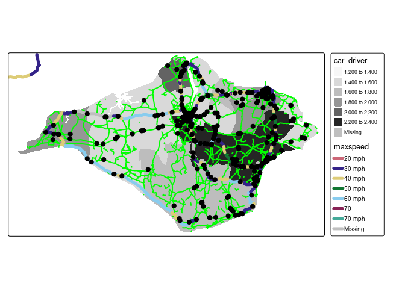

Coursework submission for Transport Data Science (TRAN5340M)
================
Student 12345

# Guidance

This template contains information and suggested headings for the TDS
module. It is based on an RMarkdown file. See the source code here:
<https://github.com/ITSLeeds/TDS/blob/master/coursework-template.Rmd> .
Do not submit coursework that contains this note or any text (other than
the headings) from this template. It is just designed to get you
started. You will submit the .Rmd file, optionally included in a .zip
file if you want to include data, and the resulting PDF document as your
coursework submission.

As outlined in the module catalogue, the coursework should be a maximum
of 10 pages long, excluding references and appendices (you should
include your best work and think about maximising the use of space - the
chunk option `out.width="50%"`, for example, can help with this as
outlined [here](https://bookdown.org/yihui/bookdown/figures.html) )

An example of a good submission can be found here (requires a University
of Leeds login):
<https://leeds365.sharepoint.com/sites/msteams_cbf52a/Shared%20Documents/General/stats19-example.zip>

The information below provides guidance on the coursework.

## 0.1 Two pager

-   Deadline for non-assessed submission of a 1 or 2 page pdf document
    with ideas before the final submission. The document will allow you
    to ask questions (e.g. “does this sound like a reasonable input
    dataset and topic?”) and describe progress on reading in input
    datasets and the analysis plan. The document will contain:
    -   A draft title of your topic
    -   The main dataset that you will use and other datasets that you
        could use
    -   Ideas on a research question
    -   Questions you would like to ask about the topic, e.g. ‘is this a
        suitable dataset?’
    -   2 or more references to the academic literature related to the
        topic
    -   Any preliminary analysis you have done
    -   The structure of the document could include
        -   Topics considered
        -   Input datasets
        -   Analysis plan - I suggest creating a workflow diagram for
            this, e.g. as presented
            [here](https://user-images.githubusercontent.com/1825120/127524923-7d9f5511-84a6-430b-8de9-a603a5524f39.png)
        -   Motivation for choosing this topic
        -   Questions and options

## 0.2 Final submission

-   Deadline: Friday 14th May, 14:00
-   Format: a PDF file (max 10 pages) and an Rmd file in a .zip file
    containing the Rmd file and minimal dataset needed to reproduce the
    results if possible (40 MB max size)
-   Template: You can download a template .Rmd file as the basis of your
    submission:
    <https://github.com/ITSLeeds/TDS/raw/master/coursework-template.Rmd>

For the coursework you will submit a pdf a document with a maximum of 10
pages that contains code and results demonstrating your transport data
science skills.

You should submit you work in .zip file containing everything needed to
reproduce the results:
<https://github.com/ITSLeeds/TDS/releases/download/0.20.1/coursework-template.zip>

## 0.3 Choosing a topic and writing your coursework

You will need to choose a topic, one or more datasets to analyse and
research questions for the 10 page coursework report.

Designing and writing a good data science project involves many stages,
not just writing and and knitting an Rmd document reporting data
analysis methods and results. The process involves:

-   Brainstorming: what kind of topics and research questions are you
    interested in?
-   Dataset identification: what datasets are available on the topic? If
    there are not good datasets related to the topic you may want to
    rethink your topic.
-   Research questions: what questions do you want to know
-   Data processing: what did you do to read-in the data?
-   Exploratory data analysis: visualisation, describing the data
-   Modelling/communication

As in real world data science work, there are many options to choose
from. You should decide on a topic based on your personal interest and
the availability of a good dataset. You can choose from and adapt one of
the following options or choose a topic of your own.

### 0.3.1 Topics

-   Data collection and analysis

    -   What is the relationship between travel behaviour (e.g. as
        manifested in origin-destination data represented as desire
        lines, routes and route networks) and road traffic casualties in
        a transport region (e.g. London, West Midlands and other regions
        in the `pct::pct_regions$region_name` data)
    -   Analysis of a large transport dataset,
        e.g. <https://www.nature.com/articles/sdata201889>

-   Infrastructure and travel behaviour

    -   What are the relationships between specific types of
        infrastructure and travel, e.g. between fast roads and walking?
    -   How do official sources of infrastructure data (e.g. the
        [CID](https://github.com/PublicHealthDataGeek/CycleInfraLnd/))
        compare with crowd-sourced datasets such as OpenStreetMap (which
        can be accessed with the new [`osmextract` R
        package](https://github.com/ropensci/osmextract))
    -   Using new data sources to support transport planning, e.g. using
        data from <https://telraam.net/> or
        <https://dataforgood.facebook.com/dfg/tools/high-resolution-population-density-maps>

-   Changing transport systems

    -   Modelling change in transport systems, e.g. by comparing
        before/after data for different countries/cities, which
        countries had the hardest lockdowns and where have changes been
        longer term? - see here for open data:
        <https://github.com/ActiveConclusion/COVID19_mobility>
    -   How have movement patterns changed during the Coronavirus
        pandemic and what impact is that likely to have long term (see
        [here](https://saferactive.github.io/trafficalmr/articles/report3.html)
        for some graphics on this)

-   Software development

    -   Creating a package to make a particular data source more
        accessible, see <https://github.com/ropensci/stats19> and
        <https://github.com/elipousson/crashapi> examples
    -   Integration between R and A/B Street - see
        <https://github.com/a-b-street/abstr>

-   Road safety - how can we makes roads and transport systems in
    general safer?

-   Other

    -   Other topics are welcome

### 0.3.2 Datasets

You should choose the main dataset that you will use for the coursework
based on the topic and the availability of datasets. If you are
interested in a particular dataset that could help you decide a topic.
Good datasets include:

-   STATS19 road crash data (other countries have other datasets),
    e.g. using data from the `stats19` package:
    <https://docs.ropensci.org/stats19/>
-   ‘PCT’ data from UK travel behaviour - see
    <https://itsleeds.github.io/pct/>
-   OpenStreetMap data (global, you will need to think of a subset by
    area/type), e.g. from the
    <https://docs.ropensci.org/osmextract/index.html> package
-   Traffic count data, e.g. from the DfT, as described here:
    <https://github.com/ITSLeeds/dftTrafficCounts>
-   Open data from a single city, e.g. Seattle:
    <https://data-seattlecitygis.opendata.arcgis.com/>
-   See here:
    <https://github.com/awesomedata/awesome-public-datasets#transportation>
-   And here: <https://github.com/CUTR-at-USF/awesome-transit>
-   and [here](https://github.com/ITSLeeds/opentransportdata)

### 0.3.3 Specific coursework options

If you are struggling for ideas and example code, these resources, in
addition to the links provided in the lectures and practicals can help:

If this is a resit you must choose a different topic.

<!-- 1. Work through the stats19 training vignette to sharpen your R skills: https://docs.ropensci.org/stats19/articles/stats19-training.html -->
<!-- 2. Take a look at the Model Basics chapter (and the next if interested) of the book R for Data Science: https://r4ds.had.co.nz/model-basics.html -->
<!-- 3. Try to reproduce the results presented in the ML practical: https://github.com/ITSLeeds/TDS/blob/master/practicals/9-ml.md -->
<!-- When working on the homework you should be thinking about the datasets that you want to use for your coursework assignment. Ideas for datasets that you could use are: -->

You could pick one of these topics:

-   What explanatory variables best predict the level of walking in
    Leeds (or a different English city), and how do walking levels
    relate to pedestrian safety? You could use the command
    `pct::get_desire_lines(region = "west-yorkshire")` to get data on
    walking desire lines and `get_stats19()` to get road crash data for
    Leeds. In terms of the topics covered in the lectures you could:

    -   Show understanding of data science in context with a brief
        introduction that touches on the definition of transport data
        science
    -   Demonstrate understanding of data structures by converting from
        a data frame of road crashes to an sf object
    -   Show routes, e.g. by getting route data with
        `pct::get_pct_routes_fast()`
    -   Show your data visualisation skills by visualising the datasets
    -   Demonstrate understanding of modelling with a simple model to
        explain why the rate of walking varies, e.g. with the distance
        of the trip and variables that you will calculate (e.g. distance
        from the city centre)

-   What factors are associated with low levels of walking and cycling
    and high road traffic casualty rates in the UK?

-   How accessible are parks and other amenities for different areas of
    a particular city

    -   This could be done using data from OSM and perhaps official data
        from local government

## 0.4 Marks

Marks are awarded in 4 categories, accounting for the following
criteria:

**Data, processing access and cleaning**

1.  The selection and effective use of input datasets that are large
    (e.g. covering multiple years), complex (e.g. containing multiple
    variables) and diverse (e.g. input datasets from multiple sources
    are used and where appropriate combined in the analysis)
2.  Describe how the data was collected and implications for data
    quality, and outline how the input datasets were downloaded (with a
    reproducible example if possible)
3.  Evidence of data cleaning techniques and adding value to the dataset
    (e.g. by creating new variables or by joining two datasets)
4.  Use of transport planning techniques such as use of buffers,
    scenarios, origin-destination data analysis geographic desire lines
    and routing

**Choice of topic and impact**

1.  Topic selection, including originality, availability of datasets
    related to the topic and relevance to solving transport planning
    problems
2.  Discuss alternative topics considered and justify the topic
3.  Make specific recommendations for further research or policies that
    are supported by the data analysis undertaken
4.  Explain the potential impacts of the work

**Visualization**

1.  Creation of figures that are readable and well-described (e.g. with
    captions and description)
2.  High quality, attractive and innovative visualisations
3.  Description of visualisation techniques, e.g. with reference to
    particular packages, commands, or the literature on how to produce
    effective data visualisations
4.  Using visualisation techniques appropriate to the topic and data and
    interpreting the results correctly (e.g. mentioning potential
    confounding factors that could account for observed patterns)

**Understand data science processes, concepts, methods and approaches**

1.  Demonstrate understanding of core concepts of data science, such as
    cleaning and reshaping data (e.g. data aggregation and dimension
    reduction), combining multiple datasets, joining, exploratory data
    analysis and visualisation, and how the work could be tranferred to
    different contexts (e.g. other time periods, cities and countries)
2.  Discuss alternative methods/approaches that could have been used to
    research the topic (e.g. qualitative research, use of alternative
    data sources), and consider and their advantages and disadvantages
    compared with your data science approach
3.  Enable reproducibility, by documenting key parts the code have
    written as part of the analysis, e.g. with reference to a key code
    chunk shown in the report and with reference to particular lines of
    code in the RMarkdown file underpinning the analysis, links to
    online resources for others wanting to reproduce the analysis for
    another area, and links to the input data, the report is fully
    reproducible, including generation of figures where possible and
    guidance on how to reproduce the results (e.g. provided in a
    footnote in the report or with a link to code stored in a platform
    such as GitHub/GitLab)
4.  Discussion of the limitations of the analysis and implications for
    the findings and how they could be addressed in future research and
    what type of data collection activities could address those
    limitations

## 0.5 Report structure

The report should have a logical structure with key headings such as:

-   Introduction
-   Input data and data cleaning
-   Exploratory data analysis
-   Discussion (e.g. strengths and weaknesses)
-   Conclusion (e.g. how the results could be used and next steps)
-   References

An example report structure is shown below.

## 0.6 Information about RMarkdown

This is an R Markdown file. You can set the output by changing
`output: github_document` to something different, like
`output: html_document`. You will need to submit your work as a pdf
document, which can be generated by converting html output to pdf
(e.g. with the `pagedown` package) or (recommended) by setting the
output to `pdf_document`. The first lines of your RMarkdown document
could look something like this to ensure that the output is a PDF
document and that the R code does not run (set `eval = FALSE` to not run
the R code):

    ---
    title: "Coursework submission for Transport Data Science (TRAN5340M)"
    subtitle: "Enter your own title here (e.g. Exploring open transport data: a study of the Isle of Wight)"
    output:
      pdf_document:
        number_sections: true
    author: "Student 12345"
    bibliography: references.bib
    ---

``` r
knitr::opts_chunk$set(echo = TRUE, warning = FALSE, message = FALSE, eval = TRUE)
```

See here for more info: <https://rmarkdown.rstudio.com/lesson-2.html>

When you open this file in RStudio and click the **Knit** button all R
code chunks are run and a markdown file (.md) suitable for publishing to
GitHub is generated.

To ensure the document is reproducible, you should include a code chunk
that shows which packages you used. You may need to install new
packages:

``` r
# install.packages("remotes")
install.packages("osmextract")
install.packages("pct")
install.packages("stats19")
```

We load the package as follows:

``` r
library(pct)
library(sf)
library(stplanr)
library(tidyverse)
library(tmap)
```

You can add references manually or with `[@citation-key]` references
linking to a .bib file like this\[@lovelace_stplanr_2017\]. And this
\[@fox_data_2018\].

## 0.7 Including Code

You can include R code in the document as follows:

``` r
summary(cars)
```

    ##      speed           dist       
    ##  Min.   : 4.0   Min.   :  2.00  
    ##  1st Qu.:12.0   1st Qu.: 26.00  
    ##  Median :15.0   Median : 36.00  
    ##  Mean   :15.4   Mean   : 42.98  
    ##  3rd Qu.:19.0   3rd Qu.: 56.00  
    ##  Max.   :25.0   Max.   :120.00

## 0.8 Including Plots

You can also embed plots, for example:

<!-- -->

Note that the `echo = FALSE` parameter was added to the code chunk to
prevent printing of the R code that generated the plot.

# 1 Introduction

This example report explores road casualty data in the Isle of Wight.

# 2 Datasets used

You can get zone, OD and even route data for any city in the UK with the
following commands. We got data for the Isle of Wight with the following
commands:

``` r
library(pct)
region_name = "isle-of-wight"
z = get_pct_zones(region = region_name, geography = "msoa")
od = get_od()
od_in_zones = od %>% 
  filter(geo_code1 %in% z$geo_code) %>% 
  filter(geo_code2 %in% z$geo_code) 
desire_lines = od2line(od_in_zones, z)
```

You could get data from OpenStreetMap with the `osmdata` package.

``` r
library(osmdata)
osm_data = opq("isle of wight") %>% 
  add_osm_feature(key = "highway", value = "primary") %>% 
  osmdata_sf()
```

You can get large OSM datasets with `osmextract`:

``` r
iow_highways = osmextract::oe_get("Isle of Wight", layer = "lines")
```

    ##   |                                                                              |                                                                      |   0%  |                                                                              |                                                                      |   1%  |                                                                              |=                                                                     |   1%  |                                                                              |=                                                                     |   2%  |                                                                              |==                                                                    |   2%  |                                                                              |==                                                                    |   3%  |                                                                              |==                                                                    |   4%  |                                                                              |===                                                                   |   4%  |                                                                              |===                                                                   |   5%  |                                                                              |====                                                                  |   5%  |                                                                              |====                                                                  |   6%  |                                                                              |=====                                                                 |   7%  |                                                                              |=====                                                                 |   8%  |                                                                              |======                                                                |   8%  |                                                                              |======                                                                |   9%  |                                                                              |=======                                                               |   9%  |                                                                              |=======                                                               |  10%  |                                                                              |=======                                                               |  11%  |                                                                              |========                                                              |  11%  |                                                                              |========                                                              |  12%  |                                                                              |=========                                                             |  12%  |                                                                              |=========                                                             |  13%  |                                                                              |=========                                                             |  14%  |                                                                              |==========                                                            |  14%  |                                                                              |==========                                                            |  15%  |                                                                              |===========                                                           |  15%  |                                                                              |===========                                                           |  16%  |                                                                              |============                                                          |  17%  |                                                                              |============                                                          |  18%  |                                                                              |=============                                                         |  18%  |                                                                              |=============                                                         |  19%  |                                                                              |==============                                                        |  19%  |                                                                              |==============                                                        |  20%  |                                                                              |==============                                                        |  21%  |                                                                              |===============                                                       |  21%  |                                                                              |===============                                                       |  22%  |                                                                              |================                                                      |  22%  |                                                                              |================                                                      |  23%  |                                                                              |=================                                                     |  24%  |                                                                              |=================                                                     |  25%  |                                                                              |==================                                                    |  25%  |                                                                              |==================                                                    |  26%  |                                                                              |===================                                                   |  26%  |                                                                              |===================                                                   |  27%  |                                                                              |===================                                                   |  28%  |                                                                              |====================                                                  |  28%  |                                                                              |====================                                                  |  29%  |                                                                              |=====================                                                 |  29%  |                                                                              |=====================                                                 |  30%  |                                                                              |=====================                                                 |  31%  |                                                                              |======================                                                |  31%  |                                                                              |======================                                                |  32%  |                                                                              |=======================                                               |  32%  |                                                                              |=======================                                               |  33%  |                                                                              |========================                                              |  34%  |                                                                              |========================                                              |  35%  |                                                                              |=========================                                             |  35%  |                                                                              |=========================                                             |  36%  |                                                                              |==========================                                            |  37%  |                                                                              |==========================                                            |  38%  |                                                                              |===========================                                           |  38%  |                                                                              |===========================                                           |  39%  |                                                                              |============================                                          |  39%  |                                                                              |============================                                          |  40%  |                                                                              |============================                                          |  41%  |                                                                              |=============================                                         |  41%  |                                                                              |=============================                                         |  42%  |                                                                              |==============================                                        |  42%  |                                                                              |==============================                                        |  43%  |                                                                              |==============================                                        |  44%  |                                                                              |===============================                                       |  44%  |                                                                              |===============================                                       |  45%  |                                                                              |================================                                      |  45%  |                                                                              |================================                                      |  46%  |                                                                              |=================================                                     |  47%  |                                                                              |=================================                                     |  48%  |                                                                              |==================================                                    |  48%  |                                                                              |==================================                                    |  49%  |                                                                              |===================================                                   |  49%  |                                                                              |===================================                                   |  50%  |                                                                              |===================================                                   |  51%  |                                                                              |====================================                                  |  51%  |                                                                              |====================================                                  |  52%  |                                                                              |=====================================                                 |  52%  |                                                                              |=====================================                                 |  53%  |                                                                              |======================================                                |  54%  |                                                                              |======================================                                |  55%  |                                                                              |=======================================                               |  55%  |                                                                              |=======================================                               |  56%  |                                                                              |========================================                              |  56%  |                                                                              |========================================                              |  57%  |                                                                              |========================================                              |  58%  |                                                                              |=========================================                             |  58%  |                                                                              |=========================================                             |  59%  |                                                                              |==========================================                            |  59%  |                                                                              |==========================================                            |  60%  |                                                                              |==========================================                            |  61%  |                                                                              |===========================================                           |  61%  |                                                                              |===========================================                           |  62%  |                                                                              |============================================                          |  62%  |                                                                              |============================================                          |  63%  |                                                                              |=============================================                         |  64%  |                                                                              |=============================================                         |  65%  |                                                                              |==============================================                        |  65%  |                                                                              |==============================================                        |  66%  |                                                                              |===============================================                       |  66%  |                                                                              |===============================================                       |  67%  |                                                                              |===============================================                       |  68%  |                                                                              |================================================                      |  68%  |                                                                              |================================================                      |  69%  |                                                                              |=================================================                     |  69%  |                                                                              |=================================================                     |  70%  |                                                                              |=================================================                     |  71%  |                                                                              |==================================================                    |  71%  |                                                                              |==================================================                    |  72%  |                                                                              |===================================================                   |  72%  |                                                                              |===================================================                   |  73%  |                                                                              |====================================================                  |  74%  |                                                                              |====================================================                  |  75%  |                                                                              |=====================================================                 |  75%  |                                                                              |=====================================================                 |  76%  |                                                                              |======================================================                |  77%  |                                                                              |======================================================                |  78%  |                                                                              |=======================================================               |  78%  |                                                                              |=======================================================               |  79%  |                                                                              |========================================================              |  79%  |                                                                              |========================================================              |  80%  |                                                                              |========================================================              |  81%  |                                                                              |=========================================================             |  81%  |                                                                              |=========================================================             |  82%  |                                                                              |==========================================================            |  82%  |                                                                              |==========================================================            |  83%  |                                                                              |==========================================================            |  84%  |                                                                              |===========================================================           |  84%  |                                                                              |===========================================================           |  85%  |                                                                              |============================================================          |  85%  |                                                                              |============================================================          |  86%  |                                                                              |=============================================================         |  87%  |                                                                              |=============================================================         |  88%  |                                                                              |==============================================================        |  88%  |                                                                              |==============================================================        |  89%  |                                                                              |===============================================================       |  89%  |                                                                              |===============================================================       |  90%  |                                                                              |===============================================================       |  91%  |                                                                              |================================================================      |  91%  |                                                                              |================================================================      |  92%  |                                                                              |=================================================================     |  92%  |                                                                              |=================================================================     |  93%  |                                                                              |==================================================================    |  94%  |                                                                              |==================================================================    |  95%  |                                                                              |===================================================================   |  95%  |                                                                              |===================================================================   |  96%  |                                                                              |====================================================================  |  96%  |                                                                              |====================================================================  |  97%  |                                                                              |====================================================================  |  98%  |                                                                              |===================================================================== |  98%  |                                                                              |===================================================================== |  99%  |                                                                              |======================================================================|  99%  |                                                                              |======================================================================| 100%
    ## 0...10...20...30...40...50...60...70...80...90...100 - done.
    ## Reading layer `lines' from data source 
    ##   `/tmp/Rtmps3deAo/geofabrik_isle-of-wight-latest.gpkg' using driver `GPKG'
    ## Simple feature collection with 49243 features and 9 fields
    ## Geometry type: LINESTRING
    ## Dimension:     XY
    ## Bounding box:  xmin: -5.715479 ymin: 43.35489 xmax: 1.92832 ymax: 51.16517
    ## Geodetic CRS:  WGS 84

``` r
summary(as.factor(iow_highways$highway))
```

    ##      bridleway         busway   construction       cycleway        footway 
    ##            176              2             37            192           6057 
    ##  living_street           path     pedestrian        primary   primary_link 
    ##              3            690             32            590             20 
    ##       proposed        raceway    residential      secondary secondary_link 
    ##             12              1           2857            385              1 
    ##        service          steps       tertiary  tertiary_link          track 
    ##           7849            420            520              2           4197 
    ##   unclassified           NA's 
    ##            858          24342

``` r
iow_highways2 = iow_highways %>% 
  filter(!is.na(highway)) %>% 
  filter(!str_detect(string = highway, pattern = "primary|track|resi|service|foot"))
summary(as.factor(iow_highways2$highway))
```

    ##      bridleway         busway   construction       cycleway  living_street 
    ##            176              2             37            192              3 
    ##           path     pedestrian       proposed        raceway      secondary 
    ##            690             32             12              1            385 
    ## secondary_link          steps       tertiary  tertiary_link   unclassified 
    ##              1            420            520              2            858

You could get road casualty data with the `stats19` package, as shown
below.

``` r
crashes = stats19::get_stats19(year = 2018, output_format = "sf") %>% 
  sf::st_transform(crs = sf::st_crs(z))

crashes_in_region = crashes[z, ]
tm_shape(z) +
  tm_fill("car_driver", palette = "Greys") +
  tm_shape(iow_highways2) +
  tm_lines(col = "green", lwd = 2) +
  tm_shape(osm_data$osm_lines) +
  tm_lines(col = "maxspeed", lwd = 5) +
  tm_shape(crashes_in_region) +
  tm_dots(size = 0.5, col = "red")
```

<!-- -->

# 3 Descriptive analysis

``` r
plot(desire_lines)
```

<!-- -->

# 4 Route analysis

A next step could be route network analysis.

See <https://luukvdmeer.github.io/sfnetworks/> for an approach we could
use (this could be a coursework topic on its own).

# 5 Additional datasets

# 6 Policy analysis

Here you could explain how you explored answers to policy questions such
as:

-   how to make the roads safer?
-   how to reduce congestion?
-   where to build bike parking?

# 7 Discussion

Include here limitations and ideas for further research.

# 8 Conclusion

What are the main things we have learned from this project?

To make the code reproducible I saved the code and data as follows

``` r
# Save outputs into zip file:
zip(zipfile = "coursework-template.zip", files = c(
  "coursework-template.Rmd",
  "tds.bib",
  "timetable.csv"
))
# piggyback::pb_upload("coursework-template.zip") # ignore this command
# piggyback::pb_upload("coursework-template.pdf") # ignore this command
```

# 9 References

Add your references here.

Reference 1

Reference 2

…

Lovelace, R., 2021. Open source tools for geographic analysis in
transport planning. J Geogr Syst.
<https://doi.org/10.1007/s10109-020-00342-2>

Boeing, G., 2021. Spatial information and the legibility of urban form:
Big data in urban morphology. International Journal of Information
Management 56, 102013. <https://doi.org/10.1016/j.ijinfomgt.2019.09.009>
