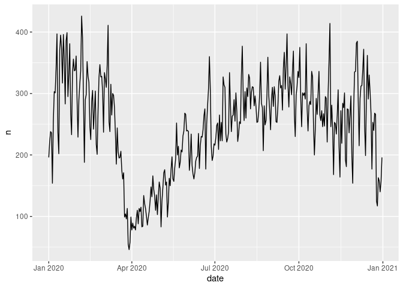

# The impact of lockdowns on collisions

# Introduction

This document explores the impact of lockdowns on the rate of
collisions.

# Data and methods

Datasets were taken from the STATS19 database and processed with the
`stats19` R package (Lovelace et al. 2019).

# Results

See the results in
<a href="#fig-crashes-per-day" class="quarto-xref">Figure 1</a>.

# Conclusion

# References

Lovelace, Robin, Malcolm Morgan, Layik Hama, and Mark Padgham. 2019.
“Stats19 a Package for Working with Open Road Crash Data.” *Journal of
Open Source Software* 4 (33): 1181.
<https://doi.org/10.21105/joss.01181>.

