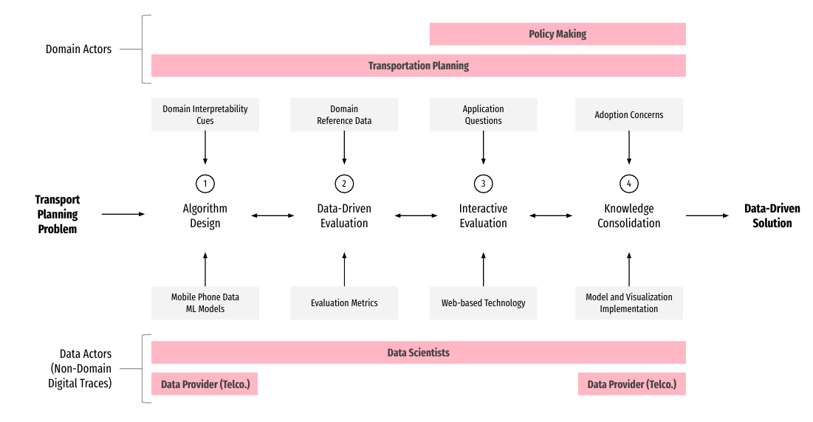

```{r, include=FALSE}
knitr::opts_chunk$set(echo = FALSE)
```


<!-- # Introduction -->
<!-- Welcome to Transport Data Science.  -->
<!-- Please make sure to read everything here in detail before the class begins. -->

# Module Information

## Module description

This module provides a broad outline of data science for transport planning.
The module delivery is undertaken via an even split between lectures, practical workshops, and seminars.
Lectures will familiarise you with key concepts and topics.
Workshops will provide a space for you to put the concepts into action, with reproducible scripts to actually *do* data science you develop programming and real world data science skills.
In seminars you will hear from experts using data science techniques to improve transport systems worldwide, making them more sustainable, healthy and efficient.

The split between lectures, practicals and seminars is shown below.

<p><table border="1" width="100%"><tr><td align="left" width="40%">Delivery type</td><td align="right" width="20%">Number</td><td align="right" width="20%">Length hours</td><td align="right" width="20%">Student hours</td></tr>
<!-- Delivery type |                 Number |             Length hours |           Student hours -->
<TR><TD>Lecture</TD><TD align="right">5</TD><TD align="right">1.00</TD><TD align="right">5.00</TD></TR>
<TR><TD>Practical</TD><TD align="right">6</TD><TD align="right">2.5</TD><TD align="right">15.00</TD></TR>
<TR><TD>Seminar</TD><TD align="right">2</TD><TD align="right">2.5</TD><TD align="right">5.00</TD></TR>
<!-- Totals                                                                                         -->
<tr><td colspan="3">Private study hours</td><td align="right">125.00</td></tr><tr><td colspan="3">Total Contact hours</td><td align="right">25.00</td></tr><tr><td colspan="3">Total hours (100hr per 10 credits)</td><td align="right">150.00</td></tr></table>

Further details of the module, including the full module description, learning outcomes, and reading list can be found on the [module catalogue](https://webprod3.leeds.ac.uk/catalogue/dynmodules.asp?Y=202122&M=TRAN-5340M).


The quantity, diversity and availability of transport data is increasing rapidly, requiring skills in the management and interrogation of data and databases.
Recent years have seen a new wave of 'big data' and 'data science' changing the world, with the Harvard Business Review describing Data Science as the 'sexiest job of the 21st century' (see [hbr.org](https://hbr.org/2012/10/data-scientist-the-sexiest-job-of-the-21st-century)).
Transport researchers increasingly need to take data from a wide range of sources and perform non-standard analyses methods on them to inform the decision-making process.

Data science skills are sought after and data scientists are [well paid](https://towardsdatascience.com/salary-breakdown-of-the-top-data-science-jobs-cf83c6464a59).
More importantly for job satisfaction, data scientists have the potential to tackle some of the world's greatest challenges [@olmos_data_2020].
Opportunities for data scientists to support transport planning to be more effective and aligned to the public interest are shown in Figure \@ref(fig:schematicdt).
Data science skills and dedicated data scientists have a huge amount to offer transport planners, especially when considering large transport systems [@graells-garrido_adoptiondriven_2020] and the urgent problem of rapid decarbonisation to tackle the climate crises, which cannot be solved using traditional methods alone [@lovelace_open_2020].

```{r schematicdt, fig.cap="Schematic diragram showing how data science techniques can support transport planning. From Graells-Garrido et al. (2020)."}

```


Despite these developments the transport sector has been slow to adapt to new methods and workflows [@lovelace_open_2021].
The Transport Systems Catapult, for example, identified a skills gap in "skilled technical talent capable of handling and analysing very large datasets compiled from multiple sources" (see [ts.catapult.org.uk](https://ts.catapult.org.uk/news-events-gallery/news/report-warns-of-uk-skills-shortage-in-im-sector/)).

This module takes a practical approach to learning about 'data science' tools and their application to investigating transport issues.
The focus is on practical data science, enabling attendees to make use of a wide range of datasets to answer real-world transport planning questions.
The course objectives are to:

- Understand the structure of transport datasets, from origin-destination to street segment levels
- Understand how to obtain, clean and store transport related data.
- Gain proficiency in command-line tools for handling large transport datasets.
- Produce data visualizations, static and via interactive web maps
- Learn where to find large transport datasets and assess data quality
- Learn how to join together the components of transport data science into a cohesive project portfolio 

## Links with other modules

This module can be taken as part of multiple courses:

- [Urban data science and analytics](https://courses.leeds.ac.uk/j135/urban-data-science-and-analytics-msc), a cross faculty MSc program
- The [Transport Planning and the Environment MSc](https://environment.leeds.ac.uk/courses/a386/transport-planning-and-the-environment-msc) course at ITS
- An optional module on the [Data Science and Data Analytics](https://courses.leeds.ac.uk/i071/data-science-and-analytics-msc) MSc course

It builds on an understanding of reproducible analysis, statistics, and exploratory data analysis.

# Module team

The module leader is Dr Robin Lovelace, an Associate Professor of Transport Data Science Institute for Transport Studies, University of Leeds.
He researches scalable, open source and interactive transport models.
He has a degree in Geography from the University of Bristol, an MSc in Environmental Science and Management from the University of York and a PhD from the university of Sheffield.

Robin is also a programmer and has contributed many software tools and resources to the data science and transport communities.
For more information see Robin's [website](https://www.robinlovelace.net/).

The course is also supported by Dr [Joey Talbot](https://environment.leeds.ac.uk/transport/staff/8838/dr-joey-talbot) Research Fellow in Transport Data Science.

# Pre-requisites

See the [the course website](https://github.com/ITSLeeds/TDS#prerequisites) web page for module pre-requisites.

You will be expected to have a laptop with recent versions of R and RStudio installed.


## Course reading
Before the course starts you should read key texts on transport data science.

**Essential**

- The [transport chapter](http://geocompr.robinlovelace.net/transport.html) (available free [online](http://geocompr.robinlovelace.net/)) [@lovelace_geocomputation_2019]

**Core**

- Paper on open source tools for geographic analysis in transport planning [@lovelace_open_2021]
- Introduction to data science with R (available free [online](http://r4ds.had.co.nz/)) [@grolemund_r_2016]
<!-- - Introductory textbook introducing machine learning with lucid prose and worked examples in R (available free [online](http://www-bcf.usc.edu/~gareth/ISL/index.html)) [@james_introduction_2013] -->
- Paper on analysing OSM data in Python (available [online](https://arxiv.org/pdf/1611.01890)) [@boeing_osmnx_2017]

**Optional**

- Paper on the **stplanr** paper for transport planning (available [online](https://cran.r-project.org/web/packages/stplanr/vignettes/stplanr-paper.html)) [@lovelace_stplanr_2018]
- Book on transport data science in Python [@fox_data_2018]
- Papers describing the use of data science to solve transport planning problems [e.g. @szell_growing_2021; @orozco_datadriven_2020]
<!-- - Seminal text on visualisation (available [online](https://github.com/yowenter/books/blob/master/Design/Edward%20R%20Tufte%20-The%20Visual%20Display%20of%20Quantitative%20Information.pdf), style available in the [tufte](https://github.com/rstudio/tufte) R package) [@tufte_visual_2001] -->
- An academic paper describing the development of a web application for the Department for Transport [@goodman_scenarios_2019]

<!-- Mayer-Schonberger V. and Cukier K. 2013. Big Data: A Revolution That -->
<!-- Will Transform How We Live, Work and Think. -->
<!-- John Murray publica- -->
<!-- tions. -->
<!-- - -->
<!-- Townsend, A.M. Smart Cities - Big Data, Civic Hackers, and the Quest -->
<!-- for a New Utopia. Norton 2014. -->
<!-- - -->
<!-- Lohr, S. 2015. Dataism. One World Publications. -->
<!-- Please also have a look at my own paper which is discussed in the rst session: -->
<!-- 3- -->
<!-- Charles Fox, Peter Billington, Dominic Paulo, and Clive Cooper. -->
<!-- Ori- -->
<!-- gin destination analysis on the London orbital automated number plate -->
<!-- recognition network. In European Transport Conference, 2010. -->
<!-- A blog full of beautiful examples of data science  perhaps you will contribute -->
<!-- to it one day? -->
<!-- - -->
<!-- www.informationisbeautiful.net -->
<!-- For fun - but making serious points about what might be possible with data: -->
<!-- - -->
<!-- Movie: Minority Report. 20th Century Fox, 2002. (Or read the Philip K -->
<!-- Dick short story if you prefer) -->
<!-- - -->
<!-- Video game: Sim City. Maxis, 2003. (or free clones such as http://www.opencity.info/) -->
<!-- If you like money, try searching this jobs website for data scientist salaries: -->

<!-- ## Specific/online resources -->

<!-- - For 'data science' and transport jobs on see sites such as www.cwjobs.co.uk -->


<!-- Riley, Hobson and Bence. -->
<!-- Mathematical Methods for Physics and En- -->
<!-- gineering (3rd edition): A Comprehensive Guide. Cambridge University -->
<!-- Press 2006. -->

<!-- You should be familiar with junior-school and high-school programming, prefer- -->
<!-- ably in Python, as covered in, -->
<!-- - -->
<!-- 5 -->
<!-- J.R. Briggs. Python for Kids. No Starch Press, 2012. [For ages 10+] -->

<!-- Note: If you are new to quickly reading and mapping out large chucks of knowledge, the mind mapping approach can help. -->

<!-- # Team working -->

<!-- Although individual reports will be submitted, you are encouraged to collaborate throughout the course. -->
<!-- Group projects that are based on a single topic or dataset, but with each member focussing on a different aspect for the report, are allowed. -->

# Getting support

- The class schedule is available on the central ITS timetable webpage.
- Session format will vary but will typically include a presentation and discussion of new topics, then project work where the lecturer is available to help with practical work.
- Much of the work contributing to the final report will be done outside class hours

Questions are encouraged so please just ask if you have any doubts.
We recommend you ask questions in the following order of priority:

1. ask course colleagues for help
2. search the Internet for technical problems before asking
3. create a reproducible example to highlight the question in code and ask in an online forum such as [StackOverflow](https://stackoverflow.com/) or the module's [issue tracker](https://github.com/ITSLeeds/TDS/issues/)
4. if all the above steps fail you can ask someone from the course team for support via chat on Teams or email, questions asked in the general channel that benefit others will be prioritised, would should share details of what you have tried in previous steps if you ask course staff

# Coursework information

This is a 15 credit module that is 100% assessed through coursework.

## Examination method

The module is 100% examined by a report on a single project that showcases skills you have learned during the course on a real transport dataset.
The coursework can be a **maximum** of **10 pages** long in total, excluding references.
Quality is valued over quantity.

The coursework is a 'portfolio' of work that you will build-up over the course of the project.

## Coursework Format

All coursework should be submitted as both a .zip containing a .pdf file with the report, ideally made using the template [coursework-template.Rmd](https://github.com/ITSLeeds/TDS/blob/master/coursework-template.Rmd), and with reproducible code and a small sample of data used to generate the results.
You should not put your name on your coursework so that it can be marked anonymously, however, you should put your ID number in the header in the top right hand corner of every page after the title page, and the module number in the top left hand corner of every page after the title page.  

You must also name your file using the following format:
ModuleNumber_Student ID Number.file type
For example:

TRAN5340M_2012345678.pdf

## Coursework Submission

All coursework should be submitted electronically through turnitin by the 2pm on the day of the deadline.
Each assignment will have its own electronic submission pigeonhole in which you can upload your work.  

The purpose of all the readings, talking, and exercises is to help you build the skills and ideas needed to deliver this project and report.
Reports receiving a high grade will cite references to academic papers and other resources used in the work.
They can include resources in the taught material or resources that go beyond what has been taught in class.

## Marking scheme

To achieve a PASS, the report must demonstrate an understanding of the techniques covered in the practical sessions, with reference to concepts underlying Data Science, taught in the lectures.
At least two outputs (images, tables, model results) must be presented to demonstrate the results of your work.
There will be a basic explanation of the underlying code.
To achieve a DISTINCTION the report must include text that shows understanding that goes beyond the material presented in the module from at least one session.

High marks will be awarded to reports that show awareness of skills useful in industry and the ability to use theoretical concepts to inform the work.
Data scientists rarely work alone so marks will also be awarded for evidence of collaboration, e.g. the adaptation of someone else's (or some organisation's) code/method with full credit to the original.

<!-- The module leader does not award marks, though may recommend them as a first marker. -->
<!-- The final awards are made by a second marker examiner. -->
Marks are awarded in 5 categories, each of which is evaluated out of 20 and which will take account of the following criteria:

**Data, processing access and cleaning**

1. The selection and effective use of input datasets that are large (e.g. covering multiple years), complex (e.g. containing multiple variables) and diverse (e.g. input datasets from multiple sources are used and where appropriate combined in the analysis)
1. Describe how the data was collected and implications for data quality, and outline how the input datasets were downloaded (with a reproducible example if possible)
1. Evidence of data cleaning techniques and adding value to the dataset (e.g. by creating new variables or by joining two datasets)
1. Use of transport planning techniques such as use of buffers, scenarios, origin-destination data analysis geographic desire lines and routing

    **Choice of topic and impact**

1. Topic selection, including originality, availability of datasets related to the topic and relevance to solving transport planning problems
1. Discuss alternative topics considered and justify the topic
1. Make specific recommendations for further research or policies that are supported by the data analysis undertaken
1. Explain the potential impacts of the work

    **Visualization**

1. Creation of figures that are readable and well-described (e.g. with captions and description)
1. High quality, attractive and innovative visualisations
1. Description of visualisation techniques, e.g. with reference to particular packages, commands, or the literature on how to produce effective data visualisations
1. Using visualisation techniques appropriate to the topic and data and interpreting the results correctly (e.g. mentioning potential confounding factors that could account for observed patterns)

    **Understand data science processes, concepts, methods and approaches**

1. Demonstrate understanding of core concepts of data science, such as cleaning and reshaping data (e.g. data aggregation and dimension reduction), combining multiple datasets, joining, exploratory data analysis and visualisation, and how the work could be tranferred to different contexts (e.g. other time periods, cities and countries)
1. Discuss alternative methods/approaches that could have been used to research the topic (e.g. qualitative research, use of alternative data sources), and consider and their advantages and disadvantages compared with your data science approach
1. Enable reproducibility, by documenting key parts the code have written as part of the analysis, e.g. with reference to a key code chunk shown in the report and with reference to particular lines of code in the RMarkdown file underpinning the analysis, links to online resources for others wanting to reproduce the analysis for another area, and links to the input data, the report is fully reproducible, including generation of figures where possible and guidance on how to reproduce the results (e.g. provided in a footnote in the report or with a link to code stored in a platform such as GitHub/GitLab)
1. Discussion of the limitations of the analysis and implications for the findings and how they could be addressed in future research and what type of data collection activities could address those limitations

# ITS/Leeds standard processes

**Coursework submission**:

All coursework should be submitted via the VLE in a .zip file that contains a PDF file of up to 10 pages, and RMarkdown file that generated the PDF file and any other data files or code that generated the results.
Note: there is a maximum size of 30 MB on the size of the .ZIP file.

Do not put your name on your coursework but do put your ID number and module number on the front cover.

All coursework should be submitted electronically through turnitin on the VLE by the 2pm on the day of the deadline.
5 marks are deducted for a submission that is made after the 2pm deadline on day one, and any time until 2pm on day 2.
Thereafter students lose a further 5 marks for each subsequent period of 24 hours.
If your assessed work is over 14 days late, you
will receive a mark of 20 on the 20-90 scale or a mark of 0 on the 0-100 scale.

It is your responsibility to make sure that you have allowed enough time to submit your work and that you have a receipt.
If your receipt does not appear in your inbox straightaway you can go back to the submission area and request a receipt in order to have confirmation that you have submitted your work successfully.

Students with dyslexia Students with dyslexia should request a dyslexia coversheet be attached to their work when handing coursework.
Coursework Extension Requests Note: Extensions are only granted in
cases were a student has experienced serious difficulty which has prevented the
completion of work within the normal time period. This may be due to illness,
bereavement, family problems or similar.
They are not granted for minor or
short term problems, including IT issues
Should you have any mitigating circumstances which lead to you wanting to
request an extension to your coursework deadline, or prevent you from attending
an examination please contact ITS Student Education Service Oce before the
day of the deadline or examination.
Mitigating circumstances are significantly disruptive or unexpected events
which are beyond your control but which might affect your academic performance. If this applies, you should inform your parent school as soon as possible.

**Plagiarism.** Please make sure that you know what constitutes as plagiarism.
The University defines plagiarism as presenting someone else's work as
your own, including images and other material as well as text. Do not plagiarise, collude, or cheat in any way.
All instances of plagiarism will be treated
severely according to University disciplinary procedures. If you are unsure, check
the University Library's plagiarism web pages: http://library.leeds.ac.uk/skills-plagiarism

**Referencing.** Referencing is the acknowledgment of the sources you used when producing your piece of work.
Referencing correctly is important to demonstrate how widely you have researched your subject, to show the basis of your arguments and conclusions, and to avoid plagiarism.
You need to give the person reading your assignment enough information to nd the sources you have consulted.
This is done by including citations in your work and providing a list
of references.
You are expected to use the University's version of the Harvard referencing style for your assignments for this module.
Guidance on how to include citations within your text and how to reference die rent types of material using Harvard is provided here: http://library.leeds.ac.uk/skills-referencing. 

The course team recommends using Zotero, a free and open source reference management system.
Used in sync with writing software such as RStudio with the **citr** package installed can make referencing fun!

**Reading Materials.**
You are encouraged to read widely and engage with
the peer-reviewed academic journal articles. Reading lists are not exhaustive:
just because a paper is not mentioned on the reading list does not mean that it
is not worthwhile. You are expected to conduct your own searches for relevant
journal articles.

Library Skills is available to all students and can help
develop a wide range of academic skills and strategies.
There are workshops
available in the Laidlaw Library on lots of die rent topics, including planning
your essay or dissertation, writing academically and presentation skills. For 1-to-1 support on academic study skills you can talk to a Learning Advisor who
can help you with developing a wide range of academic skills and strategies on
topics including academic writing, critical thinking, researching and maths. See: https://library.leeds.ac.uk/skills

# Feedback

Only your the report is assessed formally as part of your MSc grade. However we recommend that you make some notes each week on the topics
presented, which the course team is able to read and give feedback on.

You are encouraged to give each other feedback as you work together.
Please provide feedback to me on my teaching in the following ways:
- Formally, by completing a module evaluation at the end
- Informally, by talking to me in and after class. Please come and talk to me and let me know how I am doing and if there are things we
can improve about the course presentation as we go along.

# Career skills

Data science is a rapidly growing area of the economy, with the number of jobs in the sector increasing by a factor of three in the five years to 2019 according to research by the [Royal Society](https://royalsociety.org/topics-policy/projects/dynamics-of-data-science/).
You will be more employable as a result of taking this module, with skills in using modern tools for data analysis, visualisation and modelling.


# References
