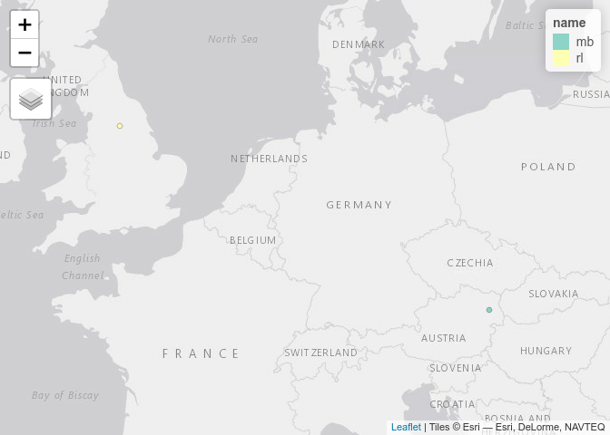

<!-- message to students, 2021-01-28 -->

Hi all,

Thank you for paying close attention and working hard during the
practical session yesterday.

It may feel like being [thrown in at the deep
end](https://www.collinsdictionary.com/dictionary/english/throw-someone-in-at-the-deep-end)
but luckily you have a life jacket: many outstanding tutorials that will
help your learning journey. You cannot learn a new language in 1 week,
let alone 1 practical session. But you all can, and I believe will, gain
proficiency with R and improve your practical data science skills over
the next three months, that is a core aim of the module.

You have homework before the next practical session to help your
journey. I estimate that these require a minimum of \~3hr but you may
benefit more from the tasks if you spend more time on them.

## Homework 1: contribute on GitHub (\~30 minutes)

Starting with the quickest piece of homework, please add the coordinates
where you are currently, the n. cups of coffee you drink per week and
favourite mode of transport for fun (you can invent the data, this is
not a test!) to this file:
<https://github.com/ITSLeeds/TDS/blob/master/messages/locations.csv>

I have added unique initials for each student and extra ‘n\_coffee’ and
‘mode’ columns. You can add your location to 0 or 1 decimal places. To
edit the file you must log-in to GitHub and then click on the pencil
shaped button in the web page above (see [here for
details](https://docs.github.com/en/github/managing-files-in-a-repository/editing-files-in-your-repository)),
which should take you to this link:

<https://github.com/ITSLeeds/TDS/edit/master/messages/locations.csv>

As an optional bonus, you can plot the data using your favourite mapping
package (suggestions, `ggplot2`, `tmap`), starting with the following
commands (try running each line interactively to help understand what
the code does):

``` r
library(tidyverse)
library(tmap)
tmap_mode("view")
url_locations = "https://github.com/ITSLeeds/TDS/raw/master/messages/locations.csv"
locations = read_csv(url_locations)
locations_sf = locations %>% 
  filter(!is.na(lon) & !is.na(lat)) %>% 
  sf::st_as_sf(coords = c("lon", "lat"))
tm_shape(locations_sf) +
  tm_dots("name")
```

<!-- -->

Bonus 2: make different visualisations of the data - you will have an
opportunity to share you map with the class next Thursday.

## Work through practical and the example with Bristol (\~60 minutes)

Ensure that you can run and understand all of the code in the ‘Bristol’
section of the practical:
<https://github.com/ITSLeeds/TDS/blob/master/practicals/2-software.md#processing-origin-destination-data-in-bristol>

You may want to go back to the previous section of the practical to
ensure you understand the concepts.

Type in the code in that section (I strong discourage copy-pasting code
here because you learn ‘muscle memory’ for coding by typing the
commands) with reference to Chapter 12 of Geocomputation with R, that
explains the data in conceptual terms:
<https://geocompr.robinlovelace.net/transport.html>

Bonus: also work through the ‘processing medium sized data’ section of
the practical and read Chapter 5 of the R for Data Science book
(Grolemund and Wickham 2016):
<https://github.com/ITSLeeds/TDS/blob/master/practicals/2-software.md#processing-medium-sized-data-and-basic-visualisation-30-minutes>

## Think about research questions and data for the coursework (\~30 minutes)

You will be assessed based on a 10 page pdf report. You do not need to
start writing the report. But before the next lecture it will help if
you have thought about transport datasets and research questions you
would like to answer using data science methods.

Bonus: create a sketch or schematic diagram illustrating the research
question you are interested in.

Creativity is an important part of the data science process so it may
help to start with a ‘blank slate.’ You can draw your ideas down on
paper on using a computer application. For inspiration, take a look at
this sketch of a web application for visualising road safety data:

<https://excalidraw.com/#room=bf5460ef09ebc3cdadef,si88ngJ5WOtODVqqjqVu3Q>

## Watch and make notes on the next lecture (\~60 minutes)

I will send you the next lecture on Monday. Be ready to watch it, make
notes, and look-up concepts and references from it.

# References

<div id="refs" class="references csl-bib-body hanging-indent">

<div id="ref-grolemund_r_2016" class="csl-entry">

Grolemund, Garrett, and Hadley Wickham. 2016. *R for Data Science*.
O’Reilly Media.

</div>

</div>
