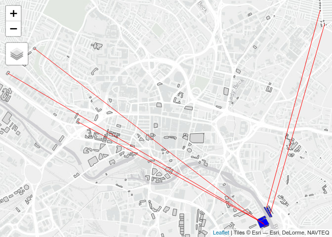
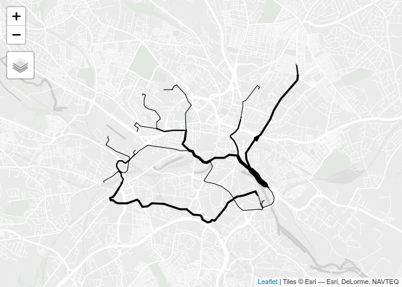
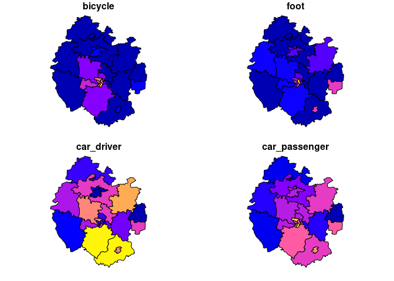

# TDS Seminar: From OD data to agent based modelling for car free futures

13:00-13:10: Introduction to the session (Robin)

13:10-13:40: A/B Street Lecture (Dustin - video)

13:40-13:55: Q&A

13:55-14:00 Break

14:00-15:00 Exercises

15:00-15:30 Discussion of coursework ideas in breakout rooms

Exercises, in ascending order of difficulty:

## Getting started (everyone) - 15 min

<!-- todo: send message saying to pre-download the zip -->
<!-- (install the abstr) -->

-   Download A/B Street and get it running:
    <https://a-b-street.github.io/docs/howto/index.html>
-   Open sandbox mode, then change the map at the top
-   Choose to download more cities, and pick **gb/leeds**
-   Open up North Leeds
-   Find the University of Leeds ITS building (using your own knowledge,
    the search tool to the bottom right, or by following the GIF below)


-   Change the scenario at the top from “none” to “trips between home
    and work”
-   Run the simulation until about 6:30 (using the speed controls at the
    bottom)

Note: If you can’t install A/B Street on your computer, ask for help. As
a last resort, you can run it in your browser, but this will be slower:
abstreet.s3-website.us-east-2.amazonaws.com/dev/game/?–dev&gb/leeds/maps/north.bin

**Next you will choose one from the following three options.**

## 1 In Game exercises - demo 5 min on key features

-   Tutorial
    -   From the main screen, open up the tutorial and play through it
        to learn basic controls
    -   If you get stuck at one of the levels, ask for help or skip it;
        the point is mostly to learn the controls
-   Editing lanes
    -   Open up the map layers (bottom right, near the minimap) and
        explore a bit
    -   Check out the bike network in Leeds – not a very connected
        network, is it?
    -   Click edit map at the top, then go click on individual lanes to
        change their type
    -   Based on your personal experience in Leeds (or another map) or
        some guesses, where should some cycle lanes go?
    -   From edit mode, you can name your proposal (from “Untitled
        Proposal”). It’s saved in a file in the
        **data/player/edits/gb/leeds/north_leeds** folder. We can
        share/discuss ideas everybody comes up with later.
-   Editing traffic signals
    -   Around 6:30 on the North Leeds map, there’s some congestion near
        Sheepscar St and Meanwood Rd
    -   Click one of the traffic signals, then edit
    -   Try to improve the timing or synchronize multiple intersections
    -   Hint: you can edit multiple intersections at the same time
    -   If you like fiddling with traffic signals, go to the main menu,
        pick challenges, and try traffic signal survivor
-   Evaluating an edited map
    -   Go to the main screen, then click Community Proposals
    -   Try the Lake Washington Blvd proposal
    -   Click on interesting roads and intersections (especially around
        the proposal) and explore the time-series data
    -   Explore the map layers (bottom right, near the minimap) –
        particularly throughput, compared to before the proposal
    -   Explore the “more data” dashboards in the top-right corner
    -   Find some individual trips that became faster or slower due to
        this change, and figure out why
    -   Does the change make fast trips much slower? Does it affect
        trips that were longer to begin with?
-   Gridlock
    -   Many problems cause the vehicles in a traffic simulation to get
        stuck, usually unrealistically
    -   Go try the weekday scenario in some Seattle maps – Phinney Ride,
        Ballard, South Seattle
    -   What are some of the problems you can find? Which might be
        caused by bad data? Which look like simulation bugs?

## 2 Import a new region (intermediate) 10 min

This exercise requires familiarity with using the command line. Go
follow <https://a-b-street.github.io/docs/howto/new_city.html>. If you
downloaded the .zip, then you can run the importer tool on a .osm file.
You may also need to get
[osmconvert](https://wiki.openstreetmap.org/wiki/Osmconvert) running.

Your goal is to import a city you’re interested in. Reach out if you
need help!

## 3 abstr (advanced) 10 min

Take a look at the documentation at
<https://a-b-street.github.io/abstr/>

Install and load the package (and the tidyverse for data manipulation
and tmap for mapping) as follows:

``` r
remotes::install_github("a-b-street/abstr")
```

``` r
library(abstr)
library(tidyverse)
library(tmap)
tmap_mode("view")
```

Reproduce the examples in the README and visualise only the resulting
driving trips at the disaggregated (building to building) level. The
results should look like this:

    ## Warning in st_centroid.sf(origin_buildings): st_centroid assumes attributes are
    ## constant over geometries of x

    ## 0 origins with no match in zone ids

    ## 0 destinations with no match in zone ids

    ##  points not in od data removed.

    ## Linking to GEOS 3.10.1, GDAL 3.4.0, PROJ 8.2.0; sf_use_s2() is TRUE

<!-- -->

    ## Default scenario name of 'test' used.

    ## Warning in st_centroid.sf(origin_buildings): st_centroid assumes attributes are
    ## constant over geometries of x

    ## Warning in st_centroid.sf(destination_buildings): st_centroid assumes attributes
    ## are constant over geometries of x

    ## 0 origins with no match in zone ids

    ## 0 destinations with no match in zone ids

    ##  points not in od data removed.

<!-- -->

Bonus: look-up the documentation for the function `stplanr::route()` and
use that in combination with the function `stplanr::route_osrm()` to
calculate driving routes associated with the desire lines shown above.

``` r
ablines_drive_routes = stplanr::route(
  l = ablines_drive,
  route_fun = stplanr::route_osrm,
  osrm.profile = "car"
)
```

    ## Warning in fun(libname, pkgname): rgeos: versions of GEOS runtime 3.10.1-CAPI-1.16.0
    ## and GEOS at installation 3.9.1-CAPI-1.14.2differ

    ## Most common output is sf

``` r
ablines_drive_routes$n = 1
ablines_rnet = stplanr::overline(ablines_drive_routes, "n")
tm_shape(ablines_rnet) + tm_lines(lwd = "n", scale = 9)
```

    ## Legend for line widths not available in view mode.

<!-- -->

What is the mean average and standard deviation of driving route
distances in that scenario?

Which of those routes could be replaced by active modes?

Bonus (warning: very difficult): Generate an A/B Street scenario of your
choice for the local authority of Hereford (or any other local authority
in England and Wales) starting with this code. Note: this requires fast
internet connection and decent computer:

``` r
local_authority_name = "Herefordshire"
pct_region_name = pct::pct_regions_lookup %>% 
  filter(lad16nm == local_authority_name) %>% 
  pull(region_name)
zones_region = pct::get_pct_zones(region = pct_region_name, geography = "msoa")
table(zones_region$lad_name)
```

    ## 
    ##               Bromsgrove Herefordshire, County of            Malvern Hills 
    ##                       14                       23                       11 
    ##                 Redditch                Worcester                 Wychavon 
    ##                       13                       14                       19 
    ##              Wyre Forest 
    ##                       14

``` r
nrow(zones_region)
```

    ## [1] 108

``` r
zones = zones_region %>% 
  filter(str_detect(string = lad_name, pattern = local_authority_name))
nrow(zones)
```

    ## [1] 23

``` r
plot(zones %>% select(bicycle:car_passenger))
```

<!-- -->

``` r
od_national = pct::get_od()
desire_lines = od::od_to_sf(od_national, z = zones)
qtm(zones, alpha = 0.3) + 
  tm_shape(desire_lines) +
  tm_lines(lwd = "all", scale = 5)
```

<!-- -->

## Working on the the exercises 20 min
