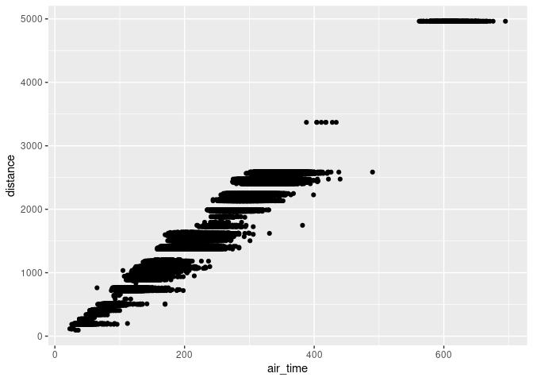
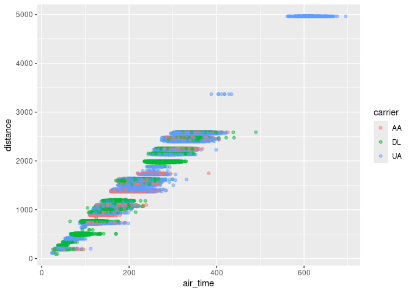

Introduction to transport data science
================
Robin Lovelace
University of Leeds
<br/>

Note: before you run this tutorial, ensure that you have recently
updated R and RStudio on your computer. Furthermore, you will need to
have installed a number of packages, as described here:
<https://docs.ropensci.org/stats19/articles/stats19-training-setup.html>

<!-- ## Agenda {-} -->
<!-- 1. Thinking about transport data science (20 min) -->
<!-- 2. Questions about the homework (10 min) -->
<!-- 3. Practical 2 (2.5 hrs) -->
<!-- - Introduction to the module and team - 30 min -->
<!-- Each person to say  1) their name and where they are based 2) why they took the module and 3) their level of knowledge of coding. -->
<!-- 1. Project set-up and using RStudio - 30 minutes -->
<!-- 1. Getting started with transport data in the stplanr package - 30 minutes -->
<!-- 1. Working alone through the questions on processing OD data - 1 hr -->
<!-- running the code in Sections 12.1 to 12.4 the Transport chapter of Geocomputation with R and answering the questions for the Bristol dataset  - 1 hr  -->
<!-- 1. Bonus: Work through [Chapter 5](https://r4ds.had.co.nz/transform.html#filter-rows-with-filter) of R for Data Science -->

# 1 Thinking about (transport) data science

- Based on the contents of the lecture, come up with *your own*
  definition of data science
- How do you see yourself using data science over the next 1 year, 5
  years, 20 years
- What do you hope to get out of it personally?
- Bonus: think of a question about a transport system you know well and
  how data science could help answer it, perhaps with reference to a
  sketch like that below

#### How much potential is there for cycling across the transport network?


# 2 Questions about homework

1.  Reproduce this script:
    <https://github.com/ITSLeeds/pct/blob/master/inst/test-setup.R>
2.  Work through the transport chapter of Geocomputation with R:
    <https://geocompr.robinlovelace.net/transport.html>

# 3 Practical 2

See
<https://github.com/ITSLeeds/TDS/blob/master/practicals/2-software.md>

<!-- - In terms of future work in an evolving job market? -->
<!-- - In terms of the kinds of problems you want to solve? -->
<!-- ## Sketching research methods (in groups of 2-4, 30 minutes) -->
<!-- Starting with the 1000 'desire lines' dataset of Leeds, sketch-out some research ideas that cover -->
<!-- 1) Hypotheses: generate two hypotheses that are falsifiable and 2 hypotheses that are not falsifiable -->
<!-- 2) Input data: draw schematic representations of additional datasets that you could use alongside the desire lines dataset, with at least one at each of these levels: -->
<!-- - Zones -->
<!-- - Points -->
<!-- - Routes -->
<!-- - Route networks -->
<!-- - Individual -->
<!-- What temporal and spatial resolution could each one have? -->
<!-- 3) Methods: using a flow diagram (e.g. as shown below) -->
<!-- ## Practical, group computer task (30 minutes) -->
<!-- Create a github account (all). See: https://github.com -->
<!-- Building on the follow code chunk (but with no copy-and-pasting), create a data frame that contains the names, coffee habits and like/dislike of bus travel for everyone in your group (just 1 computer per group): -->
<!-- ```{r} -->
<!-- person_name = c( -->
<!--   "robin", -->
<!--   "malcolm", -->
<!--   "richard" -->
<!-- ) -->
<!-- n_coffee = c( -->
<!--   5, -->
<!--   1, -->
<!--   0 -->
<!-- ) -->
<!-- like_bus_travel = c( -->
<!--   TRUE, -->
<!--   FALSE, -->
<!--   TRUE -->
<!-- ) -->
<!-- personal_data = data.frame(person_name, n_coffee, like_bus_travel) -->
<!-- personal_data -->
<!-- ``` -->
<!-- When you are complete, add your code to https://github.com/ITSLeeds/TDS/blob/master/code-r/01-person-data.R -->
<!-- ## Learning outcomes -->
<!-- - Articulate the relevance and limitations of data-centric analysis applied to transport problems, compared with other methods -->

# 4 Practical introduction to data science

## Pre-requisites

You need to have a number of packages installed and loaded. Install the
packages by typing in the following commands into RStudio (you do not
need to add the comments after the `#` symbol):[^1]

``` r
install.packages("remotes")
pkgs = c(
  "nycflights13",# data package
  "stats19",     # downloads and formats open stats19 crash data
  "tidyverse"   # a package for user friendly data science
)
remotes::install_cran(pkgs)
remotes::install_github("nowosad/spDataLarge")
```

Load the tidyverse package as follows:

``` r
library(tidyverse)
```

    ## ── Attaching core tidyverse packages ──────────────────────── tidyverse 2.0.0 ──
    ## ✔ dplyr     1.1.4          ✔ readr     2.1.5     
    ## ✔ forcats   1.0.0          ✔ stringr   1.5.1     
    ## ✔ ggplot2   3.4.4.9000     ✔ tibble    3.2.1     
    ## ✔ lubridate 1.9.3          ✔ tidyr     1.3.1     
    ## ✔ purrr     1.0.2          
    ## ── Conflicts ────────────────────────────────────────── tidyverse_conflicts() ──
    ## ✖ dplyr::filter() masks stats::filter()
    ## ✖ dplyr::lag()    masks stats::lag()
    ## ℹ Use the conflicted package (<http://conflicted.r-lib.org/>) to force all conflicts to become errors

This section will use content from Chapter 5 of the R for Data Science
book (**grolemund_data_2016?**).

- Read [section
  5.1](https://r4ds.had.co.nz/transform.html#filter-rows-with-filter) of
  R for Data Science and write code that reproduces the results in that
  section in the script `learning-tidyverse.R`

Your script will start with something like this:

``` r
library(tidyverse)
library(nycflights13)
```

- Take a random sample of 10,000 flights and assign it to an object with
  the following line of code:

``` r
library(nycflights13)
flights_sample = sample_n(flights, 1e4)
unique(flights$carrier)
```

    ##  [1] "UA" "AA" "B6" "DL" "EV" "MQ" "US" "WN" "VX" "FL" "AS" "9E" "F9" "HA" "YV"
    ## [16] "OO"

- Find the unique carriers with the `unique()` function

- Create an object containing flights from United, American, or Delta,
  and assign it to `f`, as follows:

``` r
f = filter(flights, grepl(pattern = "UA|AA|DL", x = carrier))
f2 = filter(flights, grepl(pattern = "UA", x = carrier) |
             grepl(pattern = "AA", x = carrier) |
             grepl(pattern = "DL", x = carrier)
           )
f3 = filter(flights, str_detect(carrier, "UA|AA|DL"))
```

- Create plots that visualise the sample flights, using code from
  Chapter 3 of the same book, starting with the following plot:

``` r
ggplot(f) +
  geom_point(aes(air_time, distance))
```

<!-- -->

- Add transparency so it looks like this (hint: use `alpha =` in the
  `geom_point()` function call):

<!-- -->

    ## Warning: Removed 2117 rows containing missing values or values outside the scale range
    ## (`geom_point()`).

<!-- -->

- Add a colour for each carrier, so it looks something like this:

``` r
ggplot(f) +
  geom_point(aes(air_time, distance, colour = carrier), alpha = 0.5)
```

    ## Warning: Removed 2117 rows containing missing values or values outside the scale range
    ## (`geom_point()`).

<!-- -->

- Bonus 1: find the average air time of those flights with a distance of
  1000 to 2000 miles

- Bonus 2: use the `lm()` function to find the relationship between
  flight distance and time, and plot the results (start the plot as
  follows, why did we use `na.omit()`? hint - find help with
  `?na.omit()`):

``` r
f = na.omit(f)
m = lm(air_time ~ distance, data = f)
f$pred = m$fitted.values
```

<!-- -->

# 5 Homework

1)  create a reproducible document

- Create an Rmarkdown file with the following command:

``` r
file.edit("learning-tidyverse.Rmd")
```

- Take a read of the guidance on RMarkdown files online and in the
  following location (or search online for the ‘RMarkdown cheatsheet’):

<!-- -->

    Help > Cheatsheets > RMarkdown

- Put the code you generated for `tidyverse.R` into the Rmd file and
  knit it

- Bonus: create a GitHub repo and publish the results of of your work
  (hint: putting `output: github_document` may help here!)

2)  Work-through the remaining exercises of the first sections in R4DS
    chapters 3 and 5

- Write and R script, with comments, to show your working (and prove
  you’ve done it!)

3)  Create an RMarkdown file containing reproducible code outlining what
    you learned today

[^1]: Note: if you want to install the development version of a package
    from GitHub, you can do so. Try, for example, running the following
    command: `remotes::install_github("ITSLeeds/pct")`
