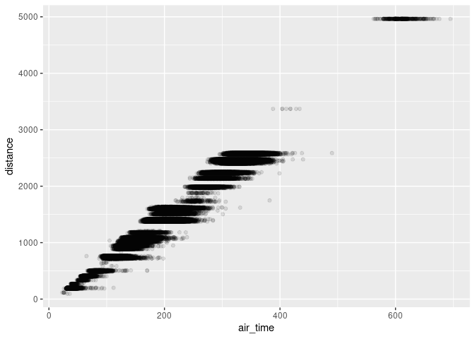

Introduction to transport data science
================
Robin Lovelace
University of Leeds
<br/>

<!-- ## Agenda {-} -->
<!-- 1. Thinking about transport data science (20 min) -->
<!-- 2. Questions about the homework (10 min) -->
<!-- 3. Practical 2 (2.5 hrs) -->
<!-- - Introduction to the module and team - 30 min -->
<!-- Each person to say  1) their name and where they are based 2) why they took the module and 3) their level of knowledge of coding. -->
<!-- 1. Project set-up and using RStudio - 30 minutes -->
<!-- 1. Getting started with transport data in the stplanr package - 30 minutes -->
<!-- 1. Working alone through the questions on processing OD data - 1 hr -->
<!-- running the code in Sections 12.1 to 12.4 the Transport chapter of Geocomputation with R and answering the questions for the Bristol dataset  - 1 hr  -->
<!-- 1. Bonus: Work through [Chapter 5](https://r4ds.had.co.nz/transform.html#filter-rows-with-filter) of R for Data Science -->

## Thinking about (transport) data science

<!-- - Based on the contents of the lecture, come up with *your own* definition of data science -->

- How do you see yourself using data science over the next 5 years?
- Think of a question about a transport system you know well and how
  data science could help answer it, perhaps with reference to a sketch
  like that below

#### How much potential is there for cycling across the transport network?


#### How can travel to schools be made safer?

#### How can hospitals encourage visitors to get there safely?

#### Where’s the best place to build electric car charging points?

See <https://www.openstreetmap.org/#map=19/53.80689/-1.55637> for more
ideas

<!-- 2. Work through the transport chapter of Geocomputation with R: https://geocompr.robinlovelace.net/transport.html -->
<!-- See https://github.com/ITSLeeds/TDS/blob/master/practicals/2-software.md -->
<!-- - In terms of future work in an evolving job market? -->
<!-- - In terms of the kinds of problems you want to solve? -->
<!-- ## Sketching research methods (in groups of 2-4, 30 minutes) -->
<!-- Starting with the 1000 'desire lines' dataset of Leeds, sketch-out some research ideas that cover -->
<!-- 1) Hypotheses: generate two hypotheses that are falsifiable and 2 hypotheses that are not falsifiable -->
<!-- 2) Input data: draw schematic representations of additional datasets that you could use alongside the desire lines dataset, with at least one at each of these levels: -->
<!-- - Zones -->
<!-- - Points -->
<!-- - Routes -->
<!-- - Route networks -->
<!-- - Individual -->
<!-- What temporal and spatial resolution could each one have? -->
<!-- 3) Methods: using a flow diagram (e.g. as shown below) -->
<!-- ## Practical, group computer task (30 minutes) -->
<!-- Create a github account (all). See: https://github.com -->
<!-- Building on the follow code chunk (but with no copy-and-pasting), create a data frame that contains the names, coffee habits and like/dislike of bus travel for everyone in your group (just 1 computer per group): -->
<!-- ```{r} -->
<!-- person_name = c( -->
<!--   "robin", -->
<!--   "malcolm", -->
<!--   "richard" -->
<!-- ) -->
<!-- n_coffee = c( -->
<!--   5, -->
<!--   1, -->
<!--   0 -->
<!-- ) -->
<!-- like_bus_travel = c( -->
<!--   TRUE, -->
<!--   FALSE, -->
<!--   TRUE -->
<!-- ) -->
<!-- personal_data = data.frame(person_name, n_coffee, like_bus_travel) -->
<!-- personal_data -->
<!-- ``` -->
<!-- When you are complete, add your code to https://github.com/ITSLeeds/TDS/blob/master/code-r/01-person-data.R -->
<!-- ## Learning outcomes -->
<!-- - Articulate the relevance and limitations of data-centric analysis applied to transport problems, compared with other methods -->

# 1 R foundations

This section builds on the Reproducible road safety with R homework, to
**read and try to complete the exercises in Chapters 1 to 4 of the book
Reproducible Road Safety Research with R.** It assumes that you have
recently updated R and RStudio on your computer. For details on
installing packages see here:
<https://docs.ropensci.org/stats19/articles/stats19-training-setup.html>

- Create a new R project called ‘practical1’
- In it create file called foundations.Rmd
- Type the following

```` markdown

This is some text:


```r
casualty_type = c("pedestrian", "cyclist", "cat")
casualty_age = seq(from = 20, to = 60, by = 20)
crashes = data.frame(casualty_type, casualty_age)
```
````

- Knit the document by pressing Ctrl+Shift+K or with the ‘Knit’ button
  in RStudio
  - Bonus: you can also ‘knit’ or compile the file with the following
    command, try it out to generate different file formats, as described
    in the [package’s
    documentation](https://rmarkdown.rstudio.com/lesson-9.html):

``` r
rmarkdown::render("foundations.Rmd", output_format = "pdf_document")
browseURL("/tmp/foundations.pdf")
```

We now have a data frame object stored in memory (technically in the
global environment) that is used as the basis of the questions.

To get some larger datasets, try the following (from Chapter 8 of RSRR)

``` r
library(stats19)
```

    ## Data provided under OGL v3.0. Cite the source and link to:
    ## www.nationalarchives.gov.uk/doc/open-government-licence/version/3/

``` r
ac = get_stats19(year = 2019, type = "collision")
```

    ## Files identified: dft-road-casualty-statistics-collision-2019.csv

    ##    https://data.dft.gov.uk/road-accidents-safety-data/dft-road-casualty-statistics-collision-2019.csv

    ## Attempt downloading from: https://data.dft.gov.uk/road-accidents-safety-data/dft-road-casualty-statistics-collision-2019.csv

    ## Data saved at /tmp/RtmpvfMU52/dft-road-casualty-statistics-collision-2019.csv

    ## Reading in:

    ## /tmp/RtmpvfMU52/dft-road-casualty-statistics-collision-2019.csv

    ## Rows: 117536 Columns: 36
    ## ── Column specification ────────────────────────────────────────────────────────
    ## Delimiter: ","
    ## chr   (6): accident_index, accident_reference, date, local_authority_ons_dis...
    ## dbl  (29): accident_year, location_easting_osgr, location_northing_osgr, lon...
    ## time  (1): time
    ## 
    ## ℹ Use `spec()` to retrieve the full column specification for this data.
    ## ℹ Specify the column types or set `show_col_types = FALSE` to quiet this message.
    ## date and time columns present, creating formatted datetime column

``` r
ca = get_stats19(year = 2019, type = "cas")
```

    ## Files identified: dft-road-casualty-statistics-casualty-2019.csv
    ## 
    ##    https://data.dft.gov.uk/road-accidents-safety-data/dft-road-casualty-statistics-casualty-2019.csv
    ## Attempt downloading from: https://data.dft.gov.uk/road-accidents-safety-data/dft-road-casualty-statistics-casualty-2019.csv
    ## Data saved at /tmp/RtmpvfMU52/dft-road-casualty-statistics-casualty-2019.csv
    ## Rows: 153158 Columns: 19── Column specification ────────────────────────────────────────────────────────
    ## Delimiter: ","
    ## chr  (2): accident_index, accident_reference
    ## dbl (17): accident_year, vehicle_reference, casualty_reference, casualty_cla...
    ## ℹ Use `spec()` to retrieve the full column specification for this data.
    ## ℹ Specify the column types or set `show_col_types = FALSE` to quiet this message.

``` r
ve = get_stats19(year = 2019, type = "veh")
```

    ## Files identified: dft-road-casualty-statistics-vehicle-2019.csv
    ## 
    ##    https://data.dft.gov.uk/road-accidents-safety-data/dft-road-casualty-statistics-vehicle-2019.csv
    ## Attempt downloading from: https://data.dft.gov.uk/road-accidents-safety-data/dft-road-casualty-statistics-vehicle-2019.csv
    ## Data saved at /tmp/RtmpvfMU52/dft-road-casualty-statistics-vehicle-2019.csv
    ## Rows: 216381 Columns: 28── Column specification ────────────────────────────────────────────────────────
    ## Delimiter: ","
    ## chr  (4): accident_index, accident_reference, generic_make_model, lsoa_of_dr...
    ## dbl (24): accident_year, vehicle_reference, vehicle_type, towing_and_articul...
    ## ℹ Use `spec()` to retrieve the full column specification for this data.
    ## ℹ Specify the column types or set `show_col_types = FALSE` to quiet this message.

2.3.1. Use the `$` operator to print the `vehicle_type` column of
`crashes`.

    - In R the `$` symbol is used to refer to elemements of a list. So the answer is simply `crashes$vehicle_type`

2.3.2. Subsetting the crashes with the `[,]` syntax

    - Try out different combinations on the dataframe

2.3.3. **Bonus**: what is the `class()` of the objects created by each
of the previous exercises?

    - Explore how many R classes you can find

Let’s go through these exercises together:

1.  Subset the `casualty_age` object using the inequality (`<`) so that
    only elements less than 50 are returned.
2.  Subset the `crashes` data frame so that only tanks are returned
    using the `==` operator.
3.  **Bonus**: assign the age of all tanks to 61.

- Try running the subsetting code on a larger dataset, e.g. the `ac`
  object created previously

1.  Coerce the `vehicle_type` column of `crashes` to the class
    `character`.
2.  Coerce the `crashes` object into a matrix. What happened to the
    values?
3.  **Bonus:** What is the difference between the output of `summary()`
    on `character` and `factor` variables?

- We’ll explore this together

## 1.1 Bonus: reproduce the contents of Chapter 2 in Python

# 2 Practical introduction to data science

## 2.1 Completing Chapters 2-4 in the RRSRR document

- This was your homework but revisit it an ensure you understand every
  bit and complete it if you haven’t already

## 2.2 Tidyverse

- Work through Chapter 5 starting with the following code:

``` r
library(tidyverse) # Load the package
```

    ## ── Attaching core tidyverse packages ──────────────────────── tidyverse 2.0.0 ──
    ## ✔ dplyr     1.1.4          ✔ readr     2.1.5     
    ## ✔ forcats   1.0.0          ✔ stringr   1.5.1     
    ## ✔ ggplot2   3.4.4.9000     ✔ tibble    3.2.1     
    ## ✔ lubridate 1.9.3          ✔ tidyr     1.3.1     
    ## ✔ purrr     1.0.2          
    ## ── Conflicts ────────────────────────────────────────── tidyverse_conflicts() ──
    ## ✖ dplyr::filter() masks stats::filter()
    ## ✖ dplyr::lag()    masks stats::lag()
    ## ℹ Use the conflicted package (<http://conflicted.r-lib.org/>) to force all conflicts to become errors

# 3 Homework

- Work through chapters 6 and 7 on spatial and temporal data in the
  [RRSRR tutorial](https://itsleeds.github.io/rrsrr/) to get R
  foundations

- Run the code in the
  [demos/demo-quarto-document.qmd](https://github.com/ITSLeeds/TDS/blob/master/demos/demo-quarto-document.qmd)
  script

Note: you can copy-paste the code from the .qmd file into a new .qmd
file on your computer and render it (convert it into a .PDF file) using
the following:

``` r
quarto::render("demo-quarto-document.qmd")
```

**Bonus**

Work through all of the code in the [RRSRR
tutorial](https://itsleeds.github.io/rrsrr/), focussing on the parts
that you think will be most useful for your coursework.

## 3.1 Bonus: Analysis of flights data

You need to have a number of packages installed and loaded. Install the
packages by typing in the following commands into RStudio (you do not
need to add the comments after the `#` symbol):[^1]

``` r
install.packages("remotes")
pkgs = c(
  "nycflights13",# data package
  "stats19",     # downloads and formats open stats19 crash data
  "tidyverse"   # a package for user friendly data science
)
remotes::install_cran(pkgs)
remotes::install_github("nowosad/spDataLarge")
```

Load the tidyverse package as follows:

``` r
library(tidyverse)
```

This section will use content from Chapter 5 of the R for Data Science
book (**grolemund_data_2016?**).

- Read [section
  5.1](https://r4ds.had.co.nz/transform.html#filter-rows-with-filter) of
  R for Data Science and write code that reproduces the results in that
  section in the script `learning-tidyverse.R`

Your script will start with something like this:

``` r
library(tidyverse)
library(nycflights13)
```

- Take a random sample of 10,000 flights and assign it to an object with
  the following line of code:

``` r
library(nycflights13)
flights_sample = sample_n(flights, 1e4)
unique(flights$carrier)
```

    ##  [1] "UA" "AA" "B6" "DL" "EV" "MQ" "US" "WN" "VX" "FL" "AS" "9E" "F9" "HA" "YV"
    ## [16] "OO"

- Find the unique carriers with the `unique()` function

- Create an object containing flights from United, American, or Delta,
  and assign it to `f`, as follows:

``` r
f = filter(flights, grepl(pattern = "UA|AA|DL", x = carrier))
f2 = filter(flights, grepl(pattern = "UA", x = carrier) |
             grepl(pattern = "AA", x = carrier) |
             grepl(pattern = "DL", x = carrier)
           )
f3 = filter(flights, str_detect(carrier, "UA|AA|DL"))
```

- Create plots that visualise the sample flights, using code from
  Chapter 3 of the same book, starting with the following plot:

``` r
ggplot(f) +
  geom_point(aes(air_time, distance))
```

<!-- -->

- Add transparency so it looks like this (hint: use `alpha =` in the
  `geom_point()` function call):

<!-- -->

    ## Warning: Removed 2117 rows containing missing values or values outside the scale range
    ## (`geom_point()`).

<!-- -->

- Add a colour for each carrier, so it looks something like this:

``` r
ggplot(f) +
  geom_point(aes(air_time, distance, colour = carrier), alpha = 0.5)
```

    ## Warning: Removed 2117 rows containing missing values or values outside the scale range
    ## (`geom_point()`).

<!-- -->

- Bonus 1: find the average air time of those flights with a distance of
  1000 to 2000 miles

- Bonus 2: use the `lm()` function to find the relationship between
  flight distance and time, and plot the results (start the plot as
  follows, why did we use `na.omit()`? hint - find help with
  `?na.omit()`):

``` r
f = na.omit(f)
m = lm(air_time ~ distance, data = f)
f$pred = m$fitted.values
```

<!-- -->

[^1]: Note: if you want to install the development version of a package
    from GitHub, you can do so. Try, for example, running the following
    command: `remotes::install_github("ITSLeeds/pct")`
