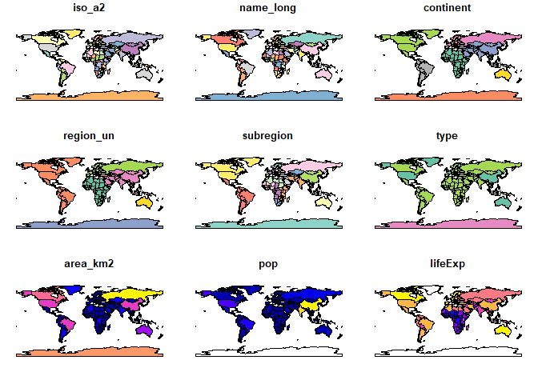
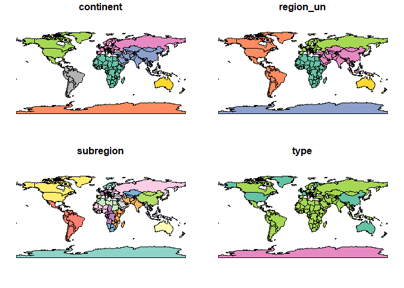
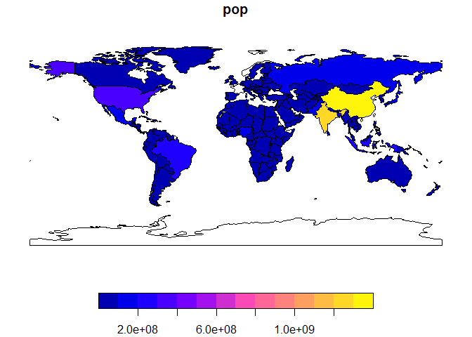
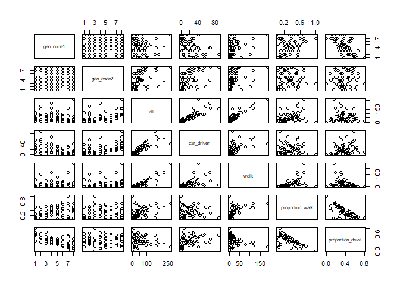
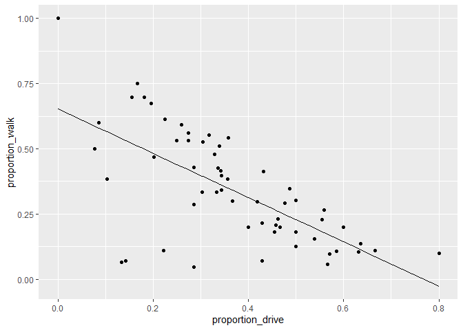
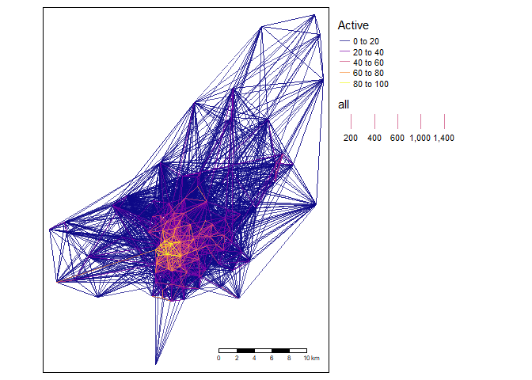
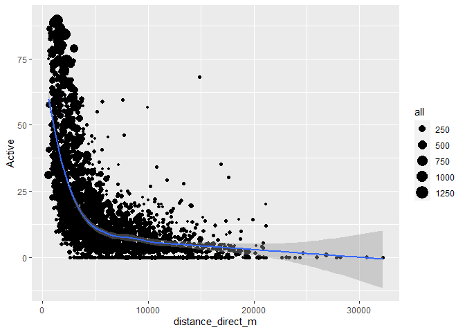

Origin-destination data
================
Malcolm Morgan
University of Leeds
<br/>

# 1 Review Homework

You should now be familiar with the basics of R and the `tidyverse`. If
you have not completed these tasks go back and do them first:

- Read Chapters 2, 3, and 4 of [Reproducible road safety research with
  R](https://itsleeds.github.io/rrsrr/basics.html)
- Read Chapters 3 and 5 of [R for Data
  Science](https://r4ds.had.co.nz/data-visualisation.html)

# 2 Getting started with GIS in R

Note that this practical takes sections from Chapters 2 - 8 of
[Geocomputation with R](https://r.geocompx.org). You should expand your
knowledge by reading these chapters in full.

## Pre-requisites

You need to have a number of packages installed and loaded. Install the
packages by typing in the following commands into RStudio (you do not
need to add the comments after the `#` symbol)

If you need to install any of these packages use:

``` r
install.packages("sf")  # Install a package from CRAN
remotes::install_github("Nowosad/spDataLarge")   # install from GitHub using the remotes package
```

``` r
library(sf)          # vector data package 
library(tidyverse)   # tidyverse packages
```

- It relies on **spData**, which loads datasets used in the code
  examples of this chapter:

``` r
library(spData)  # spatial data package 
```

1.  Check your packages are up-to-date with `update.packages()`
2.  Create an RStudio project with an appropriate name for this module
    (e.g. `TDSmodule`)
3.  Create appropriate folders for code, data and anything else
    (e.g. images)
4.  Create a script called `learning-OD.R`, e.g. with the following
    command:

``` r
dir.create("code") # 
file.edit("code/learning-OD.R")
```

## 2.1 Basic sf operations

We will start with a simple map of the world. Load the `world` object
from the `spData` package. Notice the use of `::` to say that you want
the `world` object from the `spData` package.

``` r
world = spData::world
```

Use some basic R functions to explore the `world` object.
e.g. `class(world)`, `dim(world)`, `head(world)`, `summary(world)`. Also
view the `world` object by clicking on it in the Environment panel.

`sf` objects can be plotted with `plot()`.

``` r
plot(world)
```

<!-- -->

Note that this makes a map of each column in the data frame. Try some
other plotting options

``` r
plot(world[3:6])
```

<!-- -->

``` r
plot(world["pop"])
```

<!-- -->

## 2.2 Basic spatial operations

Load the `nz` and `nz_height` datasets from the `spData` package.

``` r
nz = spData::nz
nz_height = spData::nz_height
```

We can use `tidyverse` functions like `filter` and `select` on `sf`
objects in the same way you did in Practical 1.

``` r
canterbury = nz %>% filter(Name == "Canterbury")
canterbury_height = nz_height[canterbury, ]
```

In this case we filtered the `nz` object to only include places called
`Canterbury` and then did and intersection to find objects in the
`nz_height` object that are in Canterbury.

This syntax is not very clear. But is the equivalent to

``` r
canterbury_height = nz_height[canterbury, , op = st_intersects]
```

There are many different types of relationships you can use with `op`.
Try `?st_intersects()` to see more. For example this would give all the
places not in Canterbury

``` r
nz_height[canterbury, , op = st_disjoint]
```

<figure>

<figcaption aria-hidden="true">Topological relations between vector
geometries, inspired by Figures 1 and 2 in Egenhofer and Herring (1990).
The relations for which the function(x, y) is true are printed for each
geometry pair, with x represented in pink and y represented in blue. The
nature of the spatial relationship for each pair is described by the
Dimensionally Extended 9-Intersection Model string.</figcaption>
</figure>

# 3 Getting started with OD data

In this section we will look at basic transport data in the R package
**stplanr**.

Load the `stplanr` package as follows:

``` r
library(stplanr)
```

The `stplanr` package contains some data that we can use to demonstrate
principles in Data Science, illustrated in the Figure below. Source:
Chapter 1 of R for Data Science (Grolemund and Wickham 2016) [available
online](https://r4ds.had.co.nz/introduction.html).


First we will load some sample data:

You can click on the data in the environment panel to view it or use
`head(od_data)` Now we will rename one of the columns from `foot` to
`walk`

Next we will made a new dataset `od_data_walk` by taking `od_data` and
piping it (`%>%`) to `filter` the data frame to only include rows where
`walk > 0`. Then `select` a few of the columns and calculate two new
columns `proportion_walk` and `proportion_drive`.

We can use the generic `plot` function to view the relationships between
variables

``` r
plot(od_data_walk)
```

<!-- -->

R has built in modelling functions such as `lm` lets make a simple model
to predict the proportion of people who walk based on the proportion of
people who drive.

We can use the `ggplot2` package to graph our model predictions.

``` r
ggplot(od_data_walk) +
  geom_point(aes(proportion_drive, proportion_walk)) +
  geom_line(aes(proportion_drive, proportion_walk_predicted))
```

<!-- -->

Exercises

1.  What is the class of the data in `od_data`?
2.  Subset (filter) the data to only include OD pairs in which at least
    one person (`> 0`) person walks (bonus: on what % of the OD pairs
    does at least 1 person walk?)
3.  Calculate the percentage who cycle in each OD pair in which at least
    1 person cycles
4.  Is there a positive relationship between walking and cycling in the
    data?
5.  Bonus: use the function `od2line()` in to convert the OD dataset
    into geographic desire lines

# 4 Processing origin-destination data in Bristol

This section is based on [Chapter 12 of Geocomputation with
R](https://geocompr.robinlovelace.net/transport.html). You should read
this chapter in full in your own time.

We need the `stplanr` package which provides many useful functions for
transport analysis and `tmap` package which enables advanced mapping
features.

``` r
library(stplanr)
library(tmap)
```

We will start by loading two datasets:

``` r
od = spDataLarge::bristol_od
zones = spDataLarge::bristol_zones
```

Explore these datasets using the functions you have already learnt
(e.g. `head`,`nrow`).

You will notice that the `od` datasets has shared id values with the
`zones` dataset. We can use these to make desire lines between each
zone. But first we must filter out trips that start and end in the same
zone.

``` r
od_inter = filter(od, o != d)
desire_lines = od2line(od_inter, zones)
```

Let’s calculate the percentage of trips that are made by active travel

``` r
desire_lines$Active = (desire_lines$bicycle + desire_lines$foot) /
  desire_lines$all * 100
```

Now use `tmap` to make a plot showing the number of trips and the
percentage of people using active travel.

``` r
desire_lines = desire_lines[order(desire_lines$Active),]

tm_shape(desire_lines) +   # Define the data frame used to make the map
  tm_lines(col = "Active", # We want to map lines, the colour (col) is based on the "Active" column
           palette = "plasma", # Select a colour palette
           alpha = 0.7,    # Make lines slightly transparent
           lwd = "all") +  # The line width (lwd) is based on the "all" column
  tm_layout(legend.outside = TRUE) + # Move the ledgend outside the map
  tm_scale_bar()           # Add a scale bar to the map
```

<!-- -->

Now that we have geometry attached to our data we can calculate other
variables of interest. For example let’s calculate the distacne
travelled and see if it relates to the percentage of people who use
active travel.

``` r
desire_lines$distance_direct_m = as.numeric(st_length(desire_lines))
```

Note the use of `as.numeric` by default `st_length` and many other
functions return a special type of result with `unit`. Here we force the
results back into the basic R numerical value. But be careful! The units
you get back depend on the coordinate reference system, so check your
data before you assume what values mean.

``` r
ggplot(desire_lines) +
  geom_point(aes(x = distance_direct_m, y = Active, size = all)) +
  geom_smooth(aes(x = distance_direct_m, y = Active))
```

<!-- -->

The blue line is a smoothed average of the data. It shows a common
concept in transport research, the distance decay curve. In this case it
shows that the longer the journey the less likely people are to use
active travel. But this concept applies to all kinds of travel
decisions. For example you are more likely to travel to a nearby coffee
shop than a far away coffee shop. Different types of trip have different
curves, but most people always have a bias for shorter trips.

# 5 Homework

1.  Read Chapters 2-5, 7, and 8 of [Geocomputation with
    R](https://r.geocompx.org/transport.html)
2.  Read more about using the [tmap
    package](https://r-tmap.github.io/tmap/)
3.  Work though Sections 13.1 to 13.4 of the Transport Chapter in
    [Geocomputation with R](https://r.geocompx.org/transport.html)
4.  Read more about the [ggplot2
    package](https://ggplot2.tidyverse.org/)

# 6 References

<div id="refs" class="references csl-bib-body hanging-indent">

<div id="ref-grolemund_r_2016" class="csl-entry">

Grolemund, Garrett, and Hadley Wickham. 2016. *R for Data Science*.
O’Reilly Media.

</div>

</div>
