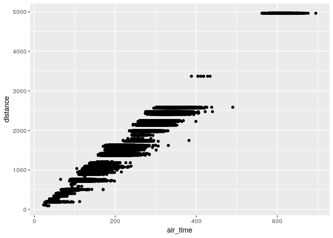
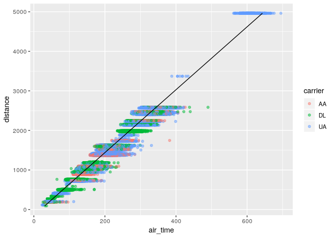
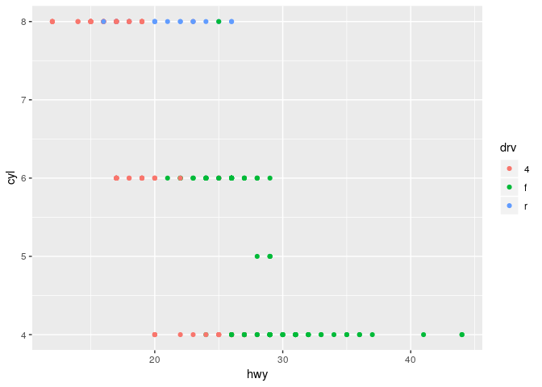
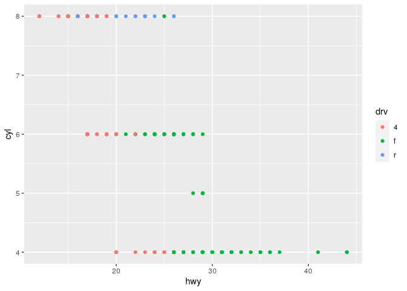
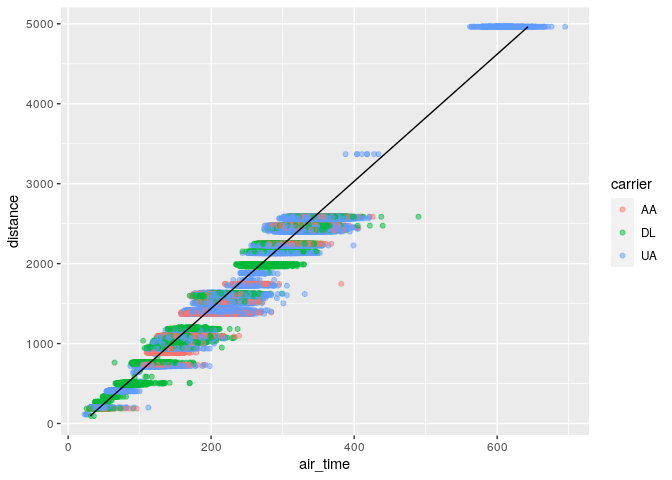

Software for transport data science
================
Robin Lovelace
University of Leeds,
2021-01-29<br/>

## Pre-requisites

You need to have a number of packages installed and loaded. Install the
packages by typing in the following commands into RStudio (you do not
need to add the comments after the `#` symbol):[1]

``` r
install.packages("remotes")
pkgs = c(
  "nycflights13",# data package
  "pct",         # package for getting travel data in the UK
  "sf",          # spatial data package
  "stats19",     # downloads and formats open stats19 crash data
  "stplanr",     # for working with origin-destination and route data
  "tidyverse",   # a package for user friendly data science
  "tmap"         # for making maps
)
remotes::install_cran(pkgs)
remotes::install_github("nowosad/spDataLarge")
```

Load the tidyverse package as follows:

``` r
library(tidyverse)
```

    ## ── Attaching packages ─────────────────────────────────────── tidyverse 1.3.0 ──

    ## ✔ ggplot2 3.3.3     ✔ purrr   0.3.4
    ## ✔ tibble  3.0.5     ✔ dplyr   1.0.3
    ## ✔ tidyr   1.1.2     ✔ stringr 1.4.0
    ## ✔ readr   1.4.0     ✔ forcats 0.5.0

    ## ── Conflicts ────────────────────────────────────────── tidyverse_conflicts() ──
    ## ✖ dplyr::filter() masks stats::filter()
    ## ✖ dplyr::lag()    masks stats::lag()

## Project set-up and tidyverse testing (30 minutes)

-   Check your packages are up-to-date with `update.packages()`
-   Create an RStudio project with an appropriate name for this module
    (e.g. `TDSmodule`)
-   Create appropriate files for code, data and anything else
    (e.g. images)
-   Create a script called `learning-tidyverse.R`, e.g. with the
    following command:

``` r
dir.create("code") # 
file.edit("code/learning-tidyverse.R")
```

## Getting started with transport data

We’re going to start by looking at the main types of transport data:[2]

``` r
od = spDataLarge::bristol_od
head(od)
```

    ## # A tibble: 6 x 7
    ##   o         d           all bicycle  foot car_driver train
    ##   <chr>     <chr>     <dbl>   <dbl> <dbl>      <dbl> <dbl>
    ## 1 E02002985 E02002985   209       5   127         59     0
    ## 2 E02002985 E02002987   121       7    35         62     0
    ## 3 E02002985 E02003036    32       2     1         10     1
    ## 4 E02002985 E02003043   141       1     2         56    17
    ## 5 E02002985 E02003049    56       2     4         36     0
    ## 6 E02002985 E02003054    42       4     0         21     0

``` r
library(sf)
```

    ## Linking to GEOS 3.8.0, GDAL 3.0.4, PROJ 7.0.0

``` r
zones = spDataLarge::bristol_zones
plot(zones)
```

<!-- -->

## Reading-in and processing basic data

Read-in coffee data:

``` r
u = paste0(
  "https://github.com/ITSLeeds/TDS/",
  "raw/master/sample-data/everyone.csv"
  )
d = read_csv(u)
```

    ## 
    ## ── Column specification ────────────────────────────────────────────────────────
    ## cols(
    ##   person_name = col_character(),
    ##   n_coffee = col_double(),
    ##   like_bus_travel = col_logical()
    ## )

Create a new variable called ‘n\_coffee\_yr’ with the following command:

``` r
d$n_coffee_yr = d$n_coffee * 52
```

Find the mean number of cups of coffee people drink per year (and the
total)

Note: the same result can be achieved as follows:

``` r
d_updated = mutate(d, n_coffee_yr = n_coffee * 52)

# or 
d_updated = d %>% 
  mutate(n_coffee_yr = n_coffee * 52)
```

-   Which do you prefer?

-   Filter-out only those who travel by bus

-   Bonus: Create a new dataset that keeps only the `person_name` and
    `n_coffee_yr` variables (hint: use the `select()` function)

-   Bonus: do those who travel by bus drink more or less coffee than
    those who do not?

## Processing medium sized data and basic visualisation (30 minutes)

This section will use content from the R for Data Science book
(**grolemund\_data\_2016?**).

-   Read [section
    5.1](https://r4ds.had.co.nz/transform.html#filter-rows-with-filter)
    of R for Data Science and write code that reproduces the results in
    that section in the script `learning-tidyverse.R`

Your script will start with something like this:

``` r
library(tidyverse)
library(nycflights13)
```

-   Take a random sample of 10,000 flights and assign it to an object
    with the following line of code:

``` r
library(nycflights13)
flights_sample = sample_n(flights, 1e4)
unique(flights$carrier)
```

    ##  [1] "UA" "AA" "B6" "DL" "EV" "MQ" "US" "WN" "VX" "FL" "AS" "9E" "F9" "HA" "YV"
    ## [16] "OO"

-   Find the unique carriers with the `unique()` function

-   Create an object containing flights from United, American, or Delta,
    and assign it to `f`, as follows:

``` r
f = filter(flights, grepl(pattern = "UA|AA|DL", x = carrier))
f2 = filter(flights, grepl(pattern = "UA", x = carrier) |
             grepl(pattern = "AA", x = carrier) |
             grepl(pattern = "DL", x = carrier)
           )
f3 = filter(flights, str_detect(carrier, "UA|AA|DL"))
```

-   Create plots that visualise the sample flights, using code from
    Chapter 3 of the same book, starting with the following plot:

``` r
ggplot(f) +
  geom_point(aes(air_time, distance))
```

<!-- -->

-   Add transparency so it looks like this (hint: use `alpha =` in the
    `geom_point()` function call):

<!-- -->

    ## Warning: Removed 2117 rows containing missing values (geom_point).

<!-- -->

-   Add a colour for each carrier, so it looks something like this:

``` r
ggplot(f) +
  geom_point(aes(air_time, distance, colour = carrier), alpha = 0.5)
```

    ## Warning: Removed 2117 rows containing missing values (geom_point).

<!-- -->

-   Bonus 1: find the average air time of those flights with a distance
    of 1000 to 2000 miles

-   Bonus 2: use the `lm()` function to find the relationship between
    flight distance and time, and plot the results (start the plot as
    follows, why did we use `na.omit()`? hint - find help with
    `?na.omit()`):

``` r
f = na.omit(f)
m = lm(air_time ~ distance, data = f)
f$pred = m$fitted.values
```

<!-- -->

## Homework

1.  create a reproducible document

-   Create an Rmarkdown file with the following command:

``` r
file.edit("learning-tidyverse.Rmd")
```

-   Take a read of the guidance on RMarkdown files online and in the
    following location (or search online for the ‘RMarkdown
    cheatsheet’):

<!-- -->

    Help > Cheatsheets > RMarkdown

-   Put the code you generated for `tidyverse.R` into the Rmd file and
    knit it

-   Bonus: create a GitHub repo and publish the results of of your work
    (hint: putting `output: github_document` may help here!)

1.  Work-through the remaining exercises of the first sections in R4DS
    chapters 3 and 5

-   Write and R script, with comments, to show your working (and prove
    you’ve done it!)

1.  Create an RMarkdown file containing reproducible code outlining what
    you learned today

2.  Identify a dataset you would like to work with for the practical
    next week.

[1]  Note: if you want to install the development version of a package
from GitHub, you can do so. Try, for example, running the following
command: `remotes::install_github("ITSLeeds/pct")`

[2]  Note: if you want to get zone data for a different region you can
do so, e.g. with:
`zones = sf::read_sf("https://github.com/npct/pct-outputs-regional-notR/raw/master/commute/msoa/west-yorkshire/z.geojson")`
