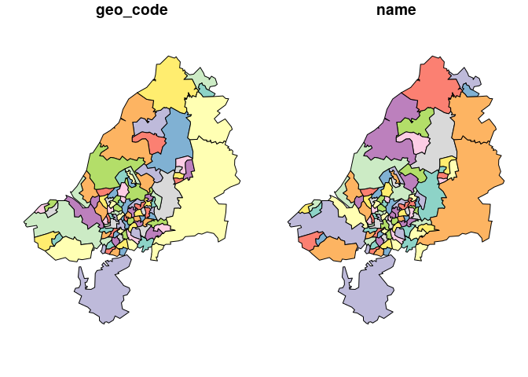
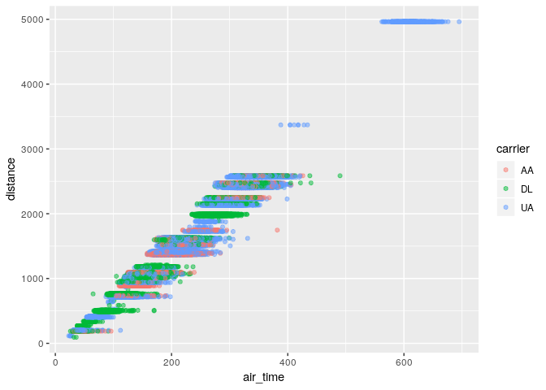
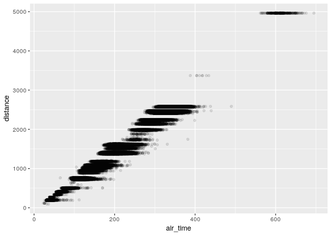

Introduction to transport data science
================
Robin Lovelace
University of Leeds,
2019-02-11<br/>

## Project set-up and tidyverse testing (30 minutes, individually)

  - Check your packages are up-to-date with `update.packages()`
  - Create an RStudio project with an appropriate name for this module
    (e.g. `TDS`)
  - Create appropriate files for code, data and anything else
    (e.g. images)
  - Create a script called `learning-tidyverse.R`, e.g. with **one** the
    following commands:

<!-- end list -->

``` r
file.edit(learning-tidyverse.R) # or
file.edit(code/learning-tidyverse.R)
```

  - Read
    [section 5.1](https://r4ds.had.co.nz/transform.html#filter-rows-with-filter)
    of R for Data Science and write code that reproduces the results in
    that section in the script `learning-tidyverse.R`

Your script will start with something like
    this:

``` r
library(tidyverse)
```

    ## ── Attaching packages ───────────────────────────────────────────────── tidyverse 1.2.1 ──

    ## ✔ ggplot2 3.1.0     ✔ purrr   0.3.0
    ## ✔ tibble  2.0.1     ✔ dplyr   0.7.8
    ## ✔ tidyr   0.8.2     ✔ stringr 1.4.0
    ## ✔ readr   1.3.1     ✔ forcats 0.3.0

    ## ── Conflicts ──────────────────────────────────────────────────── tidyverse_conflicts() ──
    ## ✖ dplyr::filter() masks stats::filter()
    ## ✖ dplyr::lag()    masks stats::lag()

``` r
library(nycflights13)
```

  - Take a random sample of 10,000 flights and assign it to an object
    with the following line of code:

<!-- end list -->

``` r
flights_sample = sample_n(flights, 1e4)
```

  - Find the unique carriers with the `unique()` function

  - Create an object containing flights from United, American, or Delta,
    and assign it to `f`, as follows:

<!-- end list -->

``` r
f = filter(flights, grepl(pattern = "UA|AA|DL", x = carrier))
```

## Basic visualisation (30 minutes, in groups, one computer per group)

  - Create plots that visualise the sample flights, using code from
    Chapter 3 of the same book, starting with the following plot:

<!-- end list -->

``` r
ggplot(f) +
  geom_point(aes(air_time, distance))
```

<!-- -->

  - Add transparency so it looks like this (hint: use `alpha =` in the
    `geom_point()` function
    call):

<!-- end list -->

    ## Warning: Removed 2117 rows containing missing values (geom_point).

<!-- -->

  - Add a colour for each carrier, so it looks something like this:

<!-- end list -->

``` r
ggplot(f) +
  geom_point(aes(air_time, distance, colour = carrier), alpha = 0.5)
```

    ## Warning: Removed 2117 rows containing missing values (geom_point).

<!-- -->

  - Bonus 1: find the average air time of those flights with a distance
    of 1000 to 2000 miles

  - Bonus 2: use the `lm()` function to find the relationship between
    flight distance and time, and plot the results (start the plot as
    follows, why did we use `na.omit()`? hint - find help with
    `?na.omit()`):

<!-- end list -->

``` r
f = na.omit(f)
m = lm(air_time ~ distance, data = f)
f$pred = m$fitted.values
```

<!-- -->

## Setting-up a reproducible document (30 minutes, individually)

  - Create an Rmarkdown file with the following command:

<!-- end list -->

``` r
file.edit("learning-tidyverse.Rmd")
```

  - Take a read of the guidance on RMarkdown files online and in the
    following location (or search online for the ‘RMarkdown
    cheatsheet’):

<!-- end list -->

    Help > Cheatsheets > RMarkdown

  - Put the code you generated for `tidyverse.R` into the Rmd file and
    knit it

  - Bonus: create a GitHub repo and publish the results of of your work
    (hint: putting `output: github_document` may help here\!)

## Homework:

1.  Work-through the remaining exercises in R4DS chapters 3 and 5

<!-- end list -->

  - Write and R script, with comments, to show your working (and prove
    you’ve done it\!)

<!-- end list -->

2.  Create an RMarkdown file containing reproducible code outlining what
    you learned today
3.  Identify a dataset you would like to work with for the practical
    next week.
