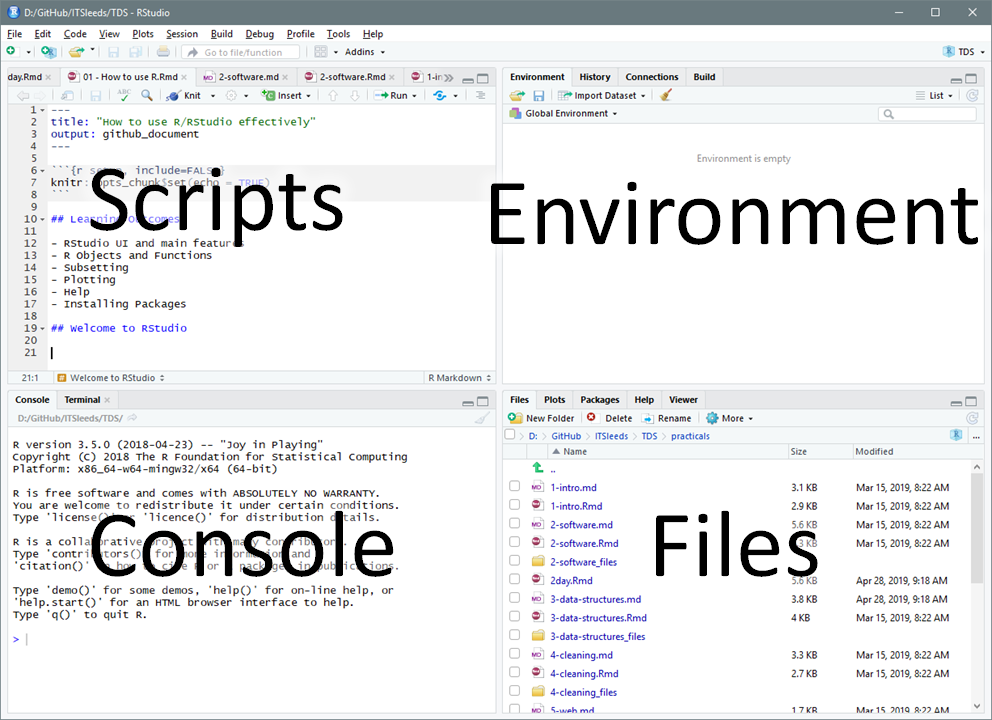
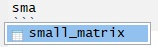
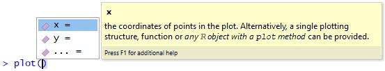

---
output:
  # github_document
  pdf_document:
    number_sections: true
title: Transport Data Science with R Practical Exercises
---

These practicals aim to test your knowledge of material covered in the Transport Data Science module hosted at https://github.com/ITSLeeds/TDS

It will use the following CRAN packages:

```{r, message=FALSE, warning=FALSE}
library(dplyr)
library(osmdata)
library(pct)
library(sf)
library(stplanr)
library(tmap)
```

# How to use R/RStudio effectively


## Learning Outcomes

- RStudio UI and main features
- R Objects and Functions
- Subsetting
- Plotting
- Help
- Installing Packages

## Welcome to RStudio

This course assumes that you have already got some basic knowledge of working with R. If you don't see the [prerequisites](https://github.com/ITSLeeds/TDS/blob/master/courses/2day.md).

```{r rstudioui, echo=FALSE, out.width="100%"}

```

### Projects

Projects are a way to organise related work together. Each project has its own folder and Rproj file.

Start a new project with:

> File > New Project

You can choose to create a new directory (folder) or associate a project with an existing directory. Make a new project called TDS and save it in a sensible place on your computer. Notice that TDS now appears in the top right of RStudio.

**Always do your work within a project**

### R Scripts

We could simply type all our code into the console, but that would require us to retype all our code every time we wish to run it. So we usually save code in a script file (with the .R extension).

Make a new script:

> Flie > New File > Rscript

Or use the new script button on the toolbar.

Save the script and give it a sensible name like `TDS-lesson-1.R` with:

> File > Save

Or the save button on the toolbar.

## Code

### Writing Code

Let's start with some basic R operations

```{r, eval=FALSE}
x <- 1:5
y <- c(0,1,3,9,18)
plot(x, y)
```

This code creates two objects, both vectors of length == 5, and then plots them.


### Running Code

We have several ways to run code within a script.

1. Place the cursor on a line of code and press `CTRL + Enter` to run that line of code.
1. Highlight a block of code or part of a line of code and press `CTRL + Enter` to run the highlighted code.
1. Press `CTRL + Shift + Enter` to run all the code in a script.
1. Press the Run button on the toolbar to run all the code in a script.
1. Use the function `source()` to run all the code in a script e.g. `source("TDS-lesson-1.R")`

### Vewing Objects

Lets create some different types of object:

```{r, eval=FALSE}
cat <- data.frame(name = c("Tiddles", "Chester", "Shadow"),
                  type = c("Tabby", "Persian", "Siamese"),
                   age = c(1, 3, 5),
                  likes_milk = c(TRUE, FALSE,TRUE))
even_numbers <- seq(from = 2, to = 4000, by = 2)
random_letters <- sample(letters, size = 100, replace = TRUE)
small_matrix <- matrix(1:24, nrow = 12)
```

We can view the objects in a range of ways:

1. Type the name of the object into the console e.g. `cat`, what happens if we try to view all 2000 even_numbers?
1. Use the `head()` function to view the first few values e.g. `head(even_numbers)`
1. Use the view table button next to matrix or data.frame objects in the environment tab.

We can also get an overview of an object using a range of functions.

1. `summary()`
1. `class()`
1. `class()`
1. `dim()`
1. `length()`

**Exercise** try these functions, what results do they give?

### Using Autocomplete

RStudio can help you write code by autocompleting. RStudio will look for similar objects and functions after typing the first three letters of a name.

```{r autocomp, echo=FALSE}

```

When there is more than one option you can select from the list using the mouse or arrow keys.

Within a function you can get a list of arguments by pressing Tab.

```{r help, echo=FALSE}

```

Notice the help popup.

### Getting help

Every function in R has a help page. You can view the help using `?` for example `?sum`. Many packages also contain vignettes, these are long form help documents containing examples and guides. `vignette()` will show a list of all the vignettes available, or you can show a specific vignette for example `vignette(topic = "sf1", package = "sf")`.

### Commenting Code

It is good practice to use comments in your code to explain what your code does. You can comment code using `#`

For example:

```{r, eval=FALSE}
# A whole line comment
x <- 1:5 # An inline comment
y <- x * 2
```

You can comment a whole block of text by selecting it and using CTRL + Shift + C

You can add a comment section using CTRL + Shift + R


### Cleaning your environment and removing objects

The Environment tab shows all the objects in your environment, this includes Data, Values, and Functions. By default, new objects appear in the Global Environment but you can see other environments with the drop-down menu. For example, each package has its own environment.

Sometimes you wish to remove things from your environment, perhaps because you no longer need them or things are getting cluttered.

You can remove an object with the `rm()` function e.g. `rm(x)` or `rm(x,y)` or you can clear your whole environment with the broom button on the Environment Tab.

### Debugging Code

This code example will run, but we can see some of RStudio's debugging features by changing it. See that when the bracket is removed the red X and the underlying highlight the broken code. You may need to save the code you see the debugging prompt.

```{r debug, echo=FALSE}
knitr::include_graphics("../courses/2day/images/debug.jpg")
```

**Always address debugging prompts before running your code**


### Saving your work

We have already seen that you can save an R script. You can also save R objects in the RDS format.

```{r, eval=FALSE}
saveRDS(cat,"cat.Rds")
```
We can also read back in our data.

```{r, eval=FALSE}
cat2 <- readRDS("cat.Rds")
identical(cat, cat2)
```

R also supports many other formats. For example CSV files.

```{r, eval=FALSE}
write.csv(cat, "cat.csv")
cat3 <- read.csv("cat.csv")
identical(cat3, cat1)
```
Notice that `cat3` and `cat` are not identical, what has changed? Hint: use `?write.csv`.

## Classes

### Subsetting

We can subset any R object to just get part of the object. Subsetting can be done by either providing the positional numbers of the subset or logical vector of the same length. For two dimension object such as matrices and data.frames you can subset by row or column.
Subsetting is done using square brackets `[]` after the name of an object.

```{r, eval=FALSE}
even_numbers[1:5] # Just the first five even_numbers
x[c(TRUE, FALSE,TRUE,FALSE,TRUE)] # The 1st, 3rd, and 5th element in x
cat[c(1,2),] # First and second row of cat
cat[,c(1,3)] # First and third column of cat
cat[,c("name","age")] # First and third column of cat by name
```

It is also possible to create logial vector for subsetting by creating a query
```{r, eval=FALSE}
x[x == 5] # Only when x == 5 (notice the use of double equals)
even_numbers[even_numbers < 50] # Just the  even_numbers less than 50
even_numbers[even_numbers %% 9 == 0] # Just the  even_numbers that are a multiple of 9
cat[cat$name == "Tiddles",] # THe rows where the name is Tiddles (notice the use of $)
```

### Dealing with NAs

R object can have a value of NA. This is how R represents missing data.

```{r, eval=FALSE}
z <- c(4,5,NA,7)
```

NA values are common in real-world data but can cause trouble, for example

```{r, eval=FALSE}
sum(z) # Result is NA
```

Some functions can be told to ignore NA values.

```{r, eval=FALSE}
sum(z, na.rm = TRUE) # Result is equal to 4 + 5 + 7
```

You can find NAs using the `is.na()` function, and then remove them

```{r, eval=FALSE}
is.na(z)
z_nona <- z[!is.na(z)] #Note the use of the not operator !
sum(z)
```

Be careful of NAs especially in statistical analysis, for example, the average of a value excluding NAs may not be representative of the whole.

## Now you are ready to use R


```{r smile}
eyes <- c(2.3,4,3.7,4)
eyes <- matrix(eyes, ncol = 2, byrow = T)
mouth <- c(2,2,2.5,1.3,3,1,3.5,1.3,4,2)
mouth <- matrix(mouth, ncol = 2, byrow = T)
plot(eyes, 
     type = "p", 
     main = "Smile you're using R",
     cex = 2,
     xlim = c(0,5),
     ylim = c(0,5))
lines(mouth,
     type = "l",
     col = "red")
```

\newpage

# Packages: ggplot2, the tidyverse and sf

## What are packages?

R has lots of functionality built in, but the real value in R is the community of package developers. Packages add new functions to R. Some packages are so useful they have become almost essential while others are only used for specific purposes.

There are two stages to using a package: installing it and loading it.

Packages that you don't have on your computer can be installed using `install.packages()` Packages come from [The Comprehensive R Archive Network](https://cran.r-project.org/) there are over 10,000 packages on CRAN. You only need to install a package once.

**Note: it is bad practice to install packages with `install.packages()` within a script, as installing packages each time it runs risks corrupting the package. You can use `remotes::install_cran()` or `remotes::install_github()` to only install a package if **

```{r, eval=FALSE}
install.packages("sf")
```

Once you have a package on your computer you need to add it to your current environment

```{r, eval=FALSE}
library(sf)
```

## sf data structure

## ggplot2

## dplyr and pipes

## Package ecosystems

## Exercises 

- Check your packages are up-to-date with `update.packages()`
- Create an RStudio project with an appropriate name for this course (e.g. `TDSwithR`)
- Create a script called `set-up.R`, e.g. with **one** the following commands:

- Pipes
- Data aggregation

# Spatial data analysis


## Reading and Writing Spatial Data


## Attribute Operations on Spatial Data

One of the nice things about the `sf` package is that an `sf data.frame` behaves just like a normal `data.frame` for non-spatial operations.
Load the example dataset for New Zealand.

```{r, eval=TRUE}
nz <- spData::nz # load the example dataset from the spData package
nz_large <- nz[nz$Population > 100000, ] # Find areas with a popualtion over 100,000
canterbury <- nz[nz$Name == "Canterbury",]
```

**Exercises:** 

1. Try some of the differnt subsetting techniques you have aleady learned on the `sf data.frame`.
1. What is the population density of each region?
1. The sex ratio is the number of males for each female in the region, which region of New Zealand has the most females, and how many are there?

## Spatial Operations 

What makes an `sf data.frame` differnt to a normal `data.frame` is the inclusion of a geometry column and spatial operations.

### Projections and Coordinate Reference Systems

When plotting a map you need X and Y coordinates to specify where objects should appear. While this is simple on a flat surface spatial data must fit onto the curved surface of the earth. You may know that it is impossible to unwrap a sphere into a single flat surface without distorting (stretching, twisting, cutting) the surface in some way. The process of making a flat map from a curved Earth is known as projection, and there are many valid ways to project a map.

Coordinate Reference Systems (CRS) refer to different ways of defining the X and Y coordinates used in different projections. Largely they fall into two categories, **geographic** and **projected**. These are illustrated in the figure below, from Chapter 2 of Geocomputation with R, in which location of London (the red X) is represented with reference to an origin (the blue circle). The left plot represents a geographic CRS with an origin at 0° longitude and latitude. The right plot represents a projected CRS with an origin located in the sea west of the South West Peninsula.

```{r vectorplots}
download.file(c("https://geocompr.robinlovelace.net/figures/vector_lonlat.png", "https://geocompr.robinlovelace.net/figures/vector_projected.png"), c("vector_lonlat.png", "vector_projected.png"))
knitr::include_graphics(c("vector_lonlat.png", "vector_projected.png"))
```

* Geographical Coordinate Systems: use latitude and longitude to represent any place on the Earth

* Projected Coordinate Systems: use distances from an origin point to represent a small part of the Earth, e.g. a country. The advantage of a projects CRS is that it is easier to calculate properties such as distance and area as coordinates are in metres.

You can find a catalogue of different CRSs at http://spatialreference.org/

CRSs are often referred to by the EPSG number. The European Petroleum Survey Group publish a database of different coordinate systems. Two useful projections to commit to memory are:

* 4326 - the World Geodetic System 1984 which is a widely used  geographical coordinate system, used in GPS datasets and the .geojson file format, for example.
* 27700 - the British National Grid

Every `sf data.frame` has a CRS.

```{r, eval=FALSE}
st_crs(nz) # 2193 the CRS for New Zealand Transverse Mercator
nz_latlng <- st_transform(nz, 4326) # Transfrom from one CRS to another
st_crs(nz) # 4326 the CRS for World Geodetic System 1984
nz_latlng <- st_transform(nz, 2193) # Transfrom back
```
**Warning** It is possible to change the CRS without reprojecting the data by:
```{r, eval=FALSE}
st_crs(nz) <- 4326
```

This is risky as you may confuse you data by having the wrong CRS.

For more infroamtion see [Chapter 6](https://geocompr.robinlovelace.net/reproj-geo-data.html) of Geocompuation with R.

### Spatial Interactions

It is possible to subset a `sf data.frame` by location as well as attributes.

Lets load the locations of some mountains in New Zeland and then find which ones are within the `nz_large` areas.

```{r, eval=TRUE}
nz_height <- spData::nz_height # Load the nz_height data
nz_height2 <- nz_height[canterbury,]
plot(nz$geom)
plot(nz_height, col = "black", add = TRUE)
plot(nz_height2, col = "red", add = TRUE)

```

By default the `st_intersects` fucntion use usesd to decide which rows to keep. 

```{r, eval=FALSE}
st_intersects(nz_height, nz_large)
```
There are many different types of spatial interaction. You can see a list of them in the help.

```{r, eval=FALSE}
?st_intersects
```

You could use a differnt fucntion by adding the `op` argument

```{r, eval=TRUE}
nz_height3 <- nz_height[canterbury, , op = st_disjoint]
```

## Geometric Operations

Geometric operation change or derive from the geometry of our data. The most commonly used functions are:

- `st_simplify` To simplify a complex shape
- `st_centroid` To find the geographical center of a shape
- `st_buffer` To creat a buffer around a shape

For more see [Section 5.2 of Geocompuation with R](https://geocompr.robinlovelace.net/geometric-operations.html#geo-vec)

TODO: add exercises from https://github.com/geocompr/geocompkg/blob/master/courses/2-day-exercises.Rmd

# Visualising spatial datasets

\newpage


# stats19 data analysis - with spatial/temporal analysis

1. Download and plot all crashes reported in Great Britain in 2017 (hint: see [the stats19 vignette](https://cran.r-project.org/web/packages/stats19/vignettes/stats19.html))
1. Filter crashes that happened in West Yorkshire
1. Get and plot origin-destination data in `west-yorkshire` with the `pct` package hosted at: https://github.com/ITSLeeds/pct (bonus: look at the source code of `get_od()` and download the origin-destination data with `download.file()`)

## Bonus exercises

Identify a region and zonal units of interest from http://geoportal.statistics.gov.uk/

1. Read them into R as an `sf` object
1. Join-on data from a non-geographic object
1. Add a data access section to your in progress portfolio
1. Get origin-destination data from Uber

# OD data with stplanr 

1. Create an object representing desire lines in West Yorkshire, e.g, with: `desire_lines_all = pct::get_pct_lines(region = "west-yorkshire")`
1. Get data from Leeds and subset the desire lines with a value of `all` of 200 or above
1. Create a buffer of 500 m for each desire line and calculate the number of crashes that happened within each (using STATS19 data downloaded in the previous exercise)
1. Create a facetted plot showing the temporal distribution of crashes in West Yorksire (you can choose whether to show these over the months of the year, over days of the week, or over the hours of a day)
1. Do a spatio-temporal subset to identify the crashes that happened within the most commonly travelled desire line between 07:00 and 10:00 during weekdays.

```{r, echo=FALSE}
desire_lines_all = pct::get_pct_lines(region = "west-yorkshire")

```

## Accessing crowd-sourced data from OSM

- Type code into the script created in the previous section so that it can reproduce this plot: 

```{r, message=FALSE, warning=FALSE, out.height="5cm"}
location = opq("leeds") %>% 
  add_osm_feature(key = "railway", value = "station") %>% 
  osmdata_sf()
station_points = location$osm_points["name"]
tm_shape(location$osm_polygons) +
  tm_polygons(col = "red") +
  tm_shape(station_points) +
  tm_dots(col = "red")  +
  tm_text(text = "name", size = 1) 
```

```{r, echo=FALSE, eval=FALSE}
write_sf(station_points, "station_points.gpkg")
piggyback::pb_upload("station_points.gpkg")
```

1. Download cycleway data with the tag highway=cycleway for Leeds from https://overpass-turbo.eu/
1. Load the data in R and plot it with `tmap` (bonus: now try to get the same data using the **osmdata** package)

# Local route network analysis

See exercises in lecture slides.

# Data and methods for assessing cycling potential 

1. Identify the top 10 desire lines in West Yorkshire along which at least 100 people travel to work, by:
    - The percentage who walk
    - The percentage who cycle
    - Bonus: Find the top 10 for *all* modes of transport and plot the results
1. Download origin-destination data from 2011 Census using the function `pct::get_od()`.
1. Convert these origin-destination pairs into geographic desire lines between centroids in Leeds (e.g. as generated by the function `pct::get_pct_centroids()`) and plot the result.
1. Find the route along the most travelled desire line in Leeds and plot the result.
1. Get cycle route data for West Yorkshire and use the function `overline2()` to identify the routes along which most people walk to work.

