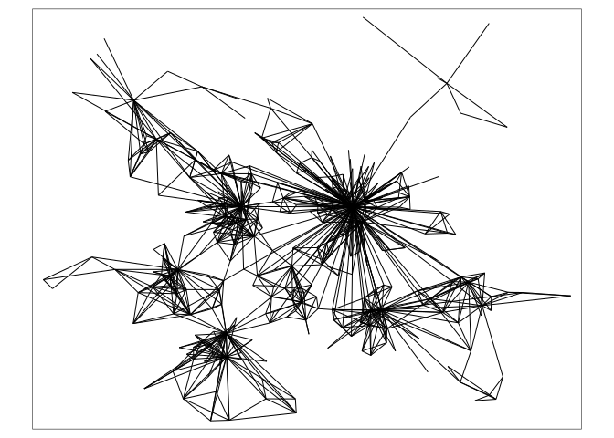
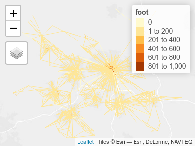

Data structures
================
Robin Lovelace
University of Leeds,
2020-02-05<br/>

## Review of homework exercise: demo then individual Q\&A

**Note**: Ensure that you have the necessary packages installed. If you
do not, you can install them as follows:

``` r
install.packages("pct") # install the pct package
```

## Practical demo of zones and lines (in groups)

  - Get data on the zones in West Yorkshire with the following
    command:

<!-- end list -->

``` r
zones = pct::get_pct_zones(region = "west-yorkshire")
```

    ## Loading required package: sp

    ## Warning in make_crs(value): the following proj4string elements are going to be
    ## ignored: +init=epsg:4326 +datum=WGS84 +no_defs +ellps=WGS84 +towgs84=0,0,0 ;
    ## remove the +init=epsg:XXXX to undo this

    ## Warning in CPL_crs_from_epsg(as.integer(substr(x[1], 12, 20))): NAs introduced
    ## by coercion

    ## Warning in CPL_crs_from_epsg(as.integer(substr(x[1], 12, 20))): GDAL Error 1:
    ## PROJ: proj_create_from_database: crs not found

  - Find out the class, names, number of columns and number of rows in
    the `zones` dataset using functions such as `names()`, `nrow()` and
    `ncol()`.

  - Plot the number of car trips and walking trips as follows, what do
    you notice about the results? Where do you think there is most
    potential to increase walking levels?

<!-- end list -->

``` r
plot(zones["car_driver"])
plot(zones["foot"])
```

  - How would you select only the `car_driver` column in the zones
    object in the tidyverse? Hint it would begin with the following
    (incomplete) lines:

<!-- end list -->

``` r
library(tidyverse)
zones %>% select(
```

  - Create a new object called `zones_active_modes` that only contains
    the `bicycle` and `foot` attribute columns. Plot it (the results
    should look like those
below).


  - Which zone has the highest level of cycling, and where is it?

  - Use the function `filter()`

  - Read-in top 1000 desire lines for Leeds with the following code
    (hint: rather than typing the url of the file you can copy-paste it
    from [github.com/ITSLeeds/TDS](https://github.com/ITSLeeds/TDS)):

<!-- end list -->

``` r
library(dplyr)
library(sf)
u = "https://github.com/ITSLeeds/TDS/releases/download/0.1/desire_lines.geojson"

download.file(u, "desire_lines.geojson")
desire_lines = read_sf("desire_lines.geojson")
# note: you can also read-in the file from the url:
# desire_lines = read_sf(u)
```

Plot the lines statically as follows:

``` r
library(tmap)
tm_shape(desire_lines) +
  tm_lines()
```



Plot the lines showing the number of car drivers as follows:

``` r
tm_shape(desire_lines) +
  tm_lines(col = "car_driver")
```


  - Plot the same lines, but with colour according to the number of
    people who walked to work in the 2011 Census

  - Re-do the plot of the number of trips made by driving, but make the
    line widths proportional to the total number (`all`) trips made
    (hint: you may need to set the scale with `scale = 5`, or another
    number greater than 1, for example)

Filter-out all lines between 1 and 3km and call the resulting
object`desire_lines_1_5km` with the following command (or similar):

``` r
desire_lines_1_5km = desire_lines %>% 
  filter(e_dist_km > 1 & e_dist_km < 3)
```

  - Plot the results to make sure the operation worked (you should get a
    result like the on
below):


Create a new variable called `percent_drive` that contains the
percentage of trips driven in each of the lines in the
`desire_lines_1_5km` object with the following command:

``` r
desire_lines_pcar = desire_lines %>% 
  mutate(percent_drive = car_driver / all * 100)
```

  - Find the top 100 most ‘car dependent’ short desire lines in West
    Yorkshire and plot the results. It should look something like
this:


  - Plot the results in an interactive map and explore the results.
    Where are the top 100 most car-dependent major commuting desire
    lines in West Yorkshire (hint: you may use the `ttm()` function to
    switch to interactive mode in
**tmap**)?

<!-- end list -->

    ## tmap mode set to interactive viewing

    ## Legend for line widths not available in view mode.



## Homework

  - Work through Chapter 12 of Geocomputation with R on Transport -
    <https://geocompr.robinlovelace.net/transport.html>
  - Save your workings in an R script

Bonus 1 Complete exercise 1 (not bonus)

Bonus 1 (non technical): answer question 3

Bonus 2 (technical): can you reproduce the results for Leeds? This
starting point may be useful:

``` r
region = "west-yorkshire"
b = "https://github.com/npct/pct-outputs-regional-notR/raw"
u = paste0("/master/commute/msoa/", region)
u_od = paste0(b, u, "/od_attributes.csv")
od = readr::read_csv(u_od)
z = sf::read_sf(paste0(b, u, "/z.geojson"))
cents = sf::read_sf(paste0(b, u, "/c.geojson"))
od_clean = od %>% 
  select(-id) %>% 
  filter(geo_code1 %in% cents$geo_code) %>% 
  filter(geo_code2 %in% cents$geo_code) 

  
desire_lines = stplanr::od2line(flow = od_clean, cents)
tm_shape(desire_lines$geometry[1:99]) %>% 
  tm_lines()
```
