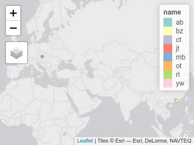

Data structures
================
Robin Lovelace
University of Leeds
<br/>

## Agenda

-   Thinking about Transport Data Science and what you want to get out
    of it (20 minutes)

-   Questions on the homework (20 minutes)

-   Reading-in transport datasets (20 minutes)

    -   I will do a live demo

-   Break

-   Getting started with the data structures practical (20 min)

    -   We will get started with the data together

-   Data Structures practical + getting help (1 hour)

## What do you want to get out of Transport Data Science?

-   Specifically which skills?
    -   Data cleaning
    -   Visualisation
    -   Modelling
-   What do you want to do with those skills?
    -   Commercial
    -   Public interest
    -   Educational
    -   Other
    -   All of the above
-   What kinds of data do you want to be working with?
    -   Commercial
    -   Open
    -   Big data
    -   Accurate data
    -   All the above
-   Where do you see your career in 5 years from now?

## Review of homework exercise: demo then individual Q&A

**Note**: Ensure that you have the necessary packages installed. If you
do not, you can install them as follows:

``` r
install.packages("pct") # install the pct package
```

``` r
library(tidyverse)
library(tmap)
tmap_mode("view")
```

    ## tmap mode set to interactive viewing

``` r
url_locations = "https://github.com/ITSLeeds/TDS/raw/master/messages/locations.csv"
locations = read_csv(url_locations)
```

    ## 
    ## ── Column specification ────────────────────────────────────────────────────────
    ## cols(
    ##   name = col_character(),
    ##   lon = col_double(),
    ##   lat = col_double(),
    ##   n_coffee = col_double(),
    ##   favourite_mode = col_character()
    ## )

``` r
locations_sf = locations %>% 
  filter(!is.na(lon) & !is.na(lat)) %>% 
  sf::st_as_sf(coords = c("lon", "lat"))
tm_shape(locations_sf) +
  tm_dots("name")
```

    ## Linking to GEOS 3.8.0, GDAL 3.0.4, PROJ 7.0.0



### Work through practical and the example with Bristol (\~60 minutes)

See
<https://github.com/ITSLeeds/TDS/blob/master/practicals/2-software.md>

### Think about research questions and data for the coursework (\~30 minutes)

See

``` r
# Ctl+Enter
# import process
u = "https://github.com/ITSLeeds/TDS/raw/master/messages/locations.csv"
locations = read_csv(file = u)
```

    ## 
    ## ── Column specification ────────────────────────────────────────────────────────
    ## cols(
    ##   name = col_character(),
    ##   lon = col_double(),
    ##   lat = col_double(),
    ##   n_coffee = col_double(),
    ##   favourite_mode = col_character()
    ## )

``` r
library(tidyverse)
# tidy data
locations = locations %>% 
  mutate(n_coffee_per_day = n_coffee / 7)
# sanity check on the data
# type in Tab to autocomplete
mean(locations$n_coffee_per_day, na.rm = TRUE)
```

    ## [1] 0.2857143

``` r
locations
```

    ## # A tibble: 19 x 6
    ##    name    lon   lat n_coffee favourite_mode n_coffee_per_day
    ##    <chr> <dbl> <dbl>    <dbl> <chr>                     <dbl>
    ##  1 rl     -1.5  53.8        5 walk                      0.714
    ##  2 mb     16.4  48.2        2 walk                      0.286
    ##  3 ct     -1.5  53.8        3 bicycle                   0.429
    ##  4 mm     NA    NA         NA <NA>                     NA    
    ##  5 jt     -1.6  53.8        1 climb                     0.143
    ##  6 ea     NA    NA         NA <NA>                     NA    
    ##  7 na     NA    NA         NA <NA>                     NA    
    ##  8 bi     NA    NA         NA <NA>                     NA    
    ##  9 mb     NA    NA         NA <NA>                     NA    
    ## 10 ab     -1.5  53.8        1 walk                      0.143
    ## 11 ld     NA    NA         NA <NA>                     NA    
    ## 12 rf     NA    NA         NA <NA>                     NA    
    ## 13 dm     NA    NA         NA <NA>                     NA    
    ## 14 sp     NA    NA         NA <NA>                     NA    
    ## 15 mp     NA    NA         NA <NA>                     NA    
    ## 16 ot     -1.5  53.8        4 walk                      0.571
    ## 17 yw    113.   23.1        0 subway                    0    
    ## 18 sw     NA    NA         NA <NA>                     NA    
    ## 19 bz    114.   22.3        0 walk                      0

``` r
plot(locations)
```


``` r
plot(locations$lon, locations$lat)
```


``` r
locations_sf = locations %>% 
  filter(!is.na(lat)) %>% 
  sf::st_as_sf(coords = c("lon", "lat"))
# visualise
tm_shape(locations_sf) +
  tm_dots()
```


## Practical demo of zones

-   Get data on the zones in West Yorkshire with the following command:

``` r
zones = pct::get_pct_zones(region = "west-yorkshire")
```

-   Find out the class, names, number of columns and number of rows in
    the `zones` dataset using functions such as `names()`, `nrow()` and
    `ncol()`.

-   Plot the number of car trips and walking trips as follows, what do
    you notice about the results? Where do you think there is most
    potential to increase walking levels?

``` r
plot(zones["car_driver"])
plot(zones["foot"])
```

-   How would you select only the `car_driver` column in the zones
    object in the tidyverse? Hint it would begin with the following
    (incomplete) lines:

``` r
library(tidyverse)
zones %>% select(
```

-   Create a new object called `zones_active_modes` that only contains
    the `bicycle` and `foot` attribute columns. Plot it (the results
    should look like those below).


-   Which zone has the highest level of cycling, and where is it?

-   Use the function `filter()`

### OD Data

### Desire lines

-   Read-in top 1000 desire lines for Leeds with the following code
    (hint: rather than typing the url of the file you can copy-paste it
    from [github.com/ITSLeeds/TDS](https://github.com/ITSLeeds/TDS)):

``` r
library(dplyr)
library(sf)
u = "https://github.com/ITSLeeds/TDS/releases/download/0.1/desire_lines.geojson"

download.file(u, "desire_lines.geojson")
desire_lines = read_sf("desire_lines.geojson")
# note: you can also read-in the file from the url:
# desire_lines = read_sf(u)
```

Plot the lines statically as follows:

``` r
library(tmap)
tm_shape(desire_lines) +
  tm_lines()
```


Plot the lines showing the number of car drivers as follows:

``` r
tm_shape(desire_lines) +
  tm_lines(col = "car_driver")
```


-   Plot the same lines, but with colour according to the number of
    people who walked to work in the 2011 Census

-   Re-do the plot of the number of trips made by driving, but make the
    line widths proportional to the total number (`all`) trips made
    (hint: you may need to set the scale with `scale = 5`, or another
    number greater than 1, for example)

Filter-out all lines between 1 and 3km and call the resulting
object`desire_lines_1_5km` with the following command (or similar):

``` r
desire_lines_1_5km = desire_lines %>% 
  filter(e_dist_km > 1 & e_dist_km < 3)
```

-   Plot the results to make sure the operation worked (you should get a
    result like the on below):


Create a new variable called `percent_drive` that contains the
percentage of trips driven in each of the lines in the
`desire_lines_1_5km` object with the following command:

``` r
desire_lines_pcar = desire_lines %>% 
  mutate(percent_drive = car_driver / all * 100)
```

-   Find the top 100 most ‘car dependent’ short desire lines in West
    Yorkshire and plot the results. It should look something like this:

<!-- -->

    ## Legend for line widths not available in view mode.


-   Plot the results in an interactive map and explore the results.
    Where are the top 100 most car-dependent major commuting desire
    lines in West Yorkshire (hint: you may use the `ttm()` function to
    switch to interactive mode in **tmap**)?

<!-- -->

    ## tmap mode set to plotting


## Homework

-   Work through Chapter 12 of Geocomputation with R on Transport -
    <https://geocompr.robinlovelace.net/transport.html>
-   Save your workings in an R script

Bonus 1 Complete exercise 1 (not bonus)

Bonus 1 (non technical): answer question 3

Bonus 2 (technical): can you reproduce the results for Leeds? This
starting point may be useful:

``` r
region = "west-yorkshire"
b = "https://github.com/npct/pct-outputs-regional-notR/raw"
u = paste0("/master/commute/msoa/", region)
u_od = paste0(b, u, "/od_attributes.csv")
od = readr::read_csv(u_od)
z = sf::read_sf(paste0(b, u, "/z.geojson"))
cents = sf::read_sf(paste0(b, u, "/c.geojson"))
od_clean = od %>% 
  select(-id) %>% 
  filter(geo_code1 %in% cents$geo_code) %>% 
  filter(geo_code2 %in% cents$geo_code) 

  
desire_lines = stplanr::od2line(flow = od_clean, cents)
tm_shape(desire_lines$geometry[1:99]) %>% 
  tm_lines()
```
