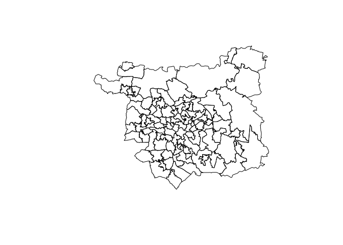

Data structures
================
Robin Lovelace
University of Leeds,
2019-03-05<br/>

## Review of homework exercise: demo then individual Q\&A

``` r
library(tidyverse)
```

    ## ── Attaching packages ────────────────────────────────────────── tidyverse 1.2.1 ──

    ## ✔ ggplot2 3.1.0       ✔ purrr   0.3.1  
    ## ✔ tibble  2.0.1       ✔ dplyr   0.8.0.1
    ## ✔ tidyr   0.8.3       ✔ stringr 1.4.0  
    ## ✔ readr   1.3.1       ✔ forcats 0.4.0

    ## ── Conflicts ───────────────────────────────────────────── tidyverse_conflicts() ──
    ## ✖ dplyr::filter() masks stats::filter()
    ## ✖ dplyr::lag()    masks stats::lag()

``` r
library(sf)
```

    ## Linking to GEOS 3.7.0, GDAL 2.3.2, PROJ 5.2.0

## Data cleaning on a big dataset

Download the file `wu03ew_v2.zip` from the Wicid website:
[wicid.ukdataservice.ac.uk](http://wicid.ukdataservice.ac.uk/cider/wicid/downloads.php).
You should be able to read it in as follows:

``` r
unzip("~/Downloads/wu03ew_v2.zip")
d = read_csv("wu03ew_v2.csv")
```

Load data representing MSOA zones in Leeds. You could download zones
from a number of places, including
<https://www.ukdataservice.ac.uk/get-data/geography.aspx>

An easy way to get zone data for Leeds is with the `ukboundaries` github
package, which can be installed as follows:

``` r
remotes::install_github("robinlovelace/ukboundaries")
```

The zones for Leeds can be shown as follows

``` r
zones = ukboundaries::msoa2011_lds
```

    ## Using default data cache directory ~/.ukboundaries/cache 
    ## Use cache_dir() to change it.

``` r
plot(zones$geometry)
```

<!-- -->

## Processing/cleaning

  - Clean the names of the `d` object, e.g. using the following
    commands:

<!-- end list -->

``` r
names(d) = snakecase::to_snake_case(names(d))
names(d)[5] = "metro"
```

  - Create a new variable called `pcycle` representing the percentage
    cycling in each OD pair

  - Create a minimal version of the dataset `d` only containing a few
    key variables

  - What proportion of people in England and Wales are represented in
    the dataset `d`

  - Create a subset of the object `d` called `d_leeds_origins` that only
    contains routes that originate in leeds

  - Create a subset that contains only od pairs with origins and
    destinations in Leeds

**Bonus: Convert the origin-destination data you have of Leeds into
desire lines**, e.g. with:

``` r
desire_lines = stplanr::od2line(flow = d_leeds_origins, zones)
desire_top = desire_lines %>% top_n(100, bicycle)
plot(desire_top)
```

``` r
mapview::mapview(desire_top)
```

## Working on your own datset / project portfolio

  - Identify, download and clean a dataset to include in your coursework
    portfolio .Rmd document
