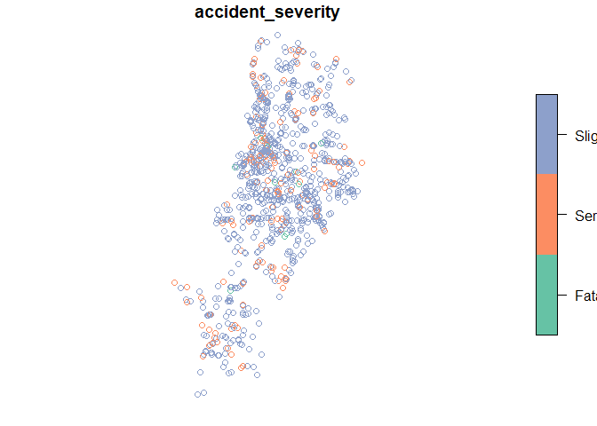
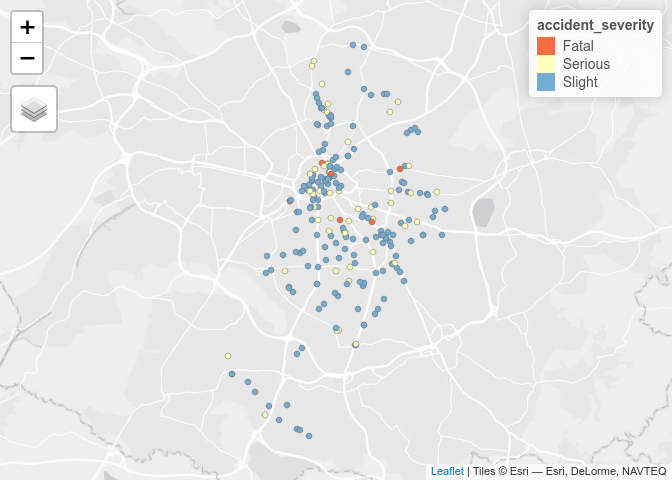

Accessing data from web sources and data cleaning
================
Robin Lovelace
University of Leeds
<br/>

## Review of homework exercise: demo with RMarkdown then individual Q&A

We will be using these packages in this practical:

``` r
library(sf)
library(stats19)
library(tidyverse)
```

## Accessing crowd-sourced data from OSM

- Navigate to <https://overpass-turbo.eu/> and play with the interface
  to see what data is available from OpenStreetMap. Download data on
  highway=cycleway for Leeds from <https://overpass-turbo.eu/>

- Load the data in R and plot it with your favourite plotting package
  (e.g. `sf`, `mapview` or `tmap`)

- Bonus: now try to get the same data using the **osmdata** package

## Get official data with stats19

- Take a read of the stats19 README page and at least one of the
  articles on it here: <https://docs.ropensci.org/stats19/>
- Install and load the stats19 package as with one of the following
  commands:

``` r
install.packages("stats19") # the stable version
# remotes::install_github("ropensci/stats19") # the most recent 'development' version
```

- Show crashes involving pedestrians in Manchester by reproducing the
  following lines of code:

``` r
library(sf)
library(stats19)
library(tidyverse)
crashes_2018 = get_stats19(year = 2018)
crashes_2018_sf = format_sf(crashes_2018)
crashes_manchester = crashes_2018_sf %>% filter(local_authority_district == "Manchester")
plot(crashes_manchester["accident_severity"])
```

<!-- -->

``` r
casualties_2018 = get_stats19(year = 2018, type = "cas")
```

    ## Warning: 22715 parsing failures.
    ##   row            col               expected        actual                                                                                                  file
    ## 30320 accident_index no trailing characters 201801T266389 'C:\Users\earmmor\AppData\Local\Temp\RtmpYnDEqF/dft-road-casualty-statistics-casualty-2018.csv'
    ## 30321 accident_index no trailing characters 201801T271905 'C:\Users\earmmor\AppData\Local\Temp\RtmpYnDEqF/dft-road-casualty-statistics-casualty-2018.csv'
    ## 30322 accident_index no trailing characters 201801T274868 'C:\Users\earmmor\AppData\Local\Temp\RtmpYnDEqF/dft-road-casualty-statistics-casualty-2018.csv'
    ## 30323 accident_index no trailing characters 201801T274868 'C:\Users\earmmor\AppData\Local\Temp\RtmpYnDEqF/dft-road-casualty-statistics-casualty-2018.csv'
    ## 30324 accident_index no trailing characters 201801T278015 'C:\Users\earmmor\AppData\Local\Temp\RtmpYnDEqF/dft-road-casualty-statistics-casualty-2018.csv'
    ## ..... .............. ...................... ............. .....................................................................................................
    ## See problems(...) for more details.

``` r
crashes_manchester = inner_join(crashes_manchester, casualties_2018)
```

    ## Warning in sf_column %in% names(g): Each row in `x` is expected to match at most 1 row in `y`.
    ## ℹ Row 27 of `x` matches multiple rows.
    ## ℹ If multiple matches are expected, set `multiple = "all"` to silence this
    ##   warning.

``` r
pedestrian_casualties = crashes_manchester %>% filter(casualty_type == "Pedestrian")
plot(pedestrian_casualties["accident_severity"])
```

<!-- -->

- Use the tmap package to create an interactive map of pedestrian
  casualties in Manchester, starting with the following commands (hint,
  use `tmaptools::palette_explorer()` and the argument
  `palette = "Reds"` in the function `tm_dots()`, for example, to change
  the default colour palette):

``` r
library(tmap)
tmap_mode("plot")
```

<!-- -->

- Based on the documentation at <https://docs.ropensci.org/stats19/>:

  - Download data on road crashes in Great Britain in 2018
  - Filter crashes that happened in Leeds

- Bonus: make a map of pedestrian casualties in Leeds that shows the
  speed limit where pedestrians were hit. Explore the results in an
  interactive map. Where do you think the speed limit should be reduced
  based on this data?

The result should look something like this:

``` r
crashes_leeds = crashes_2018_sf %>% filter(local_authority_district == "Leeds")
crashes_leeds = inner_join(crashes_leeds, casualties_2018)
```

    ## Warning in sf_column %in% names(g): Each row in `x` is expected to match at most 1 row in `y`.
    ## ℹ Row 3 of `x` matches multiple rows.
    ## ℹ If multiple matches are expected, set `multiple = "all"` to silence this
    ##   warning.

``` r
pedestrian_casualties = crashes_leeds %>% filter(casualty_type == "Pedestrian")
tm_shape(pedestrian_casualties) +
  tm_dots("speed_limit")
```

<!-- -->

- Bonus: what is the relationship between crash severity and the speed
  limit?

- Bonus: download and visualise the Leeds Bradford Cycle Superhighway
  data with these commands:

``` r
library(osmdata)
data_osm = opq("leeds uk") %>% 
  add_osm_feature(key = "name", value = "Cycle Superhighway 1") %>% 
  osmdata_sf()
```

``` r
# if the previous command fails, try:
data_osm = readRDS(url("https://github.com/ITSLeeds/TDS/releases/download/0.20.1/data_osm_cycle_superhighway.Rds"))
cycleway_100m_buffer = stplanr::geo_buffer(data_osm$osm_lines, dist = 100)
crashes_leeds_lon_lat = crashes_leeds %>% st_transform(4326)
crashes_near_cycle_superhighway = crashes_leeds_lon_lat[cycleway_100m_buffer, ]
```

``` r
tm_shape(data_osm$osm_lines) + tm_lines() +
  tm_shape(crashes_near_cycle_superhighway) + tm_dots("casualty_type")
```


- Filter crashes that happened within a 500 m buffer of the cycle
  infrastructure
- Do cyclists seem safer on the cycle superhighway?
- Bonus: pull down origin-destination data with the `pct` package hosted
  at: <https://github.com/ITSLeeds/pct>

## Get travel to work data with the PCT

Use the `pct` package’s inbuilt help to find out how to get data for
West Yorkshire. Hint: the code below gets zones for Leeds:

``` r
library(pct)
head(pct::pct_regions)
```

    ## Simple feature collection with 6 features and 1 field
    ## Geometry type: MULTIPOLYGON
    ## Dimension:     XY
    ## Bounding box:  xmin: -3.193998 ymin: 51.28676 xmax: 0.3339015 ymax: 55.07939
    ## Geodetic CRS:  WGS 84
    ##             region_name                       geometry
    ## 1                london MULTIPOLYGON (((0.2082447 5...
    ## 2    greater-manchester MULTIPOLYGON (((-2.146328 5...
    ## 3 liverpool-city-region MULTIPOLYGON (((-2.730525 5...
    ## 4       south-yorkshire MULTIPOLYGON (((-1.822229 5...
    ## 5            north-east MULTIPOLYGON (((-1.784972 5...
    ## 6         west-midlands MULTIPOLYGON (((-1.788081 5...

``` r
# see all regions with View(pct_regions)
zones = get_pct_zones(region = "west-yorkshire")
zones_leeds = zones %>% 
  filter(lad_name == "Leeds")
zones_leeds %>% 
  select(bicycle:taxi_other) %>% 
  plot()
```

<!-- -->

``` r
?get_pct_routes_fast
```

Bonus (if you have time and a decent computer): download and import the
‘car.zip’ data from <https://github.com/ITSLeeds/NTEM2OD/releases>

## Getting data from the web

Read through Section
[8.2](https://geocompr.robinlovelace.net/read-write.html#retrieving-data)
and 8.3 of Geocomputation with R.

Complete Excersises 4, 5, 6 and 7 of the chapter

## Bonus 1: osmextract

Take a read of the documentation for the
[`osmextract`](https://docs.ropensci.org/osmextract/index.html) package.

Reproduce the examples

Get all supermarkets in OSM for West Yorkshire

Identify all cycleways in West Yorkshire and, using the stats19 data you
have already downloaded, identify all crashes that happened near them.

## Bonus 2: Getting data from statistics.gov.uk

Identify a region and zonal units of interest from
<http://geoportal.statistics.gov.uk/>

- Read them into R as an `sf` object

- Join-on data from a non-geographic object

- Add a data access section to your in progress portfolio

## Bonus 3: find another geographic or transport dataset hosted online and write code to download it

- Share the code on Teams or in a GitHub issue:
  <https://github.com/ITSLeeds/TDS/issues>

## Some suggested links

### Boundary data

The list below provides links to some key data sources that may be of
use and interest, starting with the most universal and easy to use, and
ending in rather specific datasets. - UK geoportal, providing geographic
data at many levels: <https://geoportal.statistics.gov.uk> - Other
national geoportals exist, such as this: <http://www.geoportal.org/>

### UK specific resources

Students can register with Edina Digimap. It is a service which will
allow you to download UK topographic map data.
<https://digimap.edina.ac.uk/webhelp/digimapsupport/about.htm#access/access_to_digimap.htm>
UK census data can be accessed from several places including:
<https://census.edina.ac.uk/bds.html>
<https://www.nomisweb.co.uk/census/2011>
<https://www.nomisweb.co.uk/census/2011>

The UK data service hosts a wide variety of spatial and survey data
sets. An example is this recently released land use data
<https://reshare.ukdataservice.ac.uk/854240/> The Placed-Based Carbon
Calculator has transport data about the UK with free downloads on the
Data page. <https://www.carbon.place>

The University of Leeds is a partner in the Consumer Data Research
Centre. Examples of data available include Access to Healthy Assets &
Hazards (AHAH)
<https://data.cdrc.ac.uk/dataset/access-healthy-assets-hazards-ahah> And
access to online grocery deliveries
<https://www.cdrc.ac.uk/e-food-deserts/> Some CDRC datasets are openly
available and others are accessible to students and researchers. You can
register with your university of Leeds account

### International resources

The United nations have a number of access points for spatial data. For
example this for data relating to sustainable development goals:
<https://unstats-undesa.opendata.arcgis.com/> European Union data sets
are available here <https://ec.europa.eu/eurostat/web/gisco/geodata>

There are other data sources and links to data. Here are some
examples.  
<http://freegisdata.rtwilson.com/> Note this has a listing of several
transport data sources <http://www.gadm.org/> boundary datasets for
administrative areas around the world.
<https://www.gislounge.com/world-gis-data/> links to further resources
<https://library.stanford.edu/research/stanford-geospatial-center/data>
Stanford University directory of data sources
<http://www.diva-gis.org/gdata> available datasets by country.
(availability of these resources may change)

### Some sources of transport data

Some government agencies publish data. Sometimes these are in spatial
formats such as shapefiles. In other cases they are spreadsheets with
zone identifiers which can be joined to spatial data.  
• UK government transport data:
<https://ckan.publishing.service.gov.uk/publisher/department-for-transport>

This is an example of a site based in the USA. Most of the data is for
the USA, but there are some international data sets. Some sites such as
this require you to join or register to use the data.  
• <https://data.world/datasets/transportation>
