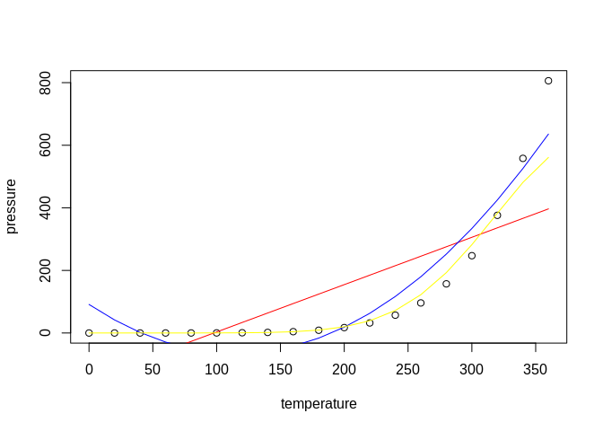

Routing homework
================
Malcolm Morgan
University of Leeds,
2020-02-11<br/>

## Prior set-up and reading (before practical)

We will use [ITS Go](https://itsleeds.github.io/go/) to do an easy setup
of your computer.

``` r
source("https://git.io/JvGjF")
```

If that does not work the packages we will be using are:

  - sf
  - tidyverse
  - tmap
  - pct
  - stplanr
  - dodgr
  - opentripplanner
  - igraph
  - ITSleeds/geofabrik

Make sure that you have installed these.

Read the OpenTripPlanner package paper for information on routing
(Morgan et al. 2019).

## The practical (during and after practical)

Ensure that you have completed the exercises in the practical session
(see the
[`practicals.2f6-routing.pdf`](https://github.com/ITSLeeds/TDS/releases/download/0.20.1/practicals.2f6-routing.pdf)
file in <https://github.com/ITSLeeds/TDS/releases> )

## An RMarkdown template

  - Read Chapter 2 of the definitive guide to the .Rmd file format (Xie,
    Allaire, and Grolemund 2018):
    <https://bookdown.org/yihui/rmarkdown/basics.html>

  - Create a new project called `tdsproject` (or similar) and create a
    new RMarkdown file by running the following command:

<!-- end list -->

``` r
usethis::use_readme_rmd()
```

On line 32 of the resulting file, replace this line

    plot(pressure)

with this:

``` r
m1 = lm(pressure ~ temperature, data = pressure)
plot(pressure)
lines(pressure$temperature, m1$fitted.values, col = "red")
```

Knit the file. You should see something that looks like this. What is
wrong with the prediction?

Challenge: generate a model prediction that more accurately models the
relationship between pressure and temperature (hint: the code `+
I(temperature^2)` may help, the result should look something like that
shown below).

<!-- -->

Try to reproduce the output of this file:
<https://github.com/ITSLeeds/TDS/blob/master/coursework-template.Rmd>

The results should look something like this:
<https://github.com/ITSLeeds/TDS/blob/master/coursework-template.md>

Challenge: knit the document to create a file called
coursework-template.pdf. \#\# References

<div id="refs" class="references">

<div id="ref-morgan_opentripplanner_2019">

Morgan, Malcolm, Marcus Young, Robin Lovelace, and Layik Hama. 2019.
“OpenTripPlanner for R.” *Journal of Open Source Software* 4 (44):
1926. <https://doi.org/10.21105/joss.01926>.

</div>

<div id="ref-xie_r_2018">

Xie, Yihui, J. J. Allaire, and Garrett Grolemund. 2018. *R Markdown: The
Definitive Guide*. 1 edition. Boca Raton: Chapman; Hall/CRC.

</div>

</div>
