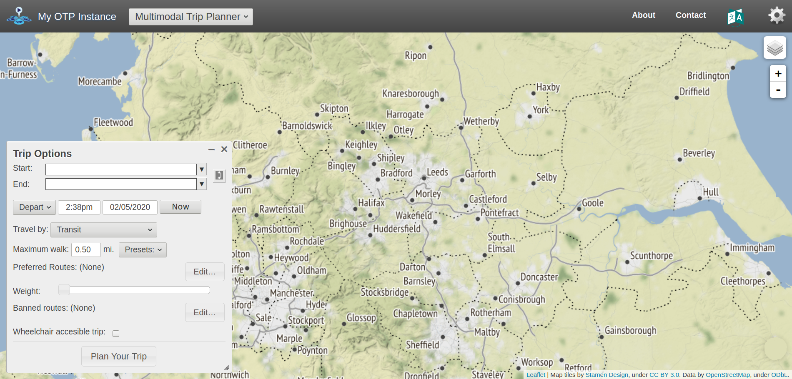

```{r, include=FALSE}
# setup
knitr::opts_chunk$set(warning = FALSE)
```

```{r, echo=FALSE, eval=FALSE}
# print pdf
pagedown::chrome_print("practicals/6-routing.md")
pagedown::chrome_print("practicals/6-routing.html")
browseURL("practicals/6-routing.pdf")
piggyback::pb_upload("practicals/6-routing.pdf")
piggyback::pb_download_url("practicals/6-routing.pdf")
```


## Setting Up (10 minutes)

We will use [ITS Go](https://itsleeds.github.io/go/) to do an easy setup of your computer.

```{r, eval=FALSE, message=FALSE, warning=FALSE}
source("https://git.io/JvGjF")
```

If that does not work the packages we will be using are:

* sf
* tidyverse
* tmap
* pct
* stplanr
* dodgr
* opentripplanner
* igraph
* ropensci/osmextract

New packages to install:

```{r, eval=FALSE}
install.packages("opentripplanner")
```

```{r, eval=TRUE, message=FALSE, warning=FALSE}
library(sf)
library(tidyverse)
library(stplanr)
library(opentripplanner)
library(tmap)
tmap_mode("plot")
```

## Using OpenTripPlanner to get routes

We have setup the Multi-modal routing service OpenTripPlanner for West Yorkshire. Try typing the URL shown during the session into your browser. You should see somthign like this:

```{r, echo = FALSE, fig.align='center', fig.cap="\\label{fig:otpgui}OTP Web GUI"}

```

**Exercise**: Play with the web interface, finding different types of routes. What strengths/limitations can you find?

### Connecting to OpenTripPlanner

```{r, echo=FALSE, eval=FALSE}
piggyback::pb_upload("otp_TDS.zip")
piggyback::pb_download_url("otp_TDS.zip")
# https://github.com/ITSLeeds/TDS/releases/download/0.20.1/otp_TDS.zip
```


```{r, eval=FALSE, engine='bash'}
# java –Xmx10000M -d64 -jar "D:/OneDrive - University of Leeds/Data/opentripplanner/otp-1.5.0-shaded.jar" --router west-yorkshire --graphs "D:/OneDrive - University of Leeds/Data/opentripplanner/graphs" --server --port 8080 --securePort 8081
sudo update-alternatives --config java
# java --version
java -version
java -Xmx10000M -d64 -jar "/home/robin/programs/otp1.5/otp_TDS/otp-1.5.0-shaded.jar" --router west-yorkshire --graphs "/home/robin/programs/otp1.5/otp_TDS/graphs" --server --port 8080 --securePort 8081
```


To allow R to connect to the OpenTripPlanner server, we will use the `opentripplanner` package and the function `otp_connect`. In this example I have saved the hostname of the server as a variable called "robinIP" in my Renviron file by using `usethis::edit_r_environ()`.

However, you can also just set it manually.

```{r, eval=TRUE, message=FALSE, warning=FALSE}
ip = "localhost"
ip = "otp.saferactive.org"
# ip = "xx.x.218.83" # an actual server
otpcon = otp_connect(hostname = ip, 
                     port = 80,
                     # port = 8080,
                     router = "west-yorkshire")
```

If you have connected successfully, then you should get a message "Router exists."

To get some routes, we will start by importing some data we have used previously.

```{r, message=FALSE}
u = "https://github.com/ITSLeeds/TDS/releases/download/0.1/desire_lines.geojson"
download.file(u, "desire_lines.geojson")
desire_lines = read_sf("desire_lines.geojson")
```

**Exercise** Subset the `desire_lines` data frame so that it only has the following columns:
"geo_code1", "geo_code2", "all", "bicycle", "foot", "car_driver", "car_passenger", "train", "taxi", "motorbike", and "geometry"   

```{r, message=FALSE, echo=FALSE}
desire_lines = desire_lines[,c("geo_code1", "geo_code2", "all", "bicycle", "foot", "car_driver", "car_passenger", "train", "taxi", "motorbike")]
```

This dataset has desire lines, but most routing packages need start and endpoints, so we will extract the points from the lines using the `line2df` function. An then select the top 3 desire lines.

**Exercises**
1. Use the `tmap` package to plot the `desire_lines`. Choose different ways to visualise the data so you can understand local commuter travel patterns.
1. Produce a data frame called `desire` which contains the coordinates of the start and endpoints of the lines in `desire_lines` but not the geometries.
1. Subset out the top three desire lines by the total number of commuters and create a new data frame called `desire_top`
1. Find the driving routes for `desire_top` and call them `routes_top` using `otp_plan`

```{r, message=FALSE}
qtm(desire_lines)
tm_shape(desire_lines) +
  tm_lines(lwd = "all", col = "car_driver", scale = 4, palette = "viridis")
```


```{r, eval=FALSE, eval=FALSE}
desire = bind_cols(desire_lines, line2df(desire_lines))
desire = st_drop_geometry(desire)
desire_top = top_n(desire, 3, all)
# pre stplanr::route() way of doing it:
routes_top = otp_plan(otpcon,
                      fromPlace = as.matrix(desire_top[,c("fx","fy")]),
                      toPlace = as.matrix(desire_top[,c("tx","ty")]),
                      mode = "CAR")
```

To find the routes for these desire lines, we can route them as follows:

```{r, message=FALSE, eval=TRUE}
routes_top = route(
  l = desire_lines %>% top_n(3, all),
  route_fun = otp_plan,
  mode = "CAR",
  otpcon = otpcon
  )
```

We can plot those routes using the `tmap` package.

```{r, message=FALSE, eval=FALSE, echo=FALSE}
tmap_mode("view")
qtm(routes_top)
```

We can also get Isochones from OTP.

```{r, message=FALSE, eval=TRUE, message=FALSE}
isochrone = otp_isochrone(otpcon, fromPlace = c(-1.558655, 53.807870), 
                          mode = c("BICYCLE","TRANSIT"),
                          maxWalkDistance = 3000)
isochrone$time = isochrone$time / 60
tm_shape(isochrone) +
  tm_fill("time", alpha = 0.6)
```

To save overloading the server, I have pre-generated some extra routes.

```{r, message=FALSE, eval=FALSE, echo=FALSE}
routes_drive = route(
  l = desire_lines,
  route_fun = otp_plan,
  mode = "CAR",
  otpcon = otpcon
  )
  
routes_dr2 = otp_plan(otpcon,
                      fromPlace = as.matrix(desire[,c("fx","fy")]),
                      toPlace = as.matrix(desire[,c("tx","ty")]),
                      fromID = desire$geo_code1,
                      toID = desire$geo_code2,
                      mode = "CAR",
                      )


routes_transit = otp_plan(otpcon,
                      fromPlace = as.matrix(desire[,c("fx","fy")]),
                      toPlace = as.matrix(desire[,c("tx","ty")]),
                      fromID = desire$geo_code1,
                      toID = desire$geo_code2,
                      mode = c("TRANSIT","WALK"),
                      maxWalkDistance = 1500,
                      ncore = 4)
write_sf(routes_drive, "driving_routes.gpkg")
write_sf(routes_transit,"transit_routes.gpkg")
```

```{r, message=FALSE, eval=TRUE, echo=TRUE}
u = "https://github.com/ITSLeeds/TDS/releases/download/0.20.1/transit_routes.gpkg"
download.file(url = u, destfile = "transit_routes.gpkg", mode = "wb")
u = "https://github.com/ITSLeeds/TDS/releases/download/0.20.1/driving_routes.gpkg"
download.file(url = u, destfile = "driving_routes.gpkg", mode = "wb")

routes_drive = read_sf("driving_routes.gpkg")
routes_transit = read_sf("transit_routes.gpkg")
```

**Exercise** Examine these two new datasets `routes_drive` and `routes_transit` plot them on a map, what useful information do they contain what is missing?


```{r, message=FALSE, eval=FALSE, echo=FALSE}
# No longer needed - route() joins
# Finally, let's join the routes to the original desire dataset.
desire_drive = left_join(desire, routes_drive, by = c("geo_code1" = "fromPlace", 
                                                      "geo_code2" = "toPlace"))
```

Note that some of the desire lines do not have a route. This is usually because the start or endpoint is too far from the road.

**Exercise** How many routes are missing for each mode? How could you improve this method, so there were no missing routes?

```{r, message=FALSE, eval=FALSE, echo=FALSE}
summary(is.na(desire_drive$duration))
desire_drive = desire_drive[is.na(desire_drive$duration),]
```

## Line Merging

Notice that `routes_transit` has returned separate rows for each mode (WALK, RAIL). Notice the `route_option` column shows that some routes have multiple options.

Let's suppose you want a single line for each route.

**Exercise**: Filter the `routes_transit` to contain only one route option per origin-destination pair.
**Bonus Exercise**: Do the above, but make sure you always select the fastest option.

```{r, eval=TRUE, message=FALSE, echo=FALSE}
routes_transit = routes_transit %>%
  filter(route_option == 1)
```

Now We will group the separate parts of the routes together.

```{r, eval=TRUE, message=FALSE}
routes_transit_group = routes_transit %>%
  dplyr::group_by(fromPlace, toPlace) %>%
  dplyr::summarise(duration = sum(duration),
                   startTime = min(startTime),
                   endTime = max(endTime),
                   distance = sum(distance))

```

We now have a single row, but instead of a `LINESTRING`, we now have a mix of `MULTILINESTRING` and `LINESTRING`, we can convert to a linestring by using `st_line_merge()`. Note how the different columns where summarised.

First, we must separate out the `MULTILINESTRING` and `LINESTRING`

```{r, eval=FALSE}
routes_transit_group_ml = routes_transit_group[st_geometry_type(routes_transit_group) == "MULTILINESTRING", ]
routes_transit_group = routes_transit_group[st_geometry_type(routes_transit_group) != "MULTILINESTRING", ]
routes_transit_group_ml = st_line_merge(routes_transit_group_ml)
routes_transit_group = rbind(routes_transit_group, routes_transit_group_ml)
```


## Network Analysis (dodgr) (20 minutes)

**Note** Some people have have problems running dodgr on Windows, if you do follow these [instructions](https://github.com/ITSLeeds/TDS/blob/master/practicals/dodgr-install.md).

We will now look to analyse the road network using `dodgr`. First let's find the distances between all our centroids for a cyclist. `dodgr_dists` returns a matrix of distances in km, note the speed of using dodgr to find 64 distances compared to using a routing service. `dodgr` works well for these type of calculation, but cannot do public transport timetables.

```{r, eval=TRUE, warning=FALSE, message=FALSE}
library(osmextract)
library(dodgr)
library(igraph)
roads = oe_get("isle-of-wight", extra_tags = c("maxspeed","oneway"))
roads = roads[!is.na(roads$highway),]
road_types = c("residential","secondary","tertiary",
                        "unclassified","primary","primary_link",
                        "secondary_link","tertiary_link")
roads = roads[roads$highway %in% road_types, ]
graph = weight_streetnet(roads)
```

<!-- **Exercise**: Reproduce the Isle of Wight flow data `d_iow_origins` that you used in the Data Cleaning Practical -->

We will find the betweeness centrality of the Isle of Wight road network. THis can take a long time, so first lets check how long it will take. 

```{r, message=TRUE, echo=TRUE}
estimate_centrality_time(graph)
centrality = dodgr_centrality(graph)


clear_dodgr_cache()

centrality_sf = dodgr_to_sf(centrality)
tm_shape(centrality_sf) +
  tm_lines("centrality",
           lwd = 3,
           n = 8,
           style = "fisher",
           palette = "-viridis")

```

**Exercise**: Use `dodgr_contract_graph` before calculating centrality, how does this affect the computation time and the results?

**Bonus Exercises**
1. Work though the OpenTripPlanner vignettes [Getting Started](https://docs.ropensci.org/opentripplanner/articles/opentripplanner.html) and [Advanced Features](https://docs.ropensci.org/opentripplanner/articles/advanced_features.html) to run your own local trip planner.

