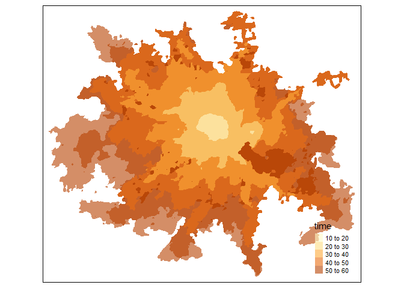
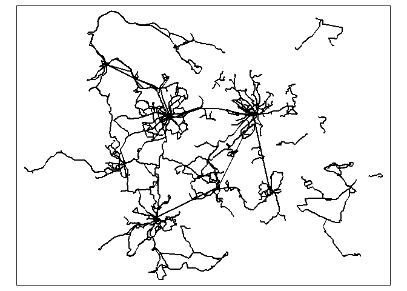
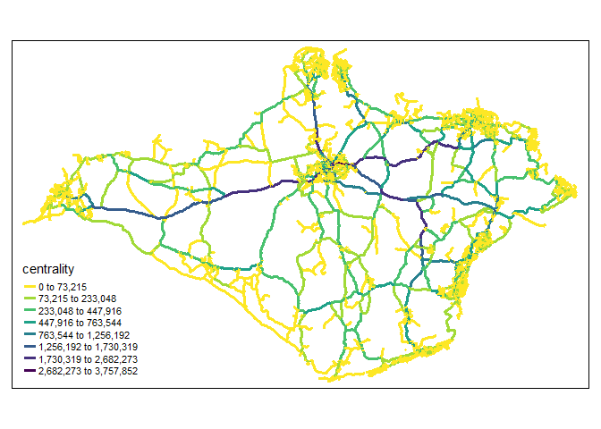

Routing
================
Malcolm Morgan and Robin Lovelace
University of Leeds
<br/>

## Setting Up

If you have not done the
[homework](https://github.com/ITSLeeds/TDS/blob/master/practicals/6-routing-homework.md),
do that first.

The packages we will be using are:

``` r
library(sf)         # Spatial data functions
library(lwgeom) 
library(tidyverse)  # General data manipulation
library(stplanr)    # General transport data functions
library(dodgr)      # Local routing and network analysis
library(opentripplanner) # Connect to and use OpenTripPlanner
library(tmap)       # Make maps
library(osmextract) # Download and import OpenStreetMap data
tmap_mode("plot")
```

## Using OpenTripPlanner to get routes

We have setup the Multi-modal routing service OpenTripPlanner for West
Yorkshire. Try the link on Minerva.

<div class="figure" style="text-align: center">


<p class="caption">
Minerva Link
</p>

</div>

You should see something like this:

<div class="figure" style="text-align: center">


<p class="caption">
OTP Web GUI
</p>

</div>

**Exercise**

1.  Play with the web interface, finding different types of routes. What
    strengths/limitations can you find?

Notice that the URL is in the form of `ip:port` note these down as you
will use them below.

### Connecting to OpenTripPlanner

To allow R to connect to the OpenTripPlanner server, we will use the
`opentripplanner` package and the function `otp_connect`.

``` r
ip = "xx.xxx.xxx.xxx" # See the link on Minerva for correct value
port = 0000           # See the link on Minerva for correct value
otpcon = otp_connect(hostname = ip, 
                     port = port,
                     router = "west-yorkshire")
```

If you have connected successfully, then you should get a message
“Router exists.”

Create a test route. Notice than in the web UI the coordiante are
`Lat/Lng` but R uses `Lng/Lat`

``` r
routes_test = otp_plan(otpcon = otpcon,
                            fromPlace = c(-1.55555, 53.81005), #Lng/Lat
                            toPlace = c(-1.54710, 53.79519),
                            mode = "WALK") 
```

You can use multiple modes and combinations try:

- `mode = "WALK"`
- `mode = c("WALK","TRANSIT")`
- `mode = c("BICYCLE","TRANSIT")`
- `mode = "CAR"`
- `mode = c("CAR_PARK","TRANSIT")`

To get some more routes, we will start by importing some data. The
`NTEM_flow.geojson` dataset the contains the top desire lines in West
Yorkshire. It was produced from a transport model called the [National
Trip End
Model](https://data.gov.uk/dataset/11bc7aaf-ddf6-4133-a91d-84e6f20a663e/national-trip-end-model-ntem)
and research from the [University of
Leeds](https://github.com/ITSLeeds/NTEM2OD).

``` r
u = "https://github.com/ITSLeeds/TDS/releases/download/22/NTEM_flow.geojson"
desire_lines = read_sf(u)
head(desire_lines)
```

    ## Simple feature collection with 6 features and 9 fields
    ## Geometry type: LINESTRING
    ## Dimension:     XY
    ## Bounding box:  xmin: -1.547 ymin: 53.7065 xmax: -1.2403 ymax: 53.7979
    ## Geodetic CRS:  WGS 84
    ## # A tibble: 6 × 10
    ##   from      to          all drive passenger  walk cycle  rail   bus
    ##   <chr>     <chr>     <dbl> <dbl>     <dbl> <dbl> <dbl> <dbl> <dbl>
    ## 1 E02002444 E02002443  1374    55        24  1121     0     0   174
    ## 2 E02002443 E02002445  1189   100        44   868     4     0   173
    ## 3 E02002442 E02002440  1494    83        40  1139    23     0   209
    ## 4 E02002442 E02002441  1747   349       168   906    62     0   262
    ## 5 E02002447 E02002448  4930    70        36  4162    98     0   564
    ## 6 E02006876 E02006875 10314  1854       942  4680   251     0  2587
    ## # … with 1 more variable: geometry <LINESTRING [°]>

We will also download the points that represent the possible start and
end point of trips in the model

``` r
u = "https://github.com/ITSLeeds/TDS/releases/download/22/NTEM_cents.geojson"
centroids = read_sf(u)
head(centroids)
```

    ## Simple feature collection with 6 features and 3 fields
    ## Geometry type: POINT
    ## Dimension:     XY
    ## Bounding box:  xmin: -1.504671 ymin: 53.70647 xmax: -1.240289 ymax: 53.71751
    ## Geodetic CRS:  WGS 84
    ## # A tibble: 6 × 4
    ##   Zone_Code rural_urban region                               geometry
    ##   <chr>     <chr>       <chr>                             <POINT [°]>
    ## 1 E02002446 Urban       Yorkshire and The Humber (-1.429355 53.70823)
    ## 2 E02002447 Urban       Yorkshire and The Humber (-1.240289 53.70647)
    ## 3 E02002444 Urban       Yorkshire and The Humber (-1.475509 53.71247)
    ## 4 E02002445 Urban       Yorkshire and The Humber (-1.504671 53.71042)
    ## 5 E02002442 Urban       Yorkshire and The Humber (-1.337374 53.71751)
    ## 6 E02002443 Urban       Yorkshire and The Humber (-1.490287 53.71438)

**Exercise**

2.  Plot the `desire_lines` and `centroids` objects using the `tmap` to
    show the number of travellers on each desire_line and the locations
    of all centroids.

``` r
tmap_mode("plot") #Change to view for interactive map
tm_shape(desire_lines) +
  tm_lines(lwd = "all", col = "all", scale = 4, palette = "-viridis") +
  tm_shape(centroids) +
  tm_dots(col = "red")
```

<!-- -->

3.  Produce some different maps for each mode of travel in the
    `desire_lines` dataset. How do the numbers of travellers change for
    walking, driving, and train travel? See example plot below.

<!-- -->

This dataset has desire lines, but most routing packages need start and
endpoints, so we will extract the start and endpoints using the package
`lwgeom`

**Exercise**

4.  Produce a data frame called `desire_top` which contains the top
    three `desire_lines` for all travellers. Hint `?top_n`

5.  We need to extract start and end point from those desire lines. We
    would also like to give each place an ID value

``` r
# Extract the start and end points
fromPlace <- lwgeom::st_startpoint(desire_top)
toPlace <- lwgeom::st_endpoint(desire_top)

# This returns just the geometry
# So make it into an sf data.frame with the ID values from desire_top

fromPlace <- st_sf(data.frame(id = desire_top$from, geometry = fromPlace))
toPlace <- st_sf(data.frame(id = desire_top$to, geometry = toPlace))
```

6.  Create a new object called `routes_drive_top`, with driving routes
    between the OD pairs represented in the `desire_top` object.

Calculate routes for the first three desire lines with the following
command:

``` r
routes_drive_top = otp_plan(otpcon = otpcon,
                            fromPlace = fromPlace,
                            toPlace = toPlace,
                            fromID = fromPlace$id,
                            toID = toPlace$id,
                            mode = "CAR")
```

7.  Plot `routes_drive_top` using the `tmap` package mode. You should
    see something like the image below.

<!-- -->

    ## tmap mode set to plotting

``` r
tm_shape(routes_drive_top) + tm_lines()
```

<!-- -->

We can also get Isochrones from OTP.

``` r
isochrone = otp_isochrone(otpcon, 
                          fromPlace = c(-1.558655, 53.807870), 
                          mode = c("BICYCLE","TRANSIT"),
                          maxWalkDistance = 3000)
isochrone$time = isochrone$time / 60
tm_shape(isochrone) +
  tm_fill("time", alpha = 0.6)
```

<!-- -->

To save you time and to prevent overloading the server, we have
pre-generated some extra routes. Download these routes and load them
into R.

``` r
u = "https://github.com/ITSLeeds/TDS/releases/download/22/routes_drive.geojson"
routes_drive = read_sf(u)
u = "https://github.com/ITSLeeds/TDS/releases/download/22/routes_transit.geojson"
routes_transit = read_sf(u)
```

We will now join the number of drivers onto the driving routes.

**Exercise**

8.  Create a dataset called `n_driver` from `desire_lines` which only
    have the columns `from` `to` and `drive`. Hint ?dplyr::select and
    ?sf::st_drop_geometry

9.  Join the `n_driver` data onto the `routes_drive` data by linking
    `fromPlace = from` and `toPlace = to`. Hint ?dplyr::left_join.

10. Plot the routes showing the number of drivers on each route.

<!-- -->

## Route Networks (also called flow maps)

The map above shows some useful information about where people drive.
But it has a problem. When many routes overlap it hides some of the
drivers. What would be more useful would be to add those drivers
together so we can see the total number of drivers on each road. This is
what a route network does.

We can produce a route network map using `stplanr::overline`.

``` r
rnet_drive = overline(routes_drive, "drive")
```

**Exercise**

10. Make a route network for driving and plot it using the `tmap`
    package. How is is different from just plotting the routes?

<!-- -->

## Line Merging

Notice that `routes_transit` has returned separate rows for each mode
(WALK, RAIL, BUS). Notice the `route_option` column shows that some
routes have multiple options.

Let’s suppose you want a single line for each route.

**Exercise**

11. Filter the `routes_transit` to contain only one route option per
    origin-destination pair and only the columns `fromPlace` `toPlace`
    `distance` `geometry`

Now We will group the separate parts of the routes together.

``` r
routes_transit_group = routes_transit %>%
  dplyr::group_by(fromPlace, toPlace) %>%
  dplyr::summarise(distance = sum(distance))
```

We now have a single row, but instead of a `LINESTRING`, we now have a
mix of `MULTILINESTRING` and `LINESTRING`, we can convert to a
`LINESTRING` by using `st_line_merge()`. Note how the different columns
where summarised.

First, we must separate out the `MULTILINESTRING` and `LINESTRING`

``` r
routes_transit_group_ml = routes_transit_group[st_geometry_type(routes_transit_group) == "MULTILINESTRING", ]
routes_transit_group = routes_transit_group[st_geometry_type(routes_transit_group) != "MULTILINESTRING", ]
routes_transit_group_ml = st_line_merge(routes_transit_group_ml)
routes_transit_group = rbind(routes_transit_group, routes_transit_group_ml)
```

**Exercise**

12. Plot the transit routes, what do you notice about them?

<!-- -->

**Bonus Exercise**:

13. Redo exercise 16 but make sure you always select the fastest option.
    You may need to re-download the `routes_transit` data.

## Network Analysis (dodgr)

**Note** Some people have have problems running dodgr on Windows, if you
do follow these
[instructions](https://github.com/ITSLeeds/TDS/blob/master/practicals/dodgr-install.md).

We will now analyse the road network using `dodgr`. Network analysis can
take a very long time on large areas. So we will use the example of the
[Isle of Wight](https://en.wikipedia.org/wiki/Isle_of_Wight), which is
ideal for transport studies as it is small, but has a full transport
system including a railway and the last commercial hovercraft service in
the world.

First we need to download the roads network from the OpenStreetMap using
`osmextract::oe_get`. We will removed most of the paths and other
features and just focus on the main roads. Then use
`dodgr::weight_streetnet` to produce a graph of the road network.

``` r
# Download data from OpenSteetMap
roads = oe_get("Isle of Wight", extra_tags = c("maxspeed","oneway"))

# Remove non-road data
roads = roads[!is.na(roads$highway),]

# Only get some road types see https://wiki.openstreetmap.org/wiki/Key:highway
road_types = c("primary","primary_link",
               "secondary","secondary_link",
               "tertiary", "tertiary_link",
               "residential","unclassified")
roads = roads[roads$highway %in% road_types, ]

# Build a graph
graph = weight_streetnet(roads)
```

We will find the betweenness centrality of the Isle of Wight road
network. This can take a long time, so first lets check how long it will
take.

``` r
estimate_centrality_time(graph)
```

    ## Estimated time to calculate centrality for full graph is 00:00:07

``` r
centrality = dodgr_centrality(graph)
```

We can convert a `dodgr` graph back into a sf data frame for plotting
using `dodgr::dodgr_to_sf`

``` r
clear_dodgr_cache()
centrality_sf = dodgr_to_sf(centrality)
```

**Exercise**

14. Plot the centrality of the Isle of Wight road network. What can
    centrality tell you about a road network?

<!-- -->

15. Use `dodgr::dodgr_contract_graph` before calculating centrality, how
    does this affect the computation time and the results?

**Bonus Exercises**

16. Work though the OpenTripPlanner vignettes [Getting
    Started](https://docs.ropensci.org/opentripplanner/articles/opentripplanner.html)
    and [Advanced
    Features](https://docs.ropensci.org/opentripplanner/articles/advanced_features.html)
    to run your own local trip planner for the Isle of Wight.

**Note** To use OpenTripPlanner on your own computer requires Java 8.
See the
[Prerequisites](https://docs.ropensci.org/opentripplanner/articles/prerequisites.html)
for more details. If you can’t install Java 8 try some of the examples
in the vignettes but modify them for West Yorkshire.

17. Read the `dodgr`
    [vignettes](https://atfutures.github.io/dodgr/articles/index.html)
