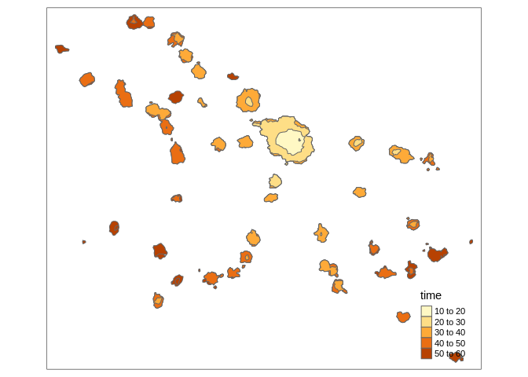
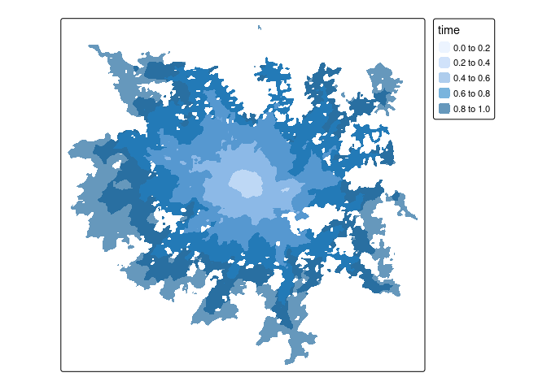

Routing
================
Malcolm Morgan
University of Leeds
<br/>

## Setting Up (10 minutes)

We will use [ITS Go](https://itsleeds.github.io/go/) to do an easy setup
of your computer.

``` r
source("https://git.io/JvGjF")
```

If that does not work the packages we will be using are:

  - sf
  - tidyverse
  - tmap
  - pct
  - stplanr
  - dodgr
  - opentripplanner
  - igraph
  - ropensci/osmextract

<!-- end list -->

``` r
library(sf)
library(tidyverse)
library(stplanr)
library(opentripplanner)
library(tmap)
tmap_mode("plot")
```

## Using OpenTripPlanner to get routes

We have setup the Multi-modal routing service OpenTripPlanner for West
Yorkshire. Try typing the URL shown during the session into your
browser. You should see somthign like this:

<div class="figure" style="text-align: center">


<p class="caption">

OTP Web GUI

</p>

</div>

**Exercise**: Play with the web interface, finding different types of
routes. What strengths/limitations can you find?

### Connecting to OpenTripPlanner

To allow R to connect to the OpenTripPlanner server, we will use the
`opentripplanner` package and the function `otp_connect`. In this
example I have saved the hostname of the server as a variable called
“robinIP” in my Renviron file by using `usethis::edit_r_environ()`

However, you can also just set it manually.

``` r
otpcon = otp_connect(hostname = "localhost", 
                     port = 8080,
                     router = "west-yorkshire")
```

If you have connected successfully, then you should get a message
“Router exists.”

To get some routes, we will start by importing some data we have used
previously.

``` r
u = "https://github.com/ITSLeeds/TDS/releases/download/0.1/desire_lines.geojson"
download.file(u, "desire_lines.geojson")
desire_lines = read_sf("desire_lines.geojson")
```

**Exercise** Subset the `desire_lines` data frame so that it only has
the following columns: “geo\_code1”, “geo\_code2”, “all”, “bicycle”,
“foot”, “car\_driver”, “car\_passenger”, “train”, “taxi”, “motorbike”,
and “geometry”

This dataset has desire lines, but most routing packages need start and
endpoints, so we will extract the points from the lines using the
`line2df` function. An then select the top 3 desire lines.

**Exercises** 1. Use the `tmap` package to plot the `desire_lines`.
Choose different ways to visualise the data so you can understand local
commuter travel patterns. 1. Produce a data frame called `desire` which
contains the coordinates of the start and endpoints of the lines in
`desire_lines` but not the geometries. 1. Subset out the top three
desire lines by the total number of commuters and create a new data
frame called `desire_top` 1. Find the driving routes for `desire_top`
and call them `routes_top` using `otp_plan`

``` r
qtm(desire_lines)
```

<!-- -->

``` r
tm_shape(desire_lines) +
  tm_lines(lwd = "all", col = "car_driver", scale = 4, palette = "viridis")
```

<!-- -->

``` r
desire = bind_cols(desire_lines, line2df(desire_lines))
desire = st_drop_geometry(desire)
desire_top = top_n(desire, 3, all)
```

To find the routes for these desire lines.

``` r
routes_top = otp_plan(otpcon,
                      fromPlace = as.matrix(desire_top[,c("fx","fy")]),
                      toPlace = as.matrix(desire_top[,c("tx","ty")]),
                      mode = "CAR")
```

We can plot those routes using the `tmap` package.

We can also get Isochones from OTP.

``` r
isochrone = otp_isochrone(otpcon, fromPlace = c(-1.558655, 53.807870), 
                          mode = c("BICYCLE","TRANSIT"),
                          maxWalkDistance = 3000)
isochrone$time = isochrone$time / 60
tm_shape(isochrone) +
  tm_fill("time", alpha = 0.6)
```

<!-- -->

To save overloading the server, I have pre-generated some extra routes.

``` r
u = "https://github.com/ITSLeeds/TDS/releases/download/0.20.1/transit_routes.gpkg"
download.file(url = u, destfile = "transit_routes.gpkg", mode = "wb")
u = "https://github.com/ITSLeeds/TDS/releases/download/0.20.1/driving_routes.gpkg"
download.file(url = u, destfile = "driving_routes.gpkg", mode = "wb")

routes_drive = read_sf("driving_routes.gpkg")
routes_transit = read_sf("transit_routes.gpkg")
```

**Exercise** Examine these two new datasets `routes_drive` and
`routes_transit` plot them on a map, what useful information do they
contain what is missing?

Finally, let’s join the routes to the original desire dataset.

Note that some of the desire lines do not have a route. This is usually
because the start or endpoint is too far from the road.

**Exercise** How many routes are missing for each mode? How could you
improve this method, so there were no missing routes?

## Line Merging

Notice that `routes_transit` has returned separate rows for each mode
(WALK, RAIL). Notice the `route_option` column shows that some routes
have multiple options.

Let’s suppose you want a single line for each route.

**Exercise**: Filter the `routes_transit` to contain only one route
option per origin-destination pair. **Bonus Exercise**: Do the above,
but make sure you always select the fastest option.

Now We will group the separate parts of the routes together.

``` r
routes_transit_group = routes_transit %>%
  dplyr::group_by(fromPlace, toPlace) %>%
  dplyr::summarise(duration = sum(duration),
                   startTime = min(startTime),
                   endTime = max(endTime),
                   distance = sum(distance))
```

We now have a single row, but instead of a `LINESTRING`, we now have a
mix of `MULTILINESTRING` and `LINESTRING`, we can convert to a
linestring by using `st_line_merge()`. Note how the different columns
where summarised.

First, we must separate out the `MULTILINESTRING` and `LINESTRING`

``` r
routes_transit_group_ml = routes_transit_group[st_geometry_type(routes_transit_group) == "MULTILINESTRING", ]
routes_transit_group = routes_transit_group[st_geometry_type(routes_transit_group) != "MULTILINESTRING", ]
routes_transit_group_ml = st_line_merge(routes_transit_group_ml)
routes_transit_group = rbind(routes_transit_group, routes_transit_group_ml)
```

## Network Analysis (dodgr) (20 minutes)

**Note** Some people have have problems running dodgr on Windows, if you
do follow these
[instructions](https://github.com/ITSLeeds/TDS/blob/master/practicals/dodgr-install.md).

We will now look to analyse the road network using `dodgr`. First let’s
find the distances between all our centroids for a cyclist.
`dodgr_dists` returns a matrix of distances in km, note the speed of
using dodgr to find 64 distances compared to using a routing service.
`dodgr` works well for these type of calculation, but cannot do public
transport timetables.

``` r
library(osmextract)
library(dodgr)
library(igraph)
roads = oe_get("isle-of-wight", extra_tags = c("maxspeed","oneway"))
```

    ## 0...10...20...30...40...50...60...70...80...90...100 - done.
    ## Reading layer `lines' from data source `C:\Users\earmmor\AppData\Local\Temp\Rtmpi8EI5m\geofabrik_isle-of-wight-latest.gpkg' using driver `GPKG'
    ## Simple feature collection with 45890 features and 11 fields
    ## geometry type:  LINESTRING
    ## dimension:      XY
    ## bbox:           xmin: -5.401978 ymin: 43.35489 xmax: -0.175775 ymax: 50.89601
    ## geographic CRS: WGS 84

``` r
roads = roads[!is.na(roads$highway),]
road_types = c("residential","secondary","tertiary",
                        "unclassified","primary","primary_link",
                        "secondary_link","tertiary_link")
roads = roads[roads$highway %in% road_types, ]
graph = weight_streetnet(roads)
```

<!-- **Exercise**: Reproduce the Isle of Wight flow data `d_iow_origins` that you used in the Data Cleaning Practical -->

We will find the betweeness centrality of the Isle of Wight road
network. THis can take a long time, so first lets check how long it will
take.

``` r
estimate_centrality_time(graph)
```

    ## Estimated time to calculate centrality for full graph is 00:00:03

``` r
centrality = dodgr_centrality(graph)


clear_dodgr_cache()

centrality_sf = dodgr_to_sf(centrality)
tm_shape(centrality_sf) +
  tm_lines("centrality",
           lwd = 3,
           n = 8,
           style = "fisher",
           palette = "-viridis")
```

<!-- -->

**Exercise**: Use `dodgr_contract_graph` before calculating centrality,
how does this affect the computation time and the results?

**Bonus Exercises** 1. Work though the OpenTripPlanner vignettes
[Getting
Started](https://docs.ropensci.org/opentripplanner/articles/opentripplanner.html)
and [Advanced
Features](https://docs.ropensci.org/opentripplanner/articles/advanced_features.html)
to run your own local trip planner.
