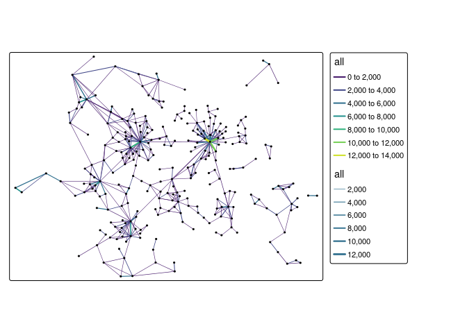
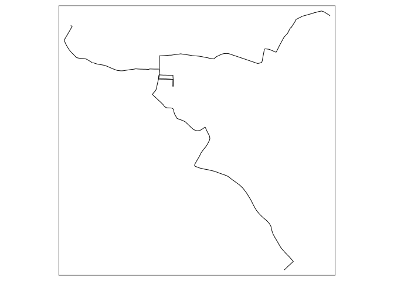

Routing
================
Malcolm Morgan
University of Leeds
<br/>

## Setting Up

If you have not installed the package before hand. You can use [ITS
Go](https://itsleeds.github.io/go/) to do an easy setup of your computer

``` r
source("https://git.io/JvGjF")
```

The packages we will be using are:

``` r
library(sf)
library(tidyverse)
library(stplanr)
library(dodgr)
library(opentripplanner)
library(tmap)
library(osmextract)
tmap_mode("plot")
```

## Using OpenTripPlanner to get routes

We have setup the Multi-modal routing service OpenTripPlanner for West
Yorkshire. Try typing this URL — otp. saferactive. org (no spaces) —
during the session into your browser. You should see something like
this:

<div class="figure" style="text-align: center">


<p class="caption">

OTP Web GUI

</p>

</div>

**Exercise**

1.  Play with the web interface, finding different types of routes. What
    strengths/limitations can you find?

### Connecting to OpenTripPlanner

To allow R to connect to the OpenTripPlanner server, we will use the
`opentripplanner` package and the function `otp_connect`.

``` r
# ip = "localhost" # to run it on your computer (see final bonus exercise)
ip = "otp.saferactive.org" # an actual server
otpcon = otp_connect(hostname = ip, 
                     port = 80,
                     router = "west-yorkshire")
```

If you have connected successfully, then you should get a message
“Router exists.”

To get some routes, we will start by importing some data we have used
previously. Note that the data frame has 78 columns (only a few of which
are useful) and 1k rows:

``` r
u = "https://github.com/ITSLeeds/TDS/releases/download/0.1/desire_lines.geojson"
desire_lines = read_sf(u)
dim(desire_lines)
```

    ## [1] 1000   78

**Exercise**

2.  Subset the and overwrite the `desire_lines` data frame with the `=`
    assignment operator so that it only has the following columns:
    geo\_code1, geo\_code2, all, bicycle, foot, car\_driver, and
    geometry. You can test the that the operation worked by executing
    the object name, the result should look like that shown below.

3.  Use the `tmap` package to plot the `desire_lines`. Choose different
    ways to visualise the data so you can understand local commuter
    travel patterns. See example plot below.

<!-- -->

This dataset has desire lines, but most routing packages need start and
endpoints, so we will extract the points from the lines using the
`line2df` function. An then select the top 3 desire lines.

**Exercise**

4.  Produce a data frame called `desire` which contains the coordinates
    of the start and endpoints of the lines in `desire_lines` but not
    the geometries. Hint `?stplanr::line2df` and `?dplyr::bind_cols`

5.  Subset out the top three desire lines by the total number of
    commuters and create a new data frame called `desire_top`. Hint
    `?dplyr::slice_max`

<!-- end list -->

    ## # A tibble: 3 x 11
    ##   geo_code1 geo_code2   all bicycle  foot car_driver    L1    fx    fy    tx
    ##   <chr>     <chr>     <int>   <int> <int>      <int> <dbl> <dbl> <dbl> <dbl>
    ## 1 E02006852 E02006875  1240     105   119        402   998 -1.58  53.8 -1.55
    ## 2 E02006861 E02006875  1198      58   495        130   999 -1.57  53.8 -1.55
    ## 3 E02002404 E02006875  1159      10   811         96   721 -1.52  53.8 -1.55
    ## # ... with 1 more variable: ty <dbl>

6.  Find the driving routes for `desire_top` and call them `routes_top`
    using `otp_plan`

To find the routes for the first three desire lines use the following
command:

``` r
routes_top = otp_plan(otpcon,
                      fromPlace = as.matrix(desire_top[,c("fx","fy")]),
                      toPlace = as.matrix(desire_top[,c("tx","ty")]),
                      mode = "CAR")
```

7.  Plot `routes_top` using the `tmap` package in interactive mode

We can also get Isochrones from OTP.

``` r
isochrone = otp_isochrone(otpcon, fromPlace = c(-1.558655, 53.807870), 
                          mode = c("BICYCLE","TRANSIT"),
                          maxWalkDistance = 3000)
isochrone$time = isochrone$time / 60
tm_shape(isochrone) +
  tm_fill("time", alpha = 0.6)
```

<!-- -->

To save overloading the server, I have pre-generated some extra routes.
Download these routes and load them into R.

``` r
u = "https://github.com/ITSLeeds/TDS/releases/download/0.20.1/transit_routes.gpkg"
download.file(url = u, destfile = "transit_routes.gpkg", mode = "wb")
u = "https://github.com/ITSLeeds/TDS/releases/download/0.20.1/driving_routes.gpkg"
download.file(url = u, destfile = "driving_routes.gpkg", mode = "wb")

routes_drive = read_sf("driving_routes.gpkg")
routes_transit = read_sf("transit_routes.gpkg")
```

## Joining Flow data to Routes

Routes are useful, but in Transport Data Science we often want to
combine routes with flow data (the number of travellers). This next
section will address how to join datasets together.

If you are unfamiliar with database joins read [this short
summary](http://www.sql-join.com/sql-join-types)

**Exercise**

8.  Subset the and overwrite the `routes_drive` and `routes_transit`
    data frame with the `=` assignment operator so that it only has the
    following columns: fromPlace, toPlace, mode, route\_option,
    distance, and geom.

9.  Examine these two new datasets `routes_drive` and `routes_transit`
    plot them on a map, what useful information do they contain what is
    missing?

10. Create a new dataset called `desire_drive` by joining the `desire`
    and `routes_drive` datasets. Hint `?dplyr::left_join`

11. Create a new dataset called `desire_transit` by joining the `desire`
    and `routes_transit` datasets. Hint `?dplyr::left_join`

**Note** that some of the desire lines do not have a route. This is
usually because the start or endpoint is too far from the road.

12. How many routes are missing for each mode? How could you improve
    this method, so there were no missing routes?

13. Remove from the `desire_drive` and `desire_transit` data frames rows
    which represent desire lines that are missing route data.

14. Try to plot the `desire_drive` and `desire_transit` dataset with the
    `tmap` package. You may find they have lost their `sf` class. In
    which case use `sf::st_as_sf` to convert them back to sf objects.

<!-- -->

## Route Networks

Route networks (also called flow maps) show transport demand on
different parts of the road network.

Now we have the number of commuters and their routes, we can produce a
route network map using `stplanr::overline`.

``` r
rnet_drive <- overline(desire_drive, "car_driver")
```

**Exercise** 15. Make a route network for driving and plot it using the
`tmap` package. How is is different from just plotting the routes?

<!-- -->

## Line Merging

Notice that `routes_transit` has returned separate rows for each mode
(WALK, RAIL). Notice the `route_option` column shows that some routes
have multiple options.

Let’s suppose you want a single line for each route.

**Exercise**:

16. Filter the `routes_transit` to contain only one route option per
    origin-destination pair.

Now We will group the separate parts of the routes together.

``` r
routes_transit_group = routes_transit %>%
  dplyr::group_by(fromPlace, toPlace) %>%
  dplyr::summarise(distance = sum(distance))
```

We now have a single row, but instead of a `LINESTRING`, we now have a
mix of `MULTILINESTRING` and `LINESTRING`, we can convert to a
linestring by using `st_line_merge()`. Note how the different columns
where summarised.

First, we must separate out the `MULTILINESTRING` and `LINESTRING`

``` r
routes_transit_group_ml = routes_transit_group[st_geometry_type(routes_transit_group) == "MULTILINESTRING", ]
routes_transit_group = routes_transit_group[st_geometry_type(routes_transit_group) != "MULTILINESTRING", ]
routes_transit_group_ml = st_line_merge(routes_transit_group_ml)
routes_transit_group = rbind(routes_transit_group, routes_transit_group_ml)
```

**Bonus Exercise**:

17. Do the above, but make sure you always select the fastest option.

## Network Analysis (dodgr)

**Note** Some people have have problems running dodgr on Windows, if you
do follow these
[instructions](https://github.com/ITSLeeds/TDS/blob/master/practicals/dodgr-install.md).

We will now analyse the road network using `dodgr`.

``` r
roads = oe_get("Isle of Wight", extra_tags = c("maxspeed","oneway"))
roads = roads[!is.na(roads$highway),]
road_types = c("residential","secondary","tertiary",
                        "unclassified","primary","primary_link",
                        "secondary_link","tertiary_link")
roads = roads[roads$highway %in% road_types, ]
graph = weight_streetnet(roads)
```

We will find the betweenness centrality of the Isle of Wight road
network. THis can take a long time, so first lets check how long it will
take.

``` r
estimate_centrality_time(graph)
```

    ## Estimated time to calculate centrality for full graph is 00:00:03

``` r
centrality = dodgr_centrality(graph)


clear_dodgr_cache()

centrality_sf = dodgr_to_sf(centrality)
tm_shape(centrality_sf) +
  tm_lines("centrality",
           lwd = 3,
           n = 8,
           style = "fisher",
           palette = "-viridis")
```

<!-- -->

**Exercise**

18. Use `dodgr_contract_graph` before calculating centrality, how does
    this affect the computation time and the results?

**Bonus Exercises**

19. Work though the OpenTripPlanner vignettes [Getting
    Started](https://docs.ropensci.org/opentripplanner/articles/opentripplanner.html)
    and [Advanced
    Features](https://docs.ropensci.org/opentripplanner/articles/advanced_features.html)
    to run your own local trip planner.
