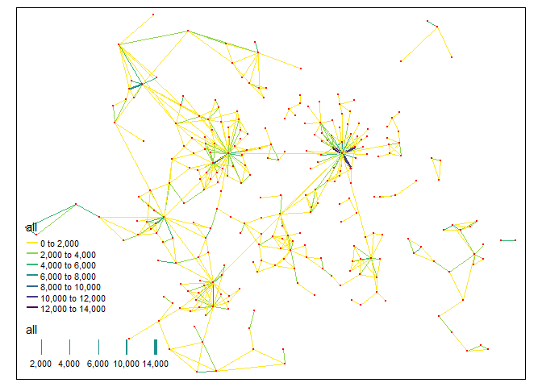
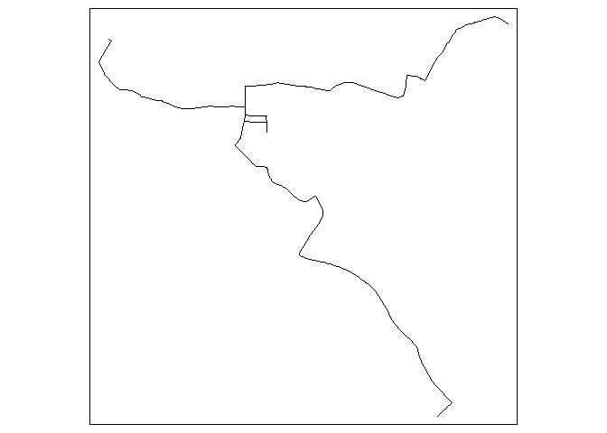
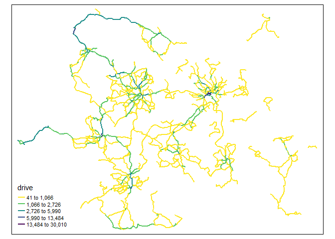
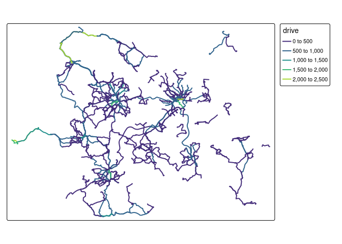
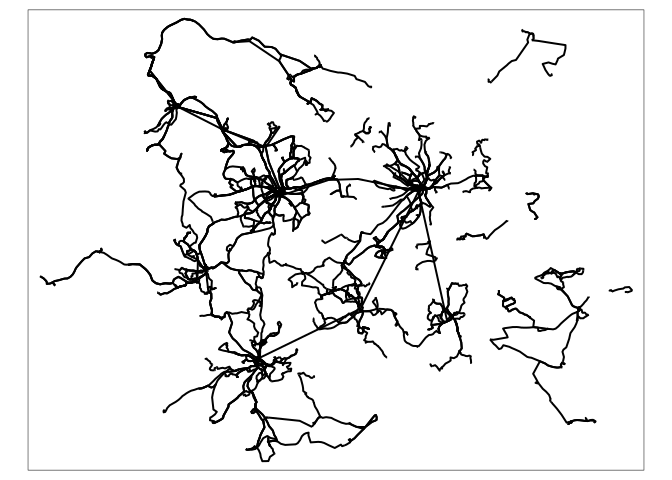

Routing
================
Malcolm Morgan and Robin Lovelace
University of Leeds
<br/>

## Setting Up

If you have not installed the package before hand. You can use [ITS
Go](https://itsleeds.github.io/go/) to do an easy setup of your computer

``` r
source("https://tinyurl.com/itsgo")
```

The packages we will be using are:

``` r
library(sf) # Spatial data functions
library(tidyverse) # General data manipulation
library(stplanr) # General transport data functions
library(dodgr) # Local routing and network analysis
library(opentripplanner) # Connect to and use OpenTripPlanner
library(tmap) # Make maps
library(osmextract) # Download and import OpenStreetMap data
tmap_mode("plot")
```

## Using OpenTripPlanner to get routes

We have setup the Multi-modal routing service OpenTripPlanner for West
Yorkshire. Try typing this URL — otp. saferactive. org (no spaces) —
during the session into your browser. You should see something like
this:


**Exercise**

1.  Play with the web interface, finding different types of routes. What
    strengths/limitations can you find?

### Connecting to OpenTripPlanner

To allow R to connect to the OpenTripPlanner server, we will use the
`opentripplanner` package and the function `otp_connect`.

``` r
# ip = "localhost" # to run it on your computer (see final bonus exercise)
ip = "otp.saferactive.org" # an actual server
otpcon = otp_connect(hostname = ip, 
                     port = 80,
                     router = "west-yorkshire")
```

If you have connected successfully, then you should get a message
“Router exists.”

To get some routes, we will start by importing some data. The
`NTEM_flow.geojson` dataset the contains the top desire lines in West
Yorkshire. It was produced from a transport model called the [National
Trip End
Model](https://data.gov.uk/dataset/11bc7aaf-ddf6-4133-a91d-84e6f20a663e/national-trip-end-model-ntem)
an research from the [University of
Leeds](https://github.com/ITSLeeds/NTEM2OD).

We will also download the points that represent the possible start and
end point of trips in the model

**Exercise**

2.  Plot the `desire_lines` and `centroids` objects using the `tmap` to
    show the number of travellers on each desire_line and the locations
    of all centroids.

``` r
tmap_mode("plot") #Change to view for interactive map
tm_shape(desire_lines) +
  tm_lines(lwd = "all", col = "all", scale = 4, palette = "viridis") +
  tm_shape(centroids) +
  tm_dots()
```

<!-- -->

3.  Produce some different maps for each mode of travel in the
    `desire_lines` dataset. How do the numbers of travellers change for
    walking, driving, and train travel? See example plot below.

<!-- -->

This dataset has desire lines, but most routing packages need start and
endpoints, so we will match the centroids with the top 3 desire lines.

**Exercise**

4.  Produce a data frame called `desire_top` which contains the top
    three `desire_lines` for all travellers.

Hint `?top_n`

5.  Create a dataset called `fromPlace` from the `centroids` dataset
    where `centroids$Zone_Code` matches `desire_top$from`.

Hint `?match()`.

6.  Create a dataset called `toPlace` from the `centroids` dataset where
    `centroids$Zone_Code` matches `desire_top$to`.

7.  Find the driving routes between `fromPlace` and `toPlace` call them
    `routes_drive_top` using `opentripplanner::otp_plan`

To find the routes for the first three desire lines use the following
command:

``` r
routes_drive_top = otp_plan(otpcon = otpcon,
                            fromPlace = fromPlace,
                            toPlace = toPlace,
                            fromID = fromPlace$Zone_Code,
                            toID = toPlace$Zone_Code,
                            mode = "CAR")
```

8.  Plot `routes_drive_top` using the `tmap` package mode. You should
    see something like the image below.

``` r
tmap_mode("plot")
tm_shape(routes_drive_top) + tm_lines()
```

<!-- -->

We can also get Isochrones from OTP.

``` r
isochrone = otp_isochrone(otpcon, fromPlace = c(-1.558655, 53.807870), 
                          mode = c("BICYCLE","TRANSIT"),
                          maxWalkDistance = 3000)
isochrone$time = isochrone$time / 60
tm_shape(isochrone) +
  tm_fill("time", alpha = 0.6)
```

<!-- -->

To save overloading the server, we have pre-generated some extra routes.
Download these routes and load them into R.

``` r
u = "https://github.com/ITSLeeds/TDS/releases/download/22/routes_drive.geojson"
routes_drive = read_sf(u)
u = "https://github.com/ITSLeeds/TDS/releases/download/22/routes_transit.geojson"
routes_transit = read_sf(u)
```

We will now join the number of drivers onto the driving routes.

**Exercise**

9.  Create a dataset called `n_driver` from `desire_lines` which only
    have the columns `from` `to` and `drive`. Hint ?dplyr::select and
    ?sf::st_drop_geometry

10. Join the `n_driver` data onto the `routes_drive` data by linking
    `fromPlace = from` and `toPlace = to`. Hint ?dplyr::left_join.

## Route Networks

Route networks (also called flow maps) show transport demand on
different parts of the road network.

Now we have the number of drivers and their routes, we can produce a
route network map using `stplanr::overline`.

``` r
rnet_drive = overline(routes_drive, "drive")
```

**Exercise**

11. Make a route network for driving and plot it using the `tmap`
    package. How is is different from just plotting the routes?

<!-- -->

## Line Merging

Notice that `routes_transit` has returned separate rows for each mode
(WALK, RAIL, BUS). Notice the `route_option` column shows that some
routes have multiple options.

Let’s suppose you want a single line for each route.

**Exercise**

12. Filter the `routes_transit` to contain only one route option per
    origin-destination pair and only the columns `fromPlace` `toPlace`
    `distance` `geometry`

Now We will group the separate parts of the routes together.

``` r
routes_transit_group = routes_transit %>%
  dplyr::group_by(fromPlace, toPlace) %>%
  dplyr::summarise(distance = sum(distance))
```

We now have a single row, but instead of a `LINESTRING`, we now have a
mix of `MULTILINESTRING` and `LINESTRING`, we can convert to a
`LINESTRING` by using `st_line_merge()`. Note how the different columns
where summarised.

First, we must separate out the `MULTILINESTRING` and `LINESTRING`

``` r
routes_transit_group_ml = routes_transit_group[st_geometry_type(routes_transit_group) == "MULTILINESTRING", ]
routes_transit_group = routes_transit_group[st_geometry_type(routes_transit_group) != "MULTILINESTRING", ]
routes_transit_group_ml = st_line_merge(routes_transit_group_ml)
routes_transit_group = rbind(routes_transit_group, routes_transit_group_ml)
```

**Exercise**

13. Plot the transit routes, what do you notice about them?

<!-- -->

**Bonus Exercise**:

14. Redo exercise 12 but make sure you always select the fastest option.
    You may need to re-download the `routes_transit` data.

## Network Analysis (dodgr)

**Note** Some people have have problems running dodgr on Windows, if you
do follow these
[instructions](https://github.com/ITSLeeds/TDS/blob/master/practicals/dodgr-install.md).

We will now analyse the road network using `dodgr`. Network analysis can
take a very long time on large areas. So we will use the example of the
[Isle of Wight](https://en.wikipedia.org/wiki/Isle_of_Wight), which is
ideal for transport studies as it is small, but has a full transport
system including a railway and the last commercial hovercraft service in
the world.

First we need to download the roads network from the OpenStreetMap using
`osmextract::oe_get`. We will removed most of the paths and other
features and just focus on the main roads. Then use
`dodgr::weight_streetnet` to produce a graph of the road network.

``` r
roads = oe_get("Isle of Wight", extra_tags = c("maxspeed","oneway"))
roads = roads[!is.na(roads$highway),]
road_types = c("primary","primary_link",
               "secondary","secondary_link",
               "tertiary", "tertiary_link",
               "residential","unclassified")
roads = roads[roads$highway %in% road_types, ]
graph = weight_streetnet(roads)
```

We will find the betweenness centrality of the Isle of Wight road
network. This can take a long time, so first lets check how long it will
take.

``` r
estimate_centrality_time(graph)
```

    ## Estimated time to calculate centrality for full graph is 00:00:09

``` r
centrality = dodgr_centrality(graph)
```

We can convert a `dodgr` graph back into a sf data frame for plotting
using `dodgr::dodgr_to_sf`

``` r
clear_dodgr_cache()
centrality_sf = dodgr_to_sf(centrality)
```

**Exercise**

15. Plot the centrality of the Isle of Wight road network. What can
    centrality tell you about a road network?

<!-- -->

16. Use `dodgr::dodgr_contract_graph` before calculating centrality, how
    does this affect the computation time and the results?

**Bonus Exercises**

17. Work though the OpenTripPlanner vignettes [Getting
    Started](https://docs.ropensci.org/opentripplanner/articles/opentripplanner.html)
    and [Advanced
    Features](https://docs.ropensci.org/opentripplanner/articles/advanced_features.html)
    to run your own local trip planner for the Isle of Wight.

**Note** To use OpenTripPlanner on your own computer requires Java 8.
See the
[Prerequisites](https://docs.ropensci.org/opentripplanner/articles/prerequisites.html)
for more details. If you can’t install Java 8 try some of the examples
in the vignettes but modify them for West Yorkshire.

18. Read the `dodgr`
    [vignettes](https://atfutures.github.io/dodgr/articles/index.html)
