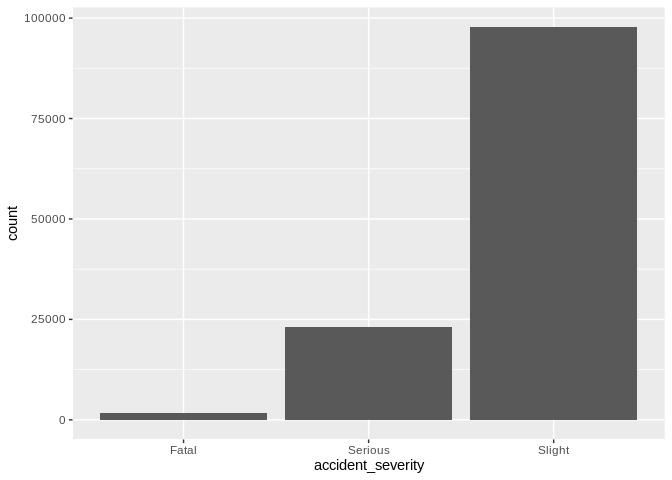
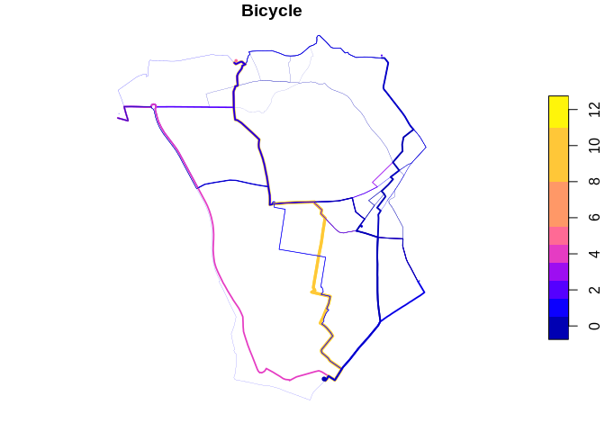

Data Visualisation
================
Robin Lovelace
University of Leeds,
2020-02-26<br/>

## Review of homework exercise: demo then individual Q\&A

``` r
library(tidyverse)
```

    ## ── Attaching packages ────────────────────────────────────────────────── tidyverse 1.3.0 ──

    ## ✔ tibble  2.1.3     ✔ dplyr   0.8.4
    ## ✔ tidyr   1.0.2     ✔ stringr 1.4.0
    ## ✔ readr   1.3.1     ✔ forcats 0.4.0
    ## ✔ purrr   0.3.3

    ## ── Conflicts ───────────────────────────────────────────────────── tidyverse_conflicts() ──
    ## ✖ dplyr::filter() masks stats::filter()
    ## ✖ dplyr::lag()    masks stats::lag()

``` r
library(stplanr)
library(sf)
```

    ## Linking to GEOS 3.8.0, GDAL 3.0.2, PROJ 6.2.1

## Basics of data visualisation

Data visualisation is a powerful way to help understand and communicate
insights about the real world contained in data.

Take this
    dataset:

``` r
crashes_gb = stats19::get_stats19(year = 2018, type = "accidents")
```

    ## Files identified: dftRoadSafetyData_Accidents_2018.csv

    ##    http://data.dft.gov.uk.s3.amazonaws.com/road-accidents-safety-data/dftRoadSafetyData_Accidents_2018.csv

    ## Data already exists in data_dir, not downloading

    ## Data saved at ~/stats19-data/dftRoadSafetyData_Accidents_2018.csv

    ## Reading in:

    ## ~/stats19-data/dftRoadSafetyData_Accidents_2018.csv

    ## date and time columns present, creating formatted datetime column

``` r
crashes_gb
```

    ## # A tibble: 122,635 x 33
    ##    accident_index location_eastin… location_northi… longitude latitude police_force
    ##    <chr>                     <int>            <int>     <dbl>    <dbl> <chr>       
    ##  1 2018010080971            529150           182270   -0.140      51.5 Metropolita…
    ##  2 2018010080973            542020           184290    0.0465     51.5 Metropolita…
    ##  3 2018010080974            531720           182910   -0.102      51.5 Metropolita…
    ##  4 2018010080981            541450           183220    0.0378     51.5 Metropolita…
    ##  5 2018010080982            543580           176500    0.0658     51.5 Metropolita…
    ##  6 2018010080983            526060           194910   -0.180      51.6 Metropolita…
    ##  7 2018010080986            525050           181050   -0.199      51.5 Metropolita…
    ##  8 2018010080987            536710           176960   -0.0329     51.5 Metropolita…
    ##  9 2018010080990            517110           186280   -0.312      51.6 Metropolita…
    ## 10 2018010080992            535450           181190   -0.0494     51.5 Metropolita…
    ## # … with 122,625 more rows, and 27 more variables: accident_severity <chr>,
    ## #   number_of_vehicles <int>, number_of_casualties <int>, date <date>, day_of_week <chr>,
    ## #   time <chr>, local_authority_district <chr>, local_authority_highway <chr>,
    ## #   first_road_class <chr>, first_road_number <int>, road_type <chr>, speed_limit <int>,
    ## #   junction_detail <chr>, junction_control <chr>, second_road_class <chr>,
    ## #   second_road_number <int>, pedestrian_crossing_human_control <chr>,
    ## #   pedestrian_crossing_physical_facilities <chr>, light_conditions <chr>,
    ## #   weather_conditions <chr>, road_surface_conditions <chr>,
    ## #   special_conditions_at_site <chr>, carriageway_hazards <chr>,
    ## #   urban_or_rural_area <chr>, did_police_officer_attend_scene_of_accident <int>,
    ## #   lsoa_of_accident_location <chr>, datetime <dttm>

Without some kind of analysis, it is hard to understand the meaning of
the data. Descriptive statistics can help, e.g. on the percentage of
different crashes that happened by speed
limit:

``` r
count_table = table(crashes_gb$speed_limit, crashes_gb$accident_severity)
count_table
```

    ##     
    ##      Fatal Serious Slight
    ##   20    49    1734   8878
    ##   30   567   13009  59903
    ##   40   169    2104   7956
    ##   50   139    1017   3897
    ##   60   542    3950  10895
    ##   70   205    1351   6270

``` r
count_table_proportions = count_table / rowSums(count_table)
round(count_table_proportions * 100, 1)
```

    ##     
    ##      Fatal Serious Slight
    ##   20   0.5    16.3   83.3
    ##   30   0.8    17.7   81.5
    ##   40   1.7    20.6   77.8
    ##   50   2.8    20.1   77.1
    ##   60   3.5    25.7   70.8
    ##   70   2.6    17.3   80.1

As expected, crashes that happened on roads with a higher speed limit
have a higher fatality rate. This can be visualised in a more appealing
and intuitive way, e.g. as follows:

``` r
library(ggplot2)
ggplot(crashes_gb) + geom_bar(aes(accident_severity)) 
```

<!-- -->

``` r
ggplot(crashes_gb, aes(speed_limit)) + geom_bar(aes(fill = accident_severity), position = "fill")
```

<!-- -->

**Exercise**: Read the documentation that appears when you run this line
of code:

    ?facet_grid

Create a facetted plot with a different facet for each speed limit.

<!-- -->

## Exercises: group

1.  Create a map showing the number of people walking in the `stplanr`
    dataset `flowlines_sf` using: -base graphics (hint: use `plot()`)
    and -**tmap** (hint: use `tm_shape(flowlines_sf) + ...`, `palette =
    "viridis"` and other options shown in
    `tmaptools::palette_explorer()` give different colourschemes).
      - Name two advantages of each approach
      - Bonus: What three other mapping packages could be used to show
        the same data?

## Result: base graphics


## Result: tmap

    ## Warning: The shape flowlines_sf is invalid. See sf::st_is_valid

<!-- -->

## Exercises: Individual

  - Based on the `routes_fast_sf` data in the `stplanr` package,
    identify roads where investment in cycling is likely to be
    effective.

Starting point:

``` r
nrow(flowlines_sf)
```

    ## [1] 49

``` r
nrow(routes_fast_sf)
```

    ## [1] 49

``` r
# routes_fast_sf = dplyr::inner_join(routes_fast_sf, flow)
routes_fast_sf = cbind(routes_fast_sf, flowlines_sf)
```

## sf results

<!-- -->

## tmap ‘view mode’ results

    ## Warning: The shape routes_fast_sf is invalid. See sf::st_is_valid

    ## Legend for line widths not available in view mode.

<!-- -->

## Exercises bonus (optional)

  - Work through the PCT training vignette at:
    <https://itsleeds.github.io/pct/articles/pct_training.html>
  - Using data in the `pct` github package, estimate cycling potential
    in a city of your choice in the UK, and show the results.

## Homework

  - To improve you R skills, work through the stats19 tutorial here:
    <https://docs.ropensci.org/stats19/articles/stats19-training.html>
  - Work on your portfolios, adding a new visualisation of the data you
    will use
