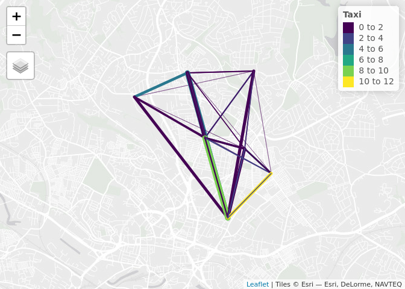
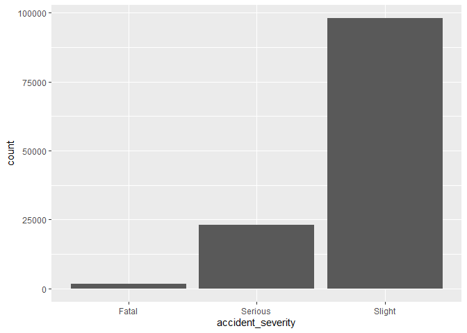

Data Visualisation
================
Robin Lovelace
University of Leeds,
2019-03-26<br/>

## Review of homework exercise: demo then individual Q\&A

``` r
library(tidyverse)
```

    ## ── Attaching packages ─────────────────────────────────────── tidyverse 1.2.1 ──

    ## ✔ ggplot2 3.1.0       ✔ purrr   0.3.2  
    ## ✔ tibble  2.1.1       ✔ dplyr   0.8.0.1
    ## ✔ tidyr   0.8.3       ✔ stringr 1.4.0  
    ## ✔ readr   1.3.1       ✔ forcats 0.4.0

    ## ── Conflicts ────────────────────────────────────────── tidyverse_conflicts() ──
    ## ✖ dplyr::filter() masks stats::filter()
    ## ✖ dplyr::lag()    masks stats::lag()

``` r
library(stplanr)
library(sf)
```

    ## Linking to GEOS 3.7.0, GDAL 2.4.0, PROJ 5.2.0

## Exercises: group

1.  Create a map showing the number of people walking in the `stplanr`
    dataset `flowlines_sf` using: -base graphics (hint: use `plot()`)
    and -**tmap** (hint: use `tm_shape(flowlines_sf) + ...`, `palette =
    "viridis"` and other options shown in
    `tmaptools::palette_explorer()` give different colourschemes).
      - Name two advantages of each approach
      - Bonus: What three other mapping packages could be used to show
        the same data?

## Result: base graphics


## Result: tmap

<!-- -->

## Exercises: Individual

  - Based on the `routes_fast_sf` data in the `stplanr` package,
    identify roads where investment in cycling is likely to be
    effective.

Starting point:

``` r
nrow(flowlines_sf)
```

    ## [1] 49

``` r
nrow(routes_fast_sf)
```

    ## [1] 49

``` r
# routes_fast_sf = dplyr::inner_join(routes_fast_sf, flow)
routes_fast_sf = cbind(routes_fast_sf, flowlines_sf)
```

## sf results

<!-- -->

## tmap ‘view mode’ results

    ## Legend for line widths not available in view mode.

<!-- -->

## Exercises bonus (optional)

  - Using data in the `pct` github package, estimate cycling potential
    in a city of your choice in the UK, and show the results.

  - Work on your portfolios, adding a new visualisation
