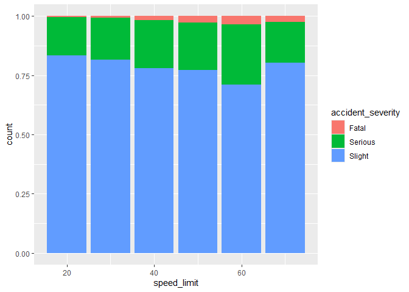

Data Visualisation
================
Robin Lovelace
University of Leeds
<br/>

## Review of homework exercise: demo then individual Q&A

``` r
library(tidyverse)
library(stplanr)
library(sf)
```

## Basics of data visualisation

Data visualisation is a powerful way to help understand and communicate
insights about the real world contained in data.

Take this dataset:

``` r
crashes_gb = stats19::get_stats19(year = 2018, type = "collision")
crashes_gb
```

    ## # A tibble: 122,635 × 37
    ##    accident_index accident_year accident_reference location_easting_osgr
    ##             <dbl>         <dbl> <chr>                              <dbl>
    ##  1  2018010080971          2018 010080971                         529150
    ##  2  2018010080973          2018 010080973                         542020
    ##  3  2018010080974          2018 010080974                         531720
    ##  4  2018010080981          2018 010080981                         541450
    ##  5  2018010080982          2018 010080982                         543580
    ##  6  2018010080983          2018 010080983                         526060
    ##  7  2018010080986          2018 010080986                         525050
    ##  8  2018010080987          2018 010080987                         536710
    ##  9  2018010080990          2018 010080990                         517110
    ## 10  2018010080992          2018 010080992                         535450
    ## # ℹ 122,625 more rows
    ## # ℹ 33 more variables: location_northing_osgr <dbl>, longitude <dbl>,
    ## #   latitude <dbl>, police_force <chr>, accident_severity <chr>,
    ## #   number_of_vehicles <dbl>, number_of_casualties <dbl>, date <date>,
    ## #   day_of_week <chr>, time <time>, local_authority_district <chr>,
    ## #   local_authority_ons_district <chr>, local_authority_highway <chr>,
    ## #   first_road_class <chr>, first_road_number <chr>, road_type <chr>, …

Without some kind of analysis, it is hard to understand the meaning of
the data. Descriptive statistics can help, e.g. on the percentage of
different crashes that happened by speed limit:

``` r
count_table = table(crashes_gb$speed_limit, crashes_gb$accident_severity)
count_table
```

    ##     
    ##      Fatal Serious Slight
    ##   20    49    1732   8880
    ##   30   567   12896  60016
    ##   40   169    2084   7976
    ##   50   139    1007   3907
    ##   60   542    3920  10925
    ##   70   205    1329   6292

``` r
count_table_proportions = count_table / rowSums(count_table)
round(count_table_proportions * 100, 1)
```

    ##     
    ##      Fatal Serious Slight
    ##   20   0.5    16.2   83.3
    ##   30   0.8    17.6   81.7
    ##   40   1.7    20.4   78.0
    ##   50   2.8    19.9   77.3
    ##   60   3.5    25.5   71.0
    ##   70   2.6    17.0   80.4

As expected, crashes that happened on roads with a higher speed limit
have a higher fatality rate. This can be visualised in a more appealing
and intuitive way, e.g. as follows:

``` r
library(ggplot2)
ggplot(crashes_gb) + geom_bar(aes(accident_severity)) 
```

<!-- -->

``` r
ggplot(crashes_gb, aes(speed_limit)) + geom_bar(aes(fill = accident_severity), position = "fill")
```

<!-- -->

**Exercise**: Improve the plots by:

1.  Label the x-axis “Speed Limit (MPH)”
2.  Adjust the x-axis to include a label for each column (e.g. 20, 30,
    40, 50, 60, 70), Hint: `scale_x_continuous`
3.  Label the y-axis “Percentage of all collisions”
4.  Adjust the y-axis to be 0-100 rather than 0-1. Hint:
    `scales::percent_format()`
5.  Label the legend “Collision Severity”
6.  Change the colour palette

**Exercise**: Read the documentation that appears when you run this line
of code:

    ?facet_grid

Create a faceted plot with a different facet for each speed limit.

<!-- -->

**Exercise**: Improve this plot by rotating the label text 90 degrees.
Hint: `theme` & `element_text`

**Exercise**: Adjust this plot to produce a facet for each severity and
bar for each speed

## Map based plots

1.  Create a map showing the number of people walking in the `stplanr`
    dataset `flowlines_sf` using: -base graphics (hint: use `plot()`)
    and -**tmap** (hint: use `tm_shape(flowlines_sf) + ...`,
    `palette = "viridis"` and other options shown in
    `tmaptools::palette_explorer()` give different colourschemes).
    - Name two advantages of each approach
    - Bonus: What three other mapping packages could be used to show the
      same data?

## Result: base graphics


## Result: tmap

<!-- -->

## Exercises

- Based on the `routes_fast_sf` data in the `stplanr` package, identify
  roads where investment in cycling is likely to be effective.

Starting point:

``` r
nrow(flowlines_sf)
```

    ## [1] 49

``` r
nrow(routes_fast_sf)
```

    ## [1] 49

``` r
# routes_fast_sf = dplyr::inner_join(routes_fast_sf, flow)
routes_fast_sf = cbind(routes_fast_sf, flowlines_sf)
```

## sf results

<!-- -->

***Exercise***

Create this map as an iterative plot using `tmap`

## Create a complex plot

Choose an example from
<https://r-graph-gallery.com/best-r-chart-examples.html> and try to
recreate it.

These example come with code you can copy, so it should be easy to
create the example plot. Then try to understand what each step in the
process is doing. Try commenting out specific lines of code or changing
settings to make your own version of the plot. Can you make an even
better plot?

## Apply your new skills to your coursework data

By now you should have identified some data to use in your coursework.
Produce a plot that helps you understand that data. Take the oppertunity
to get feeback on your analysis and plot design from the demonstrators.

## Exercises bonus (optional)

- Work through the PCT training vignette at:
  <https://itsleeds.github.io/pct/articles/pct_training.html>
- Using data in the `pct` github package, estimate cycling potential in
  a city of your choice in the UK, and show the results.

## Homework

- Work on your portfolios, adding a new visualisation of the data you
  will use. Pepare questions for the next session which is for
  coursework support.
