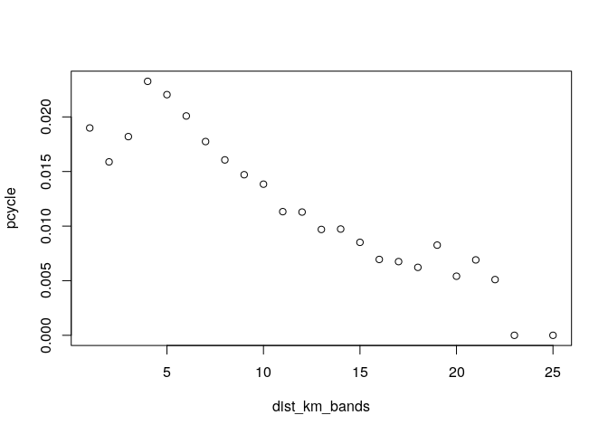

Machine Learning for Transport Planning
================
Robin Lovelace
University of Leeds, 2019-05-07<br/>

-   Generate a working hypothesis present in data you have analysed for your research portfolio (e.g. car use is negatively associated with active modes)

-   Use a conventional statistical model, e.g. with the function `lm()`, to test the hypothesis

-   Use a machine learning algorithm, e.g. that provided by `xgboost`, to explore the same relationships

-   Bonus: use a Bayesian statistical approach, e.g. with the package `brms` to explore the relationship

-   Identify pros and cons of each approach

Starting point - basic
----------------------

``` r
pct::pct_regions$region_name # see which region names are available
```

    ##  [1] "london"                       "greater-manchester"          
    ##  [3] "liverpool-city-region"        "south-yorkshire"             
    ##  [5] "north-east"                   "west-midlands"               
    ##  [7] "warwickshire"                 "west-yorkshire"              
    ##  [9] "cheshire"                     "lancashire"                  
    ## [11] "humberside"                   "north-yorkshire"             
    ## [13] "derbyshire"                   "leicestershire"              
    ## [15] "nottinghamshire"              "hereford-and-worcester"      
    ## [17] "shropshire"                   "staffordshire"               
    ## [19] "avon"                         "devon"                       
    ## [21] "dorset"                       "wiltshire"                   
    ## [23] "cambridgeshire"               "bedfordshire"                
    ## [25] "essex"                        "kent"                        
    ## [27] "berkshire"                    "buckinghamshire"             
    ## [29] "east-sussex"                  "hampshire"                   
    ## [31] "isle-of-wight"                "cornwall-and-isles-of-scilly"
    ## [33] "cumbria"                      "gloucestershire"             
    ## [35] "hertfordshire"                "lincolnshire"                
    ## [37] "norfolk"                      "northamptonshire"            
    ## [39] "northumberland"               "oxfordshire"                 
    ## [41] "somerset"                     "suffolk"                     
    ## [43] "surrey"                       "west-sussex"                 
    ## [45] "wales"

``` r
l = pct::get_pct_lines("west-yorkshire")
```

    ## Loading required package: sp

``` r
l$pcycle = l$bicycle / l$all
l$dist_km_bands = ceiling(l$rf_dist_km)
library(dplyr)
```

    ## 
    ## Attaching package: 'dplyr'

    ## The following objects are masked from 'package:stats':
    ## 
    ##     filter, lag

    ## The following objects are masked from 'package:base':
    ## 
    ##     intersect, setdiff, setequal, union

``` r
l_agg = l %>% 
  sf::st_drop_geometry() %>% 
  group_by(dist_km_bands) %>% 
  summarise(pcycle = sum(bicycle) / sum(all))
plot(l_agg)
```



``` r
# a simple model
names(l)
```

    ##  [1] "id"                      "geo_code1"              
    ##  [3] "geo_code2"               "geo_name1"              
    ##  [5] "geo_name2"               "lad11cd1"               
    ##  [7] "lad11cd2"                "lad_name1"              
    ##  [9] "lad_name2"               "all"                    
    ## [11] "bicycle"                 "foot"                   
    ## [13] "car_driver"              "car_passenger"          
    ## [15] "motorbike"               "train_tube"             
    ## [17] "bus"                     "taxi_other"             
    ## [19] "govtarget_slc"           "govtarget_sic"          
    ## [21] "govtarget_slw"           "govtarget_siw"          
    ## [23] "govtarget_sld"           "govtarget_sid"          
    ## [25] "govnearmkt_slc"          "govnearmkt_sic"         
    ## [27] "govnearmkt_slw"          "govnearmkt_siw"         
    ## [29] "govnearmkt_sld"          "govnearmkt_sid"         
    ## [31] "gendereq_slc"            "gendereq_sic"           
    ## [33] "gendereq_slw"            "gendereq_siw"           
    ## [35] "gendereq_sld"            "gendereq_sid"           
    ## [37] "dutch_slc"               "dutch_sic"              
    ## [39] "dutch_slw"               "dutch_siw"              
    ## [41] "dutch_sld"               "dutch_sid"              
    ## [43] "ebike_slc"               "ebike_sic"              
    ## [45] "ebike_slw"               "ebike_siw"              
    ## [47] "ebike_sld"               "ebike_sid"              
    ## [49] "govtarget_sldeath_heat"  "govtarget_slvalue_heat" 
    ## [51] "govtarget_sideath_heat"  "govtarget_sivalue_heat" 
    ## [53] "govnearmkt_sldeath_heat" "govnearmkt_slvalue_heat"
    ## [55] "govnearmkt_sideath_heat" "govnearmkt_sivalue_heat"
    ## [57] "gendereq_sldeath_heat"   "gendereq_slvalue_heat"  
    ## [59] "gendereq_sideath_heat"   "gendereq_sivalue_heat"  
    ## [61] "dutch_sldeath_heat"      "dutch_slvalue_heat"     
    ## [63] "dutch_sideath_heat"      "dutch_sivalue_heat"     
    ## [65] "ebike_sldeath_heat"      "ebike_slvalue_heat"     
    ## [67] "ebike_sideath_heat"      "ebike_sivalue_heat"     
    ## [69] "govtarget_slco2"         "govtarget_sico2"        
    ## [71] "govnearmkt_slco2"        "govnearmkt_sico2"       
    ## [73] "gendereq_slco2"          "gendereq_sico2"         
    ## [75] "dutch_slco2"             "dutch_sico2"            
    ## [77] "ebike_slco2"             "ebike_sico2"            
    ## [79] "e_dist_km"               "rf_dist_km"             
    ## [81] "rq_dist_km"              "dist_rf_e"              
    ## [83] "dist_rq_rf"              "rf_avslope_perc"        
    ## [85] "rq_avslope_perc"         "rf_time_min"            
    ## [87] "rq_time_min"             "geometry"               
    ## [89] "pcycle"                  "dist_km_bands"

``` r
m = lm(pcycle ~ rf_dist_km + rq_dist_km + car_driver + rf_avslope_perc, data = l)
summary(m)
```

    ## 
    ## Call:
    ## lm(formula = pcycle ~ rf_dist_km + rq_dist_km + car_driver + 
    ##     rf_avslope_perc, data = l)
    ## 
    ## Residuals:
    ##       Min        1Q    Median        3Q       Max 
    ## -0.025021 -0.012588 -0.008095  0.000683  0.298247 
    ## 
    ## Coefficients:
    ##                   Estimate Std. Error t value Pr(>|t|)    
    ## (Intercept)      2.920e-02  1.077e-03  27.121  < 2e-16 ***
    ## rf_dist_km      -8.236e-04  1.773e-04  -4.645 3.44e-06 ***
    ## rq_dist_km      -1.481e-04  1.482e-04  -0.999    0.318    
    ## car_driver       8.634e-07  5.688e-06   0.152    0.879    
    ## rf_avslope_perc -2.240e-03  2.452e-04  -9.136  < 2e-16 ***
    ## ---
    ## Signif. codes:  0 '***' 0.001 '**' 0.01 '*' 0.05 '.' 0.1 ' ' 1
    ## 
    ## Residual standard error: 0.02408 on 11573 degrees of freedom
    ## Multiple R-squared:  0.03864,    Adjusted R-squared:  0.03831 
    ## F-statistic: 116.3 on 4 and 11573 DF,  p-value: < 2.2e-16
