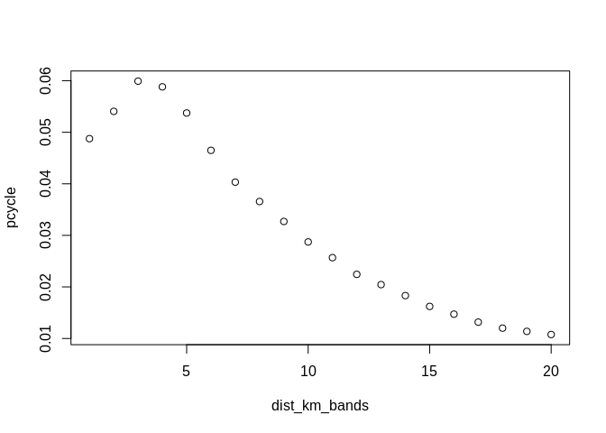
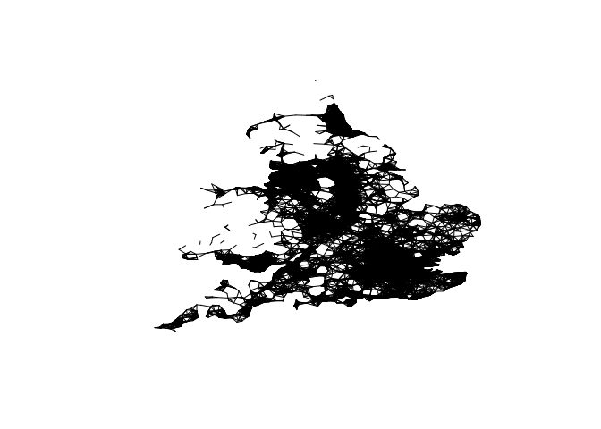
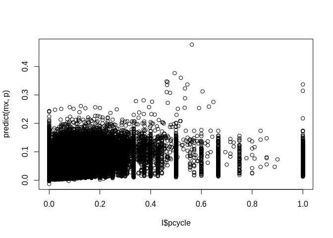
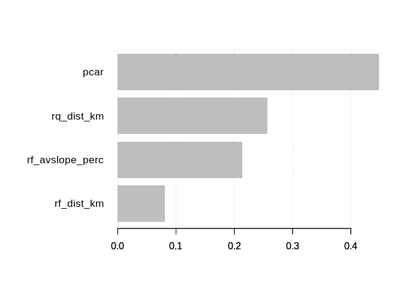
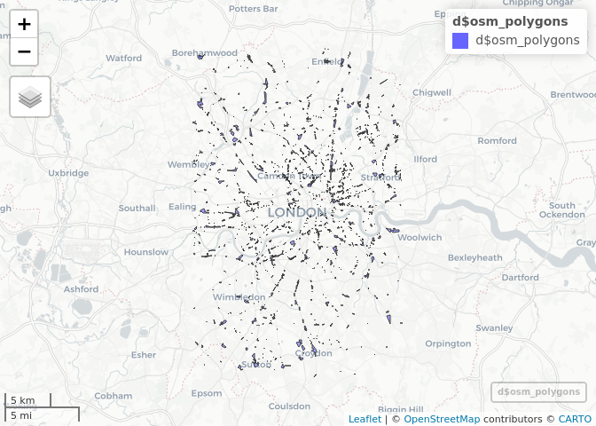

Machine Learning for Transport Planning
================
Robin Lovelace
University of Leeds,
2020-02-26<br/>

  - Generate a working hypothesis present in data you have analysed for
    your research portfolio (e.g. car use is negatively associated with
    active modes)

  - Use a conventional statistical model, e.g. with the function `lm()`,
    to test the hypothesis

  - Use a machine learning algorithm, e.g. that provided by `xgboost`,
    to explore the same relationships

  - Bonus: use a Bayesian statistical approach, e.g. with the package
    `brms` to explore the relationship

  - Identify pros and cons of each approach

## Starting point - basic

``` r
library(dplyr)
```

    ## 
    ## Attaching package: 'dplyr'

    ## The following objects are masked from 'package:stats':
    ## 
    ##     filter, lag

    ## The following objects are masked from 'package:base':
    ## 
    ##     intersect, setdiff, setequal, union

``` r
pct::pct_regions$region_name # see which region names are available
```

    ##  [1] "london"                       "greater-manchester"          
    ##  [3] "liverpool-city-region"        "south-yorkshire"             
    ##  [5] "north-east"                   "west-midlands"               
    ##  [7] "warwickshire"                 "west-yorkshire"              
    ##  [9] "cheshire"                     "lancashire"                  
    ## [11] "humberside"                   "north-yorkshire"             
    ## [13] "derbyshire"                   "leicestershire"              
    ## [15] "nottinghamshire"              "hereford-and-worcester"      
    ## [17] "shropshire"                   "staffordshire"               
    ## [19] "avon"                         "devon"                       
    ## [21] "dorset"                       "wiltshire"                   
    ## [23] "cambridgeshire"               "bedfordshire"                
    ## [25] "essex"                        "kent"                        
    ## [27] "berkshire"                    "buckinghamshire"             
    ## [29] "east-sussex"                  "hampshire"                   
    ## [31] "isle-of-wight"                "cornwall-and-isles-of-scilly"
    ## [33] "cumbria"                      "gloucestershire"             
    ## [35] "hertfordshire"                "lincolnshire"                
    ## [37] "norfolk"                      "northamptonshire"            
    ## [39] "northumberland"               "oxfordshire"                 
    ## [41] "somerset"                     "suffolk"                     
    ## [43] "surrey"                       "west-sussex"                 
    ## [45] "wales"

``` r
l = pct::get_pct_lines("west-yorkshire")
```

    ## Loading required package: sp

    ## Warning in make_crs(value): the following proj4string elements are going to be
    ## ignored: +init=epsg:4326 +datum=WGS84 +no_defs +ellps=WGS84 +towgs84=0,0,0 ;
    ## remove the +init=epsg:XXXX to undo this

    ## Warning in CPL_crs_from_epsg(as.integer(substr(x[1], 12, 20))): NAs introduced
    ## by coercion

    ## Warning in CPL_crs_from_epsg(as.integer(substr(x[1], 12, 20))): GDAL Error 1:
    ## PROJ: proj_create_from_database: crs not found

``` r
download.file("https://github.com/npct/pct-outputs-national/raw/master/commute/msoa/l_all.Rds", "l.Rds")
l = readRDS("l.Rds") %>% sf::st_as_sf() 
```

    ## Warning in make_crs(value): the following proj4string elements are going to be
    ## ignored: +init=epsg:4326 +datum=WGS84 +no_defs +ellps=WGS84 +towgs84=0,0,0 ;
    ## remove the +init=epsg:XXXX to undo this

    ## Warning in CPL_crs_from_epsg(as.integer(substr(x[1], 12, 20))): NAs introduced
    ## by coercion

    ## Warning in CPL_crs_from_epsg(as.integer(substr(x[1], 12, 20))): GDAL Error 1:
    ## PROJ: proj_create_from_database: crs not found

``` r
l$pcycle = l$bicycle / l$all
l$dist_km_bands = ceiling(l$rf_dist_km)
l = l %>% 
  select(-contains("_s"))
l_agg = l %>% 
  sf::st_drop_geometry() %>% 
  group_by(dist_km_bands) %>% 
  summarise(pcycle = sum(bicycle) / sum(all))
plot(l_agg)
```

<!-- -->

``` r
# a simple model
names(l)
```

    ##  [1] "id"              "geo_code1"       "geo_code2"       "geo_name1"      
    ##  [5] "geo_name2"       "lad11cd1"        "lad11cd2"        "lad_name1"      
    ##  [9] "lad_name2"       "all"             "bicycle"         "foot"           
    ## [13] "car_driver"      "car_passenger"   "motorbike"       "train_tube"     
    ## [17] "bus"             "taxi_other"      "e_dist_km"       "rf_dist_km"     
    ## [21] "rq_dist_km"      "dist_rf_e"       "dist_rq_rf"      "rf_avslope_perc"
    ## [25] "rq_avslope_perc" "rf_time_min"     "rq_time_min"     "pcycle"         
    ## [29] "dist_km_bands"   "geometry"

``` r
m = lm(pcycle ~ rf_dist_km + rq_dist_km + car_driver + rf_avslope_perc, data = l)
summary(m)
```

    ## 
    ## Call:
    ## lm(formula = pcycle ~ rf_dist_km + rq_dist_km + car_driver + 
    ##     rf_avslope_perc, data = l)
    ## 
    ## Residuals:
    ##      Min       1Q   Median       3Q      Max 
    ## -0.08055 -0.03134 -0.01831 -0.00215  1.02133 
    ## 
    ## Coefficients:
    ##                   Estimate Std. Error t value Pr(>|t|)    
    ## (Intercept)      8.295e-02  4.657e-04 178.115  < 2e-16 ***
    ## rf_dist_km      -9.444e-04  1.175e-04  -8.041 8.97e-16 ***
    ## rq_dist_km      -1.880e-03  1.029e-04 -18.276  < 2e-16 ***
    ## car_driver      -5.352e-05  3.034e-06 -17.640  < 2e-16 ***
    ## rf_avslope_perc -1.057e-02  1.586e-04 -66.667  < 2e-16 ***
    ## ---
    ## Signif. codes:  0 '***' 0.001 '**' 0.01 '*' 0.05 '.' 0.1 ' ' 1
    ## 
    ## Residual standard error: 0.08722 on 436298 degrees of freedom
    ## Multiple R-squared:  0.03883,    Adjusted R-squared:  0.03882 
    ## F-statistic:  4407 on 4 and 436298 DF,  p-value: < 2.2e-16

``` r
plot(l$geometry)
```

<!-- -->

``` r
m = lm(pcycle ~ rf_dist_km + rq_dist_km + car_driver + rf_avslope_perc, data = l, weights = all)
summary(m)
```

    ## 
    ## Call:
    ## lm(formula = pcycle ~ rf_dist_km + rq_dist_km + car_driver + 
    ##     rf_avslope_perc, data = l, weights = all)
    ## 
    ## Weighted Residuals:
    ##     Min      1Q  Median      3Q     Max 
    ## -2.0197 -0.0929 -0.0360  0.0001 16.3461 
    ## 
    ## Coefficients:
    ##                   Estimate Std. Error  t value Pr(>|t|)    
    ## (Intercept)      8.605e-02  2.162e-04  398.080  < 2e-16 ***
    ## rf_dist_km      -7.250e-04  7.728e-05   -9.382  < 2e-16 ***
    ## rq_dist_km      -2.255e-03  6.785e-05  -33.239  < 2e-16 ***
    ## car_driver       2.719e-06  5.534e-07    4.914 8.93e-07 ***
    ## rf_avslope_perc -1.235e-02  7.065e-05 -174.754  < 2e-16 ***
    ## ---
    ## Signif. codes:  0 '***' 0.001 '**' 0.01 '*' 0.05 '.' 0.1 ' ' 1
    ## 
    ## Residual standard error: 0.284 on 436298 degrees of freedom
    ## Multiple R-squared:  0.1573, Adjusted R-squared:  0.1573 
    ## F-statistic: 2.035e+04 on 4 and 436298 DF,  p-value: < 2.2e-16

``` r
l = l %>% mutate(pcar = car_driver / all)
m = lm(pcycle ~ rf_dist_km + rq_dist_km + pcar + rf_avslope_perc, data = l, weights = all)
summary(m)
```

    ## 
    ## Call:
    ## lm(formula = pcycle ~ rf_dist_km + rq_dist_km + pcar + rf_avslope_perc, 
    ##     data = l, weights = all)
    ## 
    ## Weighted Residuals:
    ##     Min      1Q  Median      3Q     Max 
    ## -2.8957 -0.1027 -0.0420  0.0140 15.7229 
    ## 
    ## Coefficients:
    ##                   Estimate Std. Error  t value Pr(>|t|)    
    ## (Intercept)      1.085e-01  2.213e-04  490.456   <2e-16 ***
    ## rf_dist_km      -1.666e-03  7.427e-05  -22.425   <2e-16 ***
    ## rq_dist_km      -6.553e-04  6.596e-05   -9.935   <2e-16 ***
    ## pcar            -5.523e-02  3.040e-04 -181.654   <2e-16 ***
    ## rf_avslope_perc -9.933e-03  6.922e-05 -143.497   <2e-16 ***
    ## ---
    ## Signif. codes:  0 '***' 0.001 '**' 0.01 '*' 0.05 '.' 0.1 ' ' 1
    ## 
    ## Residual standard error: 0.2739 on 436298 degrees of freedom
    ## Multiple R-squared:  0.2165, Adjusted R-squared:  0.2165 
    ## F-statistic: 3.014e+04 on 4 and 436298 DF,  p-value: < 2.2e-16

``` r
# with xgboost

p = l %>%
  sf::st_drop_geometry() %>% 
  select(rf_dist_km, rq_dist_km, pcar, rf_avslope_perc) %>%
  as.matrix()

mx = xgboost::xgboost(p, label = l$pcycle, nrounds = 19, weight = l$all)
```

    ## [1]  train-rmse:0.326802 
    ## [2]  train-rmse:0.231035 
    ## [3]  train-rmse:0.164870 
    ## [4]  train-rmse:0.119710 
    ## [5]  train-rmse:0.089620 
    ## [6]  train-rmse:0.070261 
    ## [7]  train-rmse:0.058394 
    ## [8]  train-rmse:0.051476 
    ## [9]  train-rmse:0.047707 
    ## [10] train-rmse:0.045492 
    ## [11] train-rmse:0.044430 
    ## [12] train-rmse:0.043841 
    ## [13] train-rmse:0.043418 
    ## [14] train-rmse:0.043258 
    ## [15] train-rmse:0.042936 
    ## [16] train-rmse:0.042875 
    ## [17] train-rmse:0.042768 
    ## [18] train-rmse:0.042622 
    ## [19] train-rmse:0.042512

``` r
plot(l$pcycle, predict(mx, p))
```

<!-- -->

``` r
cor(l$pcycle, predict(mx, p))^2
```

    ## [1] 0.09717851

``` r
cor(l$pcycle, predict(m, l))^2
```

    ## [1] 0.0743329

``` r
n = colnames(p)
i = xgboost::xgb.importance(n, model = mx)
xgboost::xgb.plot.importance(i)
```

<!-- -->

## OSM retail

``` r
region_name = "london"
library(osmdata)
```

    ## Data (c) OpenStreetMap contributors, ODbL 1.0. https://www.openstreetmap.org/copyright

``` r
d = opq(region_name) %>% 
  add_osm_feature(key = "landuse", "retail") %>% 
  osmdata_sf()
d
```

    ## Object of class 'osmdata' with:
    ##                  $bbox : 51.3473219,-0.2876474,51.6673219,0.0323526
    ##         $overpass_call : The call submitted to the overpass API
    ##                  $meta : metadata including timestamp and version numbers
    ##            $osm_points : 'sf' Simple Features Collection with 36536 points
    ##             $osm_lines : 'sf' Simple Features Collection with 12 linestrings
    ##          $osm_polygons : 'sf' Simple Features Collection with 2476 polygons
    ##        $osm_multilines : NULL
    ##     $osm_multipolygons : 'sf' Simple Features Collection with 16 multipolygons

``` r
mapview::mapview(d$osm_polygons)
```

<!-- -->
