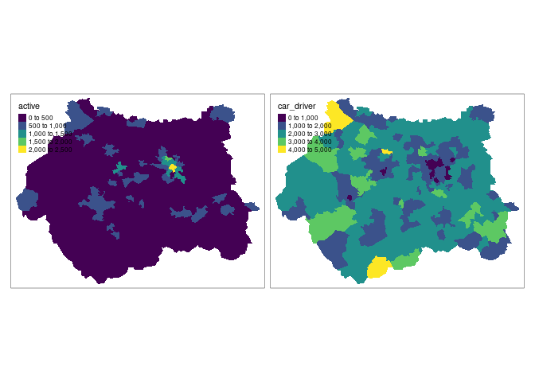
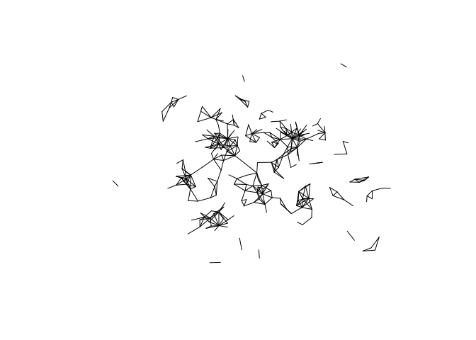

OD and route data analysis
================
Robin Lovelace
University of Leeds
<br/>

This package builds on the [routing
practical](https://github.com/ITSLeeds/TDS/blob/master/practicals/6-routing.md)
and demonstrates ways to analyse OD and route network data.

As before we will use the `tidyverse`, `tmap` and `sf` packages:

``` r
library(tidyverse)
library(tmap)
library(sf)
```

## Input data

-   Get data on the zones in West Yorkshire with the following command:

``` r
zones = pct::get_pct_zones(region = "west-yorkshire", geography = "msoa")
```

-   Get origin-destination data with the following commands:

``` r
u = "https://github.com/ITSLeeds/TDS/releases/download/0.1/desire_lines.geojson"
download.file(u, "desire_lines.geojson")
desire_lines = read_sf("desire_lines.geojson")
```

## Exploratory analysis of zone data

-   Find out the class, names, number of columns and number of rows in
    the `zones` dataset using functions such as `names()`, `nrow()` and
    `ncol()`.

-   Explore the link between the `zones` and `desire_lines` datasets:
    what percentage of ‘zone IDs’ (codes that identify the zones) can be
    found in the desire lines object (either as zones of origin or
    destination)?

    -   Hint: you can break this question into pieces:
        -   The following command will generate a vector containing
            logical (boolean) values, each `TRUE` when the corresponding
            zone ID is contained within the `desire_lines` variable:
            `zones_in_o = zones$geo_code %in% desire_lines$from`
    -   What percentage of the desire lines are contained within West
        Yorkshire (and how did you find out)?

-   Plot the number of car trips and walking trips as follows, what do
    you notice about the results? Where is most potential to increase
    walking levels, based on these results?

``` r
plot(zones["car_driver"])
plot(zones["foot"])
```

-   How would you select only the `car_driver` column in the zones
    object in the tidyverse? Hint it would begin with the following
    (incomplete) lines:

``` r
library(tidyverse)
zones %>% select(
```

-   Create an object called `zones_car_foot` that only contains columns
    representing the number of trips originating in each zone by car and
    foot.
    -   Plot the object, you should see something like the figure below.


-   Create a new object called `zones_active_modes` that is identical to
    the `zones` object but which has a new column called `active`,
    containing the number of people walking plus the number of people
    cycling to work (hint: use the function `mutate()`. Plot the spatial
    distribution of trips made by car and active modes in a facetted map
    (hint, use `tm_fill(c("active", "car_driver"))`). The results should
    look like those below (bonus, create a scatter plot showing the
    relationship between these variables).



-   Which zone has the highest level of cycling, and where is it?
-   Use the function `filter()` to create an object only containing that
    zone

### Desire lines

-   Read-in top 1000 desire lines for Leeds with the following code
    (hint: rather than typing the url of the file you can copy-paste it
    from [github.com/ITSLeeds/TDS](https://github.com/ITSLeeds/TDS)):

``` r
# note: you can also read-in the file from the url:
# desire_lines = read_sf(u)
```

Plot the lines statically as follows:

``` r
library(tmap)
tm_shape(desire_lines) +
  tm_lines()
```


Plot the lines showing the number of car drivers as follows:

``` r
tm_shape(desire_lines) +
  tm_lines(col = "car_driver")
```


-   Plot the same lines, but with colour according to the number of
    people who walked to work in the 2011 Census

-   Re-do the plot of the number of trips made by driving, but make the
    line widths proportional to the total number (`all`) trips made
    (hint: you may need to set the scale with `scale = 5`, or another
    number greater than 1, for example)

Filter-out all lines between 1 and 3km and call the resulting
object`desire_lines_1_3km` with the following command (or similar):

``` r
desire_lines_1_3km = desire_lines %>% 
  filter(e_dist_km > 1 & e_dist_km < 3)
```

-   Plot the results to make sure the operation worked (you should get a
    result like the on below):



Create a new variable called `percent_drive` that contains the
percentage of trips driven in each of the lines in the
`desire_lines_1_3km` object with the following command:

``` r
desire_lines_pcar = desire_lines_1_3km %>% 
  mutate(percent_drive = car_driver / all * 100)
```

-   Find the top 100 most ‘car dependent’ short desire lines in West
    Yorkshire and plot the results. It should look something like this:


-   Plot the results in an interactive map and explore the results.
    Where are the top 100 most car-dependent major commuting desire
    lines in West Yorkshire (hint: you may use the `ttm()` function to
    switch to interactive mode in **tmap**)?

<!-- -->

    ## tmap mode set to interactive viewing

    ## Legend for line widths not available in view mode.


To get not only the most car dependent desire lines but route segments,
run the following commands:

``` r
# warning, takes some time, skip this chunk to speed-up results
routes = pct::get_pct_routes_fast("west-yorkshire", geography = "msoa") 
routes_dep_100 = routes %>% 
  filter(id %in% car_dep_100$id)
saveRDS(routes_dep_100, "routes_dep_100.Rds")
```

You can read-in the results as follows:

``` r
u = "https://github.com/ITSLeeds/TDS/releases/download/22/routes_dep_100.Rds"
download.file(url = u, destfile = "routes_dep_100.Rds")
routes_dep_100 = readRDS("routes_dep_100.Rds")
```

To convert these routes into route segments, with estimates of n. people
driving on different parts of the network (based on a small sample of
total travel), use the overline function (see `?overline` for help):


What could be done to reduce car dependency in these areas?

Bonus: undertake the analysis above but using desire lines from the NTEM
project.

-   Read them in with the following commands:

``` r
u = "https://github.com/ITSLeeds/TDS/releases/download/22/NTEM_flow.geojson"
desire_lines = read_sf(u)
head(desire_lines)
```

    ## Simple feature collection with 6 features and 9 fields
    ## Geometry type: LINESTRING
    ## Dimension:     XY
    ## Bounding box:  xmin: -1.547 ymin: 53.7065 xmax: -1.2403 ymax: 53.7979
    ## Geodetic CRS:  WGS 84
    ## # A tibble: 6 × 10
    ##   from      to          all drive passenger  walk cycle  rail   bus
    ##   <chr>     <chr>     <dbl> <dbl>     <dbl> <dbl> <dbl> <dbl> <dbl>
    ## 1 E02002444 E02002443  1374    55        24  1121     0     0   174
    ## 2 E02002443 E02002445  1189   100        44   868     4     0   173
    ## 3 E02002442 E02002440  1494    83        40  1139    23     0   209
    ## 4 E02002442 E02002441  1747   349       168   906    62     0   262
    ## 5 E02002447 E02002448  4930    70        36  4162    98     0   564
    ## 6 E02006876 E02006875 10314  1854       942  4680   251     0  2587
    ## # … with 1 more variable: geometry <LINESTRING [°]>

## Homework

Make a start on your coursework and the ‘2 pager’.

Take a read of the documentation for the abstr package:
<https://a-b-street.github.io/abstr/> that will be useful preparation
for the seminar.

Reproduce the results presented in the [transport chapter of
Geocomputation with
R](https://geocompr.robinlovelace.net/transport.html) for another
region, e.g. West Yorkshire. This starting point may be useful:

``` r
region = "west-yorkshire"
b = "https://github.com/npct/pct-outputs-regional-notR/raw"
u = paste0("/master/commute/msoa/", region)
u_od = paste0(b, u, "/od_attributes.csv")
od = readr::read_csv(u_od)
z = sf::read_sf(paste0(b, u, "/z.geojson"))
cents = sf::read_sf(paste0(b, u, "/c.geojson"))
od_clean = od %>% 
  select(-id) %>% 
  filter(geo_code1 %in% cents$geo_code) %>% 
  filter(geo_code2 %in% cents$geo_code) 

  
desire_lines = stplanr::od2line(flow = od_clean, cents)
tm_shape(desire_lines$geometry[1:99]) %>% 
  tm_lines()
```
