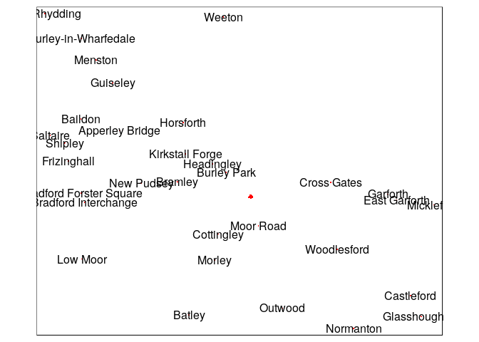

Transport Data Science with R Practical Exercises
================

These practicals aim to test your knowledge of material covered in the Transport Data Science module hosted at <https://github.com/ITSLeeds/TDS>

It will use the following CRAN packages:

``` r
library(dplyr)
library(osmdata)
library(pct)
library(sf)
library(stplanr)
library(tmap)
```

Project set-up
==============

-   Check your packages are up-to-date with `update.packages()`
-   Create an RStudio project with an appropriate name for this course (e.g. `TDSwithR`)
-   Create a script called `set-up.R`, e.g. with **one** the following commands:

``` r
file.edit("get-transport-data.R") 
```

Getting transport data
======================

Accessing crowd-sourced data from OSM
-------------------------------------

-   Type code into the script created in the previous section so that it can reproduce this plot:

``` r
location = opq("leeds") %>% 
  add_osm_feature(key = "railway", value = "station") %>% 
  osmdata_sf()
station_points = location$osm_points["name"]
tm_shape(location$osm_polygons) +
  tm_polygons(col = "red") +
  tm_shape(station_points) +
  tm_dots(col = "red")  +
  tm_text(text = "name", size = 1) 
```



1.  Download cycleway data with the tag highway=cycleway for Leeds from <https://overpass-turbo.eu/>
2.  Load the data in R and plot it with `tmap` (bonus: now try to get the same data using the **osmdata** package)

Get official data with stats19 and pct packages
-----------------------------------------------

1.  Download and plot all crashes reported in Great Britain in 2017 (hint: see [the stats19 vignette](https://cran.r-project.org/web/packages/stats19/vignettes/stats19.html))
2.  Filter crashes that happened in West Yorkshire
3.  Get and plot origin-destination data in `west-yorkshire` with the `pct` package hosted at: <https://github.com/ITSLeeds/pct> (bonus: look at the source code of `get_od()` and download the origin-destination data with `download.file()`)

Bonus exercises
---------------

Identify a region and zonal units of interest from <http://geoportal.statistics.gov.uk/>

1.  Read them into R as an `sf` object
2.  Join-on data from a non-geographic object
3.  Add a data access section to your in progress portfolio
4.  Get origin-destination data from Uber

Working with spatio-temporal data
=================================

1.  Create an object representing desire lines in West Yorkshire, e.g, with: `desire_lines_all = pct::get_pct_lines(region = "west-yorkshire")`
2.  Get data from Leeds and subset the desire lines with a value of `all` of 200 or above
3.  Create a buffer of 500 m for each desire line and calculate the number of crashes that happened within each (using STATS19 data downloaded in the previous exercise)
4.  Create a facetted plot showing the temporal distribution of crashes in West Yorksire (you can choose whether to show these over the months of the year, over days of the week, or over the hours of a day)
5.  Do a spatio-temporal subset to identify the crashes that happened within the most commonly travelled desire line between 07:00 and 10:00 during weekdays.

Traffic data and pollution analysis with R
==========================================

See exercises in lecture slides.

From desire lines to route networks
===================================

1.  Identify the top 10 desire lines in West Yorkshire along which at least 100 people travel to work, by:
    -   The percentage who walk
    -   The percentage who cycle
    -   Bonus: Find the top 10 for *all* modes of transport and plot the results
2.  Download origin-destination data from 2011 Census using the function `pct::get_od()`.
3.  Convert these origin-destination pairs into geographic desire lines between centroids in Leeds (e.g. as generated by the function `pct::get_pct_centroids()`) and plot the result.
4.  Find the route along the most travelled desire line in Leeds and plot the result.
5.  Get cycle route data for West Yorkshire and use the function `overline2()` to identify the routes along which most people walk to work.
