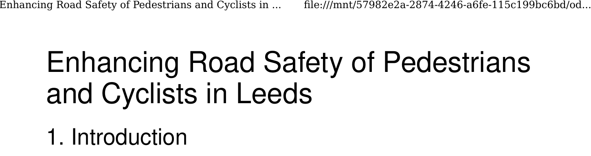

background-image: url(https://c1.staticflickr.com/2/1216/1096671706_571a263b63_b.jpg)
background-position: 50% 50%
class: center, bottom, inverse

```{r setup, include=FALSE}
options(htmltools.dir.version = FALSE)
library(RefManageR)
BibOptions(check.entries = FALSE, 
           bib.style = "authoryear", 
           cite.style = 'alphabetic', 
           style = "markdown",
           first.inits = FALSE,
           hyperlink = FALSE, 
           dashed = FALSE)
my_bib = ReadBib("../tds.bib", check = FALSE)
```

<!-- --- -->

<!-- # This session in context -->

<!--    - Introduction to transport data science -->

<!-- -  Software for practical data science  -->

<!--  - The structure of transport data -->
<!--  - Data cleaning and subsetting -->
<!--  - Accessing data from web sources -->
<!--  - Routing -->
<!--  - Data visualization -->
<!--  - Project work -->
<!--  -  ## <font color="red"> Professional issues + project work</font>  -->

---

# Reminder on Coursework

--

When's the deadline?

--

```{r}
as.Date("2024-05-17")
```

--

```{r}
# Friday 19th May
as.Date("2024-05-17") - Sys.Date()
```


--

Remember the marking [criteria](https://github.com/ITSLeeds/TDS/blob/master/coursework-template.md#04-marks):

--

    **Understanding of concepts, methods and approaches**

    **Data, processing access and cleaning**

    **Application choice**

    **Visualization**

    **Understand the data science process**
    
---

## '2 pager' document on plans

- Well done everyone who submitted a .zip file containing an .Rmd file and a 1 page pdf

- Based on feedback that you received, and subsequent work, can each person state:

  - A draft title of your topic
  - The main dataset that you will use and other datasets that you could use
  - Ideas on a research question
  - Questions you would like to ask about the topic, e.g. 'is this a suitable dataset?'
  - 1 or more references to the academic literature related to the topic
  - Any preliminary analysis you have done

- Source: `coursework-template.Rmd` in the TDS GitHub repository

---

# Example

```{r, echo=FALSE, eval=FALSE}
browseURL("~/OneDrive/career/modules/tds/examples/tds-coursework-example-2019-2020.pdf")
system("rg '201380814' ~/hd/backups/onedrive-backups/onedrive-big-mirror/career/modules/tds/2020-marks/")
system("rg test ~/hd/backups/onedrive-backups/onedrive-big-mirror/career/modules/tds/2020-marks/")
file.edit("~/hd/backups/onedrive-backups/onedrive-big-mirror/career/modules/tds/2020-marking/02/122554084-TDS_Coursework_Draft.tex")
```

```{r, echo=FALSE}

```


```{r, echo=FALSE}
# knitr::include_graphics("../figures/example-pdf.png")
```

Note: 

- Good structure
- Well written
- Reproducible


See `stats19-example.zip` in the [github.com/ITSLeeds/TDS/releases/tag/23](https://github.com/ITSLeeds/TDS/releases/tag/23) for an an example of a coursework submission

---

## Data science workflows

```{r, echo=FALSE, eval=FALSE}
file.copy("https://d33wubrfki0l68.cloudfront.net/571b056757d68e6df81a3e3853f54d3c76ad6efc/32d37/diagrams/data-science.png", "figures/r4ds-workflow.png")
```

Source: [R for Data Science](https://r4ds.had.co.nz/introduction.html) open source book


---

# Managing time and prioritising ([Source](https://csgillespie.github.io/efficientR/workflow.html))


---

# Practical

- What are the strongest aspects of your coursework idea so far? What are the weakest?

--

- What are the priorities over the next three weeks (break it down into 3 parts) 

--

- What do you need to find more literature on?

--

- What do you need more data on (you should have all the data already)?

--

- What additional skills do you need (now is a good time to ask)?

---

<!-- ### What is machine learning? -->

<!-- -- -->

<!-- - [Applied statistics](https://machinelearningmastery.com/relationship-between-applied-statistics-and-machine-learning/) vs ML: a continuum -->

<!--  -->

<!-- --- -->

<!-- # Machine learning types -->

<!-- There are 2 basic types `r Citep(my_bib, "james_introduction_2013a", .opts = list(cite.style = "authoryear"))` -->

<!-- - Supervised learning, when you have a training dataset -->

<!-- - Unsupervised learning, where there is no 'dependent variable' -->


<!-- --- -->

<!-- # Deep learning -->

<!-- - Google is now 'AI First' (NYT [2016](https://www.nytimes.com/2016/12/14/magazine/the-great-ai-awakening.html)) -->

<!--  -->

<!-- --- -->

<!-- # Example of a machine learning problem -->

<!-- - Cycling infrastructure is a 'fuzzy' concept -->

<!-- - Difficult to pin down with a simple relationship -->

<!-- - So machine learning should help! -->

<!-- - See www.cyipt.bike -->

<!-- --- -->

# Input data - messy


---

# Input data - simplification


<!-- --- -->

<!-- # Results of ML exercise -->

<!-- See https://github.com/cyipt/cyipt/blob/master/model-uptake.md -->

<!-- -- -->

<!--  -->
<!-- --- -->

<!-- # Observations -->

<!-- - Input data is very noisy -->

<!-- -- -->

<!-- - Machine learning didn't reveal any expected insights in this case -->

<!-- -- -->

<!-- - But did reveal *unexpected* insight: road speeds and traffic volumes seem to be associated with lower uptake of cycling -->

---

# Working on your projects

- Plan ahead: what else do you need to do on your project?
- Schedule work: when will you find time to do it?
- Use Microsoft Calendar or similar: put it in the calendar.
- Reproducibility: ensure your .Rmd files are reproducible
- Ask for help: what do you need help with?
- Work: get you head down and make use of this time!

---

# References

```{r, 'refs', results="asis", echo=FALSE}
PrintBibliography(my_bib)
# RefManageR::WriteBib(my_bib, "refs-geostat.bib")
```

## Questions are welcome

- On GitHub
- On the chat
- Via email
